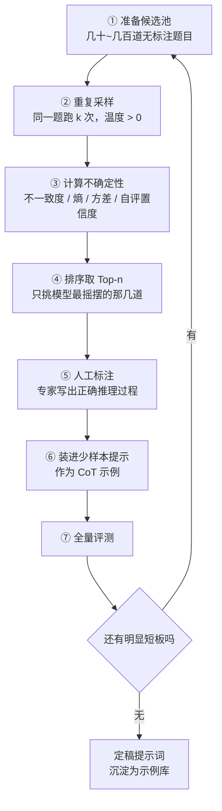

# 主动提示（Active Prompting）

少样本提示（few-shot）人人会用，但有个现实问题没人回答你：**例子到底该挑哪几个？**

大多数人的做法是随手从数据里抓 5 条，或者挑几道自己觉得典型的。问题是——你觉得典型的题，模型可能早就会了；标它等于白花钱。

**主动提示（Active Prompting）** 换了个思路：先让模型把所有题做一遍，看它在哪些题上**答得最摇摆**，然后人只标那几道，塞回提示里当示例。

::: tip 一句话定义
**主动提示（Active Prompting）** = 用「模型的不确定性」当筛子，从候选题里挑出模型最没把握的少数样本交人工标注思维链（Chain-of-Thought，CoT），再把这些高价值示例放进少样本提示中，用最小标注成本换最大提升。
:::

## 为什么这么挑才对

你可以把它理解成**给模型出一份错题本**。

> 复习不会去刷你已经全对的章节，而是专攻反复做错的那几类。主动提示就是让模型自己交出错题本。

它解决三个真实痛点：

- **标注贵**：人工写一条高质量思维链要几分钟，几百条就是几天人力。预算必须花在刀刃上。
- **随机挑例子方差大**：论文（Diao et al., 2023，《Active Prompting with Chain-of-Thought for Large Language Models》）里换一组示例，准确率能差好几个点。你以为是模型不行，其实是例子没选对。
- **模型的短板你猜不到**：它可能在一道你觉得幼稚的题上反复翻车。让数据说话，比拍脑袋准。

这套逻辑其实是机器学习里的**主动学习（active learning）** 搬到了提示工程上：不追求标全，只标最有信息量的。

## 完整闭环



关键在第 ②③ 步：**不确定性怎么量**。

## 四种不确定性度量

| 度量 | 怎么算 | 特点 |
| --- | --- | --- |
| 不一致度（disagreement） | k 次答案里去重个数 ÷ k | 最简单，原论文首推 |
| 熵（entropy） | 按答案频率算信息熵 | 比不一致度更细腻 |
| 方差（variance） | 数值型答案的离散程度 | 只适合数学题这类数值输出 |
| 自评置信度 | 直接问模型「你有多确定，0-100」 | 便宜，但模型常常盲目自信 |

举个直观例子。同一道题跑 5 次：

- 答案是 `42, 42, 42, 42, 42` → 不一致度 1/5 = 0.2，模型很稳，**不值得标**。
- 答案是 `42, 37, 42, 51, 8` → 不一致度 4/5 = 0.8，它基本在瞎猜，**优先标注**。

> 实操建议：k 取 5~10，温度设 0.7 左右。温度设成 0 你会发现所有题的不一致度都是 0.2，筛子直接失效。

## 可复制示例（OpenAI 格式）

```js
// 需 API Key：https://platform.openai.com 获取，设为环境变量 OPENAI_API_KEY
// 模型：gpt-4o（OpenAI, 2024）；可换 deepseek-chat / qwen-plus 等
import OpenAI from 'openai'

const client = new OpenAI({ apiKey: process.env.OPENAI_API_KEY })

// 候选池：只有题目，没有标注——这正是主动提示的起点
const pool = [
  '一件商品原价 200 元，先涨价 20% 再打八折，最终价格是多少？',
  '3 支笔 12 元，5 支多少钱？',
  '某商场满 300 减 50，可叠加 9 折券（先减后折）。买 620 元实付多少？',
]

const K = 5 // 每题采样次数

async function uncertainty(question) {
  const answers = []
  for (let i = 0; i < K; i++) {
    const res = await client.chat.completions.create({
      model: 'gpt-4o',
      temperature: 0.7, // 必须 > 0，否则答案全同、测不出摇摆
      messages: [
        {
          role: 'system',
          content: '你是数学解题助手。请一步步推理，最后一行只写「答案：<数字>」。',
        },
        { role: 'user', content: question },
      ],
    })
    const text = res.choices[0].message.content
    answers.push((text.match(/答案：\s*([\d.]+)/) || [])[1] ?? 'N/A')
  }
  // 不一致度 = 去重后个数 / 采样次数
  return { question, u: new Set(answers).size / K, answers }
}

const ranked = []
for (const q of pool) ranked.push(await uncertainty(q))
ranked.sort((a, b) => b.u - a.u)

console.log('优先送人工标注的题：')
ranked.slice(0, 1).forEach((r) => console.log(r.u.toFixed(2), r.question, r.answers))
// 输出示例：0.80 某商场满 300 减 50，可叠加 9 折券... [ '513', '498', '513', '459', '513' ]
```

拿到高不确定性的题后，**由人工写出正确的完整推理过程**，再作为 `assistant` 示例塞进提示：

```js
// 人工标注好的高价值示例，直接当少样本 CoT 用（示意：省略了 system 消息）
const messages = [
  { role: 'user', content: '某商场满 300 减 50，可叠加 9 折券（先减后折）。买 620 元实付多少？' },
  {
    role: 'assistant',
    content:
      '先判断满减：620 ≥ 600，满 300 减 50 可用两次，减 100 → 520。\n再用 9 折券：520 × 0.9 = 468。\n答案：468',
  },
  { role: 'user', content: '<你的新问题>' },
]
```

::: warning 常见坑
- **温度设成 0**：所有题的不确定性都一样，整套方法直接废掉。这是最高频的错误。
- **把不确定性当成错误**：模型可能答得很稳但**稳定错**。这类题不确定性低，筛不出来——所以仍需一份人工抽检的测试集兜底。
- **标注质量放水**：主动提示的全部价值压在那几条人工示例上。让实习生随便写几句，等于精挑细选后喂了垃圾。
- **只跑一轮**：标完一批就收工。它本质是迭代的——补完短板后重跑，短板会转移到新的地方。
- **成本没算清**：候选池 × k 次采样。500 道题 × 5 次 = 2500 次调用，先用小样本试通流程再放量。
:::

## 2025 年还有必要吗

有人会问：现在的推理模型（如 o 系列、DeepSeek-R1）自己就会生成长思维链，还需要人工标 CoT 示例吗？

分场景看：

- **通用推理任务**：确实弱化了，推理模型自带的思维链通常比人写的示例更强，不用折腾。
- **私有领域任务**（内部风控规则、专业审核标准、企业口径）：**依然刚需**。模型没见过你的规则，推理再强也推不出你公司的口径，必须靠示例注入。
- **不确定性本身有了新用途**：现在常被拿来做**模型路由**——低不确定性的题给便宜小模型，高不确定性的题升级到强模型或推理模型，成本能砍一大截。它同样是筛选评测集难例的好办法。

换句话说，「让模型标出自己没底的地方」这个思路比具体技巧活得更久。

## 速查清单 ✅

- [ ] 能说清五步：采样 → 测不确定性 → 挑难题 → 人工标注 → 回填提示
- [ ] 记住采样温度必须 > 0，k 取 5~10
- [ ] 会算不一致度：去重答案数 ÷ 采样次数
- [ ] 知道「不确定性低 ≠ 答得对」，要留测试集
- [ ] 明白它是迭代闭环，不是一次性动作
- [ ] 知道不确定性还能用于模型路由和难例挖掘

## 记忆卡片 🃏

> **主动提示（Active Prompting）** = 让模型交出错题本，人只标最摇摆的那几道，再塞回提示当示例。
> 核心公式：**不一致度 = 去重答案数 ÷ 采样次数**，越高越该标。
> 一句话：把有限的标注预算花在模型真正不会的地方。

## 小结

主动提示解决的是「例子该挑哪几个」这个被长期忽视的问题：用不确定性当筛子，把标注预算精准投在模型的短板上。它和上一篇的 [自动提示工程（APE）](/advanced/ape) 正好互补——APE 优化**指令怎么写**，主动提示优化**示例挑哪些**。

如果模型的短板不是「不会推理」而是「不知道事实」，那再多示例也没用，你需要的是 [检索增强生成（RAG）](/advanced/rag)。

---

> **来源与授权**：本文改编自 [dair-ai/Prompt-Engineering-Guide](https://github.com/dair-ai/Prompt-Engineering-Guide)（MIT License，Copyright 2022 DAIR.AI），并参考 [promptingguide.ai](https://www.promptingguide.ai) 与 [deepwiki.com.cn](https://deepwiki.com.cn/dair-ai/Prompt-Engineering-Guide) 的中文内容。仅供学习交流，保留原作者版权声明。
