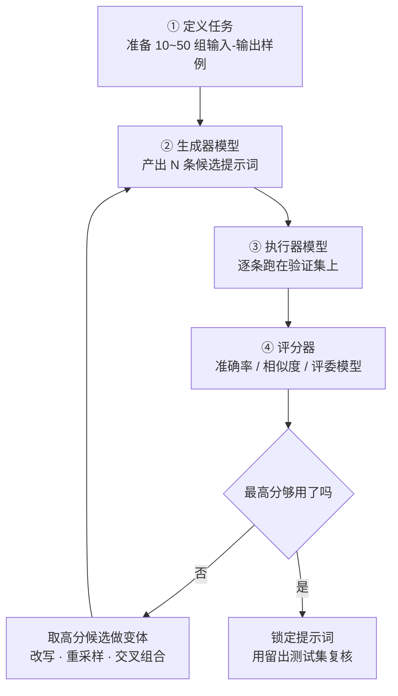

# 自动提示工程（APE）

你大概干过这种事：一个提示词改了二十版，每版手动跑三五条测试，最后凭「哪个看着顺眼」留一个。

累，还不靠谱——你的「顺眼」没有任何数据支撑。换个同事来选，可能选另一个。

**自动提示工程（Automatic Prompt Engineering，APE）** 的想法很朴素：模型不是很会写东西吗？那让它来写提示词。你只负责出题和打分。

::: tip 一句话定义
**自动提示工程（APE）** = 让大语言模型（LLM）根据任务样例批量生成候选提示词，再用一套自动评分规则挑出最好的那条，把「人肉试错」变成可复现的搜索过程。
:::

## 为什么值得上自动化

**第一，模型能想到你想不到的措辞。**

最出名的证据来自 APE 原始论文（Zhou et al., 2022，《Large Language Models Are Human-Level Prompt Engineers》）。人手写的思维链（Chain-of-Thought，CoT）咒语是「Let's think step by step」，而 APE 自动搜出来的是：

> Let's work this out in a step by step way to be sure we have the right answer.

就多了半句「确保我们得到正确答案」，算术推理准确率反而更高。这种措辞你很难拍脑袋想出来。

**第二，有分数才有进步。**

手动改提示是「盲调」，APE 强制你先定义「什么叫更好」。一旦有了评分函数，优化就变成可复现的工程活儿，而不是玄学。

> 打个比方：手写提示 = 手动调参；APE = 提示词的自动超参搜索（AutoML）。

**第三，规模一大就必须自动化。** 你有 50 个业务场景，每个都手调一遍？不现实。

## 四步闭环



流程里有三个角色，可以是同一个模型，也可以分开省钱：

| 角色 | 干什么 | 选型建议 |
| --- | --- | --- |
| 生成器 | 造候选提示词 | 用强模型，温度调高（0.9~1.0）保证多样 |
| 执行器 | 拿候选提示词真跑任务 | 用你**线上要用的那个模型**，否则白测 |
| 评分器 | 给输出打分 | 能用规则就别用模型，便宜又稳定 |

### 打分怎么打

| 方法 | 适用 | 代价 |
| --- | --- | --- |
| 精确匹配 | 分类、抽取、有唯一答案 | 最便宜，首选 |
| 执行准确率 | 生成代码/SQL，跑一遍看对不对 | 便宜且客观 |
| 评委模型（LLM-as-a-Judge） | 开放式写作、摘要 | 贵，且评委自身有偏好 |

一句话原则：**能写规则的地方绝不请模型当评委。**

## 可复制示例（OpenAI 格式）

分两段：先让模型生成候选，再自动评分选优。

```js
// 需 API Key：https://platform.openai.com 获取，设为环境变量 OPENAI_API_KEY
// 模型：生成器 gpt-4o（OpenAI, 2024）；执行器建议换成你线上真用的那个
//      也可用 deepseek-chat / qwen-plus / glm-4 等国产模型平替
import OpenAI from 'openai'

const client = new OpenAI({ apiKey: process.env.OPENAI_API_KEY })

// 验证集：任务的「标准答案」，APE 靠它打分
const devSet = [
  { input: '这快递也太慢了，等了一周', label: '负面' },
  { input: '客服态度特别好，问题秒解决', label: '正面' },
  { input: '包装一般，东西还行', label: '中性' },
]

// ---------- ① 生成候选提示词 ----------
async function genCandidates(n = 5) {
  const res = await client.chat.completions.create({
    model: 'gpt-4o',
    temperature: 1.0, // 关键：温度高才有多样性
    messages: [
      {
        role: 'system',
        content: '你是提示词优化专家。只输出提示词本身，一行一条，不要编号和解释。',
      },
      {
        role: 'user',
        content: `根据下面的输入-输出样例，反推出一条能让模型稳定完成该任务的指令。
请给出 ${n} 条**措辞差异明显**的候选指令。

样例：
${devSet.map((d) => `输入：${d.input}\n输出：${d.label}`).join('\n---\n')}`,
      },
    ],
  })
  return res.choices[0].message.content.split('\n').filter((s) => s.trim())
}

// ---------- ② 用候选提示词跑验证集 ----------
async function score(instruction) {
  let hit = 0
  for (const { input, label } of devSet) {
    const res = await client.chat.completions.create({
      model: 'gpt-4o',
      temperature: 0, // 评测必须固定，否则分数是噪音
      messages: [
        { role: 'system', content: instruction },
        { role: 'user', content: input },
      ],
    })
    if (res.choices[0].message.content.trim().includes(label)) hit++
  }
  return hit / devSet.length
}

// ---------- ③ 选优 ----------
const candidates = await genCandidates()
const ranked = []
for (const c of candidates) ranked.push({ c, s: await score(c) })
ranked.sort((a, b) => b.s - a.s)

console.log('最优提示词：', ranked[0].c, '得分：', ranked[0].s)
// 输出示例：最优提示词：判断这条评论的情感倾向，只回答「正面」「负面」或「中性」之一。 得分：1
```

跑通之后你会发现：**评测代码比提示词本身值钱**。有了它，以后换模型、加需求都能一键回归。

::: warning 常见坑
- **过拟合验证集**：三条样例就敢定稿，等于用三道题决定高考策略。验证集至少几十条，另外留一份**从没参与选优**的测试集做最终复核。
- **评分函数跑偏**：你按「字符完全相同」打分，模型多输出一个句号就判错，于是选出一条啰嗦却守格式的提示词。分数必须对齐你真正在意的东西。
- **候选没多样性**：温度设成 0 让模型生成候选，五条几乎一模一样，搜了半天等于没搜。
- **成本失控**：候选数 × 验证集条数 = 调用次数，很容易几千次起。先用小验证集粗筛，再对 Top 3 做全量精评。
:::

## 别自己从零写：现成方案

2025 年这事已经有轮子了，不必手搓：

- **DSPy**：把提示当成可编译的程序，`MIPROv2` 等优化器自动搜指令和示例组合，是目前工程界最主流的做法。
- **OPRO**（Google, 2023）：让模型读「历史提示 + 得分」再提新提示，是它搜出了那句著名的「Take a deep breath and work on this problem step-by-step」。
- **平台内置优化器**：OpenAI 与 Anthropic 的控制台都自带提示词生成/改写功能，适合快速拿一个不错的起点，再接你自己的评测。

## 速查清单 ✅

- [ ] 能说清 APE 的四步：生成 → 执行 → 打分 → 选优
- [ ] 动手前先准备好验证集 + 评分函数，而不是先想提示词
- [ ] 生成候选用高温度，评测执行用温度 0
- [ ] 执行器模型与线上模型保持一致
- [ ] 留出独立测试集，防止过拟合
- [ ] 知道 DSPy / OPRO 这类现成工具的存在

## 记忆卡片 🃏

> **自动提示工程（APE）** = 让模型写提示词，用分数挑最好的那条。
> 三件套：候选生成器 + 验证集 + 评分函数。
> 核心心法：**先定义「什么叫更好」，再谈优化**；没有评测的优化都是错觉。

## 小结

APE 把提示工程从手感活变成了搜索问题：模型批量产候选，评分函数决胜负，你只需定义任务和标准。它最大的价值其实不是那条最优提示词，而是逼你建起一套**可复现的评测**。

如果你的痛点不是「提示词不够好」，而是「不知道该拿哪些例子去教模型」，下一篇更对症：[主动提示（Active Prompting）](/advanced/active-prompt)。

---

> **来源与授权**：本文改编自 [dair-ai/Prompt-Engineering-Guide](https://github.com/dair-ai/Prompt-Engineering-Guide)（MIT License，Copyright 2022 DAIR.AI），并参考 [promptingguide.ai](https://www.promptingguide.ai) 与 [deepwiki.com.cn](https://deepwiki.com.cn/dair-ai/Prompt-Engineering-Guide) 的中文内容。仅供学习交流，保留原作者版权声明。
