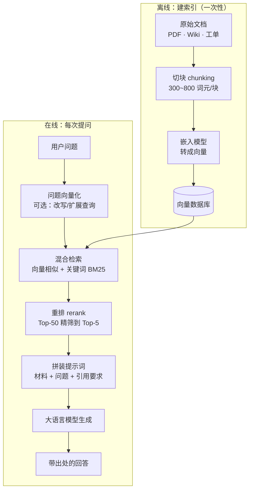

# 检索增强生成（RAG）

你问模型「我们公司的年假怎么算」，它答得头头是道、语气自信，细节全是编的。

这不是模型坏了。它压根没见过你公司的员工手册——训练数据里没有的东西，它只能靠语言概率「猜」一个像样的答案出来。这就是**幻觉（hallucination）**。

修法特别朴素：**别让它凭记忆答，先把资料翻出来放它眼前。**

::: tip 一句话定义
**检索增强生成（Retrieval-Augmented Generation，RAG）** = 回答前先从外部知识库检索相关片段，把片段拼进提示词，让大语言模型（LLM）**基于给定材料**作答，而不是靠参数里的记忆。
:::

## 为什么必须有 RAG

> 类比：闭卷考试 vs 开卷考试。
> 不用 RAG 是闭卷，模型只能靠背；用了 RAG 是开卷，答案就在翻开的那一页上。

它一次解决四个问题：

| 痛点 | RAG 怎么治 |
| --- | --- |
| 幻觉 | 有原文可依，还能要求「找不到就说不知道」 |
| 知识过期 | 更新知识库即可，不用重新训练模型 |
| 不懂私有数据 | 你的合同、工单、代码库，模型训练时都没见过 |
| 无法溯源 | 可以让它标注引用出处，答案可核查 |

对比微调（fine-tuning）就更清楚了：**微调教模型「怎么说」，RAG 告诉模型「说什么」**。要灌事实，八成场景 RAG 都比微调划算得多。

## 检索流程



看着环节多，其实就两件事：**离线把资料切碎存好，在线把最相关的几块捞出来递给模型。**

## 三个决定成败的细节

**① 切块（chunking）别乱切。**

按固定字数硬切，会把一句话劈成两半，检索出来的片段读不通。正确做法是按结构切——标题、段落、Markdown 小节，并让相邻块**重叠 10%~20%**，避免关键信息正好卡在边界上。

**② 别只用向量检索。**

向量擅长找语义相近的内容，但对**专有名词、编号、型号**特别不灵。用户搜「XR-200 报错 E31」，向量检索可能给你一堆「设备故障处理」的泛泛之谈。

所以线上系统基本都用**混合检索**：向量 + 关键词（BM25）各取一份，合并后再交给重排模型（如 Cohere Rerank、BGE-Reranker）精排。这一步通常是 RAG 效果提升最明显的改动。

**③ 提示里必须写死约束。**

给了材料不等于模型会老实用。必须明确要求：只依据材料回答、标注出处、材料没写就说不知道。这三句话能挡掉大部分幻觉。

## 可复制示例（OpenAI 格式）

```js
// 需 API Key：https://platform.openai.com 获取，设为环境变量 OPENAI_API_KEY
// 模型：生成 gpt-4o（OpenAI, 2024）；嵌入 text-embedding-3-small（2024）
// 生产环境请把内存数组换成 pgvector / Milvus / Qdrant 等向量库
import OpenAI from 'openai'

const client = new OpenAI({ apiKey: process.env.OPENAI_API_KEY })

// —— 离线：知识库切块（这里用极简示例代替真实文档解析）——
const chunks = [
  { id: 'hr-01', text: '员工入职满 1 年享 5 天年假，满 3 年 10 天，满 5 年 15 天。' },
  { id: 'hr-02', text: '年假需提前 3 个工作日在 OA 提交申请，由直属主管审批。' },
  { id: 'hr-03', text: '未使用的年假可结转至次年 3 月 31 日，逾期作废。' },
]

async function embed(texts) {
  const res = await client.embeddings.create({
    model: 'text-embedding-3-small',
    input: texts,
  })
  return res.data.map((d) => d.embedding)
}

const cos = (a, b) => {
  const dot = a.reduce((s, v, i) => s + v * b[i], 0)
  const na = Math.hypot(...a)
  const nb = Math.hypot(...b)
  return dot / (na * nb)
}

const index = (await embed(chunks.map((c) => c.text))).map((v, i) => ({ ...chunks[i], v }))

// —— 在线：检索 + 生成 ——
const question = '我入职 4 年了，年假有几天？没休完怎么办？'
const [qv] = await embed([question])

const topK = index
  .map((c) => ({ ...c, score: cos(qv, c.v) }))
  .sort((a, b) => b.score - a.score)
  .slice(0, 3) // 生产环境这里应接一层 rerank 再截断

const context = topK.map((c) => `[${c.id}] ${c.text}`).join('\n')

const completion = await client.chat.completions.create({
  model: 'gpt-4o',
  temperature: 0, // 事实问答别放开温度
  messages: [
    {
      role: 'system',
      // 三条铁律：只用材料、标出处、不知道就承认
      content: `你是企业知识库问答助手。严格遵守：
1. 只依据【参考材料】回答，不得引入材料外的信息；
2. 每条结论后用 [编号] 标注出处；
3. 材料中没有的内容，直接回答「材料中未提及」，禁止推测。`,
    },
    {
      role: 'user',
      content: `【参考材料】\n${context}\n\n【问题】\n${question}`,
    },
  ],
})

console.log(completion.choices[0].message.content)
// 输出示例：
// 入职满 3 年可享 10 天年假，你入职 4 年，按此标准为 10 天 [hr-01]。
// 未休完的年假可结转至次年 3 月 31 日，逾期作废 [hr-03]。
```

## RAG vs 直接塞长上下文：怎么选

这是现在最容易搞混的问题。主流模型上下文窗口已经卷到百万级词元（GPT-4.1 系列 100 万、Gemini 1.5/2.5 Pro 100 万~200 万、Claude 20 万），于是有人说：**全塞进去不就完了，还要 RAG 干嘛？**

先纠正一个认知：**长上下文不是 RAG 的替代品，两者解决的问题不同。**

| 维度 | RAG | 长上下文直塞 |
| --- | --- | --- |
| 知识规模 | 无上限，几千万字也行 | 受窗口限制 |
| 单次成本 | 只付 Top-5 片段的钱 | 每次都为全量材料付费 |
| 延迟 | 检索快，生成短 | 输入越长首字延迟越久 |
| 准确性风险 | 检索没捞到就答不出 | 「中间信息丢失」，材料一长中段内容易被忽略 |
| 更新 | 改库即生效 | 每次重传 |
| 工程复杂度 | 高（切块/索引/重排） | 极低，拼字符串就行 |

**实用判断标准：**

- 材料 **< 5 万词元**、且相对固定 → 直接塞。别为了几十页 PDF 搭一套向量库，工程复杂度换不来收益。配合**提示缓存（prompt caching）**，重复部分成本还能降一大截。
- 材料 **上百万字、经常更新、需要溯源** → 必须 RAG。这时长上下文既付不起钱也定位不准。
- **两者结合（现在最常见）**：先用检索把候选粗筛到几万词元，再一次性塞进长上下文窗口让模型通读。既省钱又不丢细节，业界叫它「粗检索 + 长上下文精读」。

再往上一层，这些做法都被归进了 **上下文工程（context engineering）**——它比提示工程更宽，管的是「在有限的上下文窗口里，该放什么、放多少、按什么顺序放」。检索、切块、重排、压缩、缓存、记忆管理都属于它。RAG 只是上下文工程中最成熟的一个手段，而不是全部。

顺带一提，2025 年更流行的形态是 **Agentic RAG**：不再一次检索定生死，而是让智能体（agent）自己决定检不检、检几轮、要不要改写查询后再搜一次。本质上是把「检索」变成了模型可调用的工具，详见 [工具调用](/agents/function-calling)。

::: warning 常见坑
- **切块太大或太小**：太大塞不下也淹没重点，太小丢上下文。先从 300~800 词元 + 15% 重叠试起。
- **只上向量检索**：编号、型号、人名类查询频繁翻车。务必补关键词检索 + 重排。
- **提示里不写约束**：不说「只依据材料」，模型照样把自己的记忆混进来，你连它编没编都看不出。
- **不做检索评测**：回答不好，先分清是「没检索到」还是「检索到了但没答好」。前者调检索，后者调提示——搞反了会白改半天。
- **无脑用长上下文兜底**：材料一长，中段内容被忽略的现象很明显，账单也很直观。
:::

## 速查清单 ✅

- [ ] 能说清 RAG 四步：切块 → 索引 → 检索 → 拼提示生成
- [ ] 知道要用混合检索（向量 + 关键词）并加重排
- [ ] 提示里写死三条：只用材料、标出处、没有就说不知道
- [ ] 会按材料规模选 RAG 还是长上下文（5 万词元是个粗略分界）
- [ ] 知道「检索 + 长上下文」结合是当下主流做法
- [ ] 排查问题时能分清检索环节和生成环节

## 记忆卡片 🃏

> **检索增强生成（RAG）** = 先查资料，再让模型基于资料回答。
> 一句话本质：把闭卷考改成开卷考。
> 选型口诀：**材料小而稳 → 直接塞；材料大又常变 → 上 RAG；想两头兼顾 → 先检索粗筛，再长上下文精读。**

## 小结

RAG 把模型从「凭记忆答题」拉回到「基于材料答题」，是压制幻觉最有效的工程手段。长上下文没有淘汰它，只是让选择变多了——现在你要判断的是**该给模型看多少、看哪些**，这已经是上下文工程的范畴。

模型能读的不只有文字。下一篇看看怎么把图片、语音一起喂进去：[多模态提示](/advanced/multimodal)。

---

> **来源与授权**：本文改编自 [dair-ai/Prompt-Engineering-Guide](https://github.com/dair-ai/Prompt-Engineering-Guide)（MIT License，Copyright 2022 DAIR.AI），并参考 [promptingguide.ai](https://www.promptingguide.ai) 与 [deepwiki.com.cn](https://deepwiki.com.cn/dair-ai/Prompt-Engineering-Guide) 的中文内容。仅供学习交流，保留原作者版权声明。
