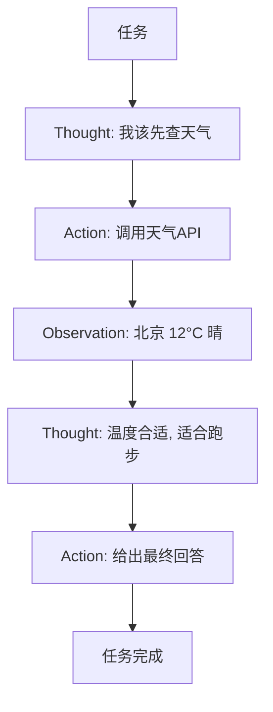

# ReAct（推理 + 行动）

你有没有想过：为什么模型能"查资料后再回答"？比如你问"今天北京天气适合跑步吗"，它能去查天气、再下结论。这背后常站着一种叫 **ReAct** 的范式。

ReAct = **Reason（推理）+ Act（行动）**。它让大语言模型（LLM）不再闷头空想，而是**先想一步（Thought），再决定调哪个工具（Action），看了工具返回的结果（Observation）后，继续想下一步**，如此循环，直到把事办成。

::: tip 一句话定义
**ReAct** = 让模型以「思考 Thought → 行动 Action（调用工具/函数）→ 观察 Observation」的循环反复迭代，边推理边与外部交互，直到达成目标。
:::

## 为什么"想"和"干"要交替

纯推理的模型有个硬伤：**它的知识停在训练截止日，且算不准实时数据**。让它"想"出"今天股价"只会瞎编。

它和前面讲的思维链最大的区别就一个字：**动**。思维链只在脑子里"想给自己听"，全程不碰外面世界；ReAct 则会"想一步、出去干一步、把结果带回来再想"。当任务需要实时数据、需要操作软件、需要查数据库时，光想不动的模型就废了——而 ReAct 正好补上这截。

ReAct（Yao 等，2022，Princeton + Google）的妙处在于把"思考"和"行动"织在一起：

- **Thought（思考）**：模型自己盘算"我现在知道啥、还缺啥、下一步该干嘛"。
- **Action（行动）**：模型决定调用某个工具，比如搜索引擎、计算器、查数据库、调 API。
- **Observation（观察）**：工具返回真实结果，模型读到后更新认知，进入下一轮 Thought。

> 类比：你做研究不是闷头空想，而是"想想缺什么 → 去搜一下 → 看到结果 → 再想"，ReAct 就是把这个循环写进了提示里。

## 循环结构



注意箭头是**闭环**：每轮都从 Observation 回到 Thought，直到模型认为能交付。

每一轮循环都遵循同一套节奏：模型先产出 Thought（它当前的判断与计划），再产出 Action（具体要调哪个工具、传什么参数），你执行后把 Observation 灌回去。关键点是**Observation 必须由真实的工具产生**，而不能让模型"假装"看到了结果——否则就退化成幻觉，ReAct 也就失去意义。

## 可复制示例（OpenAI 格式）

下面用函数调用（function calling）演示 ReAct 思路。模型先"想"要查天气，再"行动"调函数，最后基于返回"观察"作答。

```js
// 需 API Key：https://platform.openai.com 获取，设为环境变量 OPENAI_API_KEY
// 模型：gpt-4o（OpenAI，2024）；ReAct 也可跑在 o1/o3、Claude、DeepSeek 等支持工具调用的模型
import OpenAI from 'openai'
const client = new OpenAI({ apiKey: process.env.OPENAI_API_KEY })

// ① 告诉模型有哪些"工具"可用（这就是它的 Action 空间）
const tools = [{
  type: 'function',
  function: {
    name: 'get_weather',
    description: '查询某城市当前天气',
    parameters: {
      type: 'object',
      properties: { city: { type: 'string', description: '城市名' } },
      required: ['city'],
    },
  },
}]

const messages = [
  { role: 'user', content: '今天北京天气适合户外跑步吗？' },
]

// ② 模型进入 ReAct：先 Thought 再 Action（返回 tool_calls）
const r1 = await client.chat.completions.create({
  model: 'gpt-4o',
  messages,
  tools,
})
const call = r1.choices[0].message
console.log('模型想做的 Action：', call.tool_calls?.[0]?.function)
// 输出示例：{ name: 'get_weather', arguments: '{"city":"北京"}' }

// ③ Observation：我们把真实工具结果"喂"回去（实际中你本地执行函数）
messages.push(call) // 模型的 tool_call 请求
messages.push({
  role: 'tool',
  tool_call_id: call.tool_calls[0].id,
  content: JSON.stringify({ city: '北京', temp: 12, condition: '晴', wind: '微风' }),
})

// ④ 模型基于 Observation 继续 Thought，给出最终答案
const r2 = await client.chat.completions.create({
  model: 'gpt-4o',
  messages,
  tools,
})
console.log('最终回答：', r2.choices[0].message.content)
// 输出示例：北京今天 12°C、晴、微风，体感舒适，适合户外跑步。
```

::: warning 常见坑
- **工具描述写不清**：模型靠 `description` 决定调哪个 Action。描述含糊，它就调错或瞎编参数。
- **忘把 Observation 喂回去**：你执行完工具后，必须把结果以 `role: 'tool'` 塞回 messages，否则模型"行动"了却"看不到"结果，循环断掉。
- **无限循环**：模型一直 Thought→Action 不收手。要设最大步数上限兜底。
- **把 ReAct 当万能**：简单问答硬上工具调用反而更慢更贵，先判断要不要"行动"。
:::

## 进阶小贴士

举个常见例子——联网研究助手。你问"对比 A、B 两家公司最新财报"，它的循环可能是：Thought「我需要两家最新营收数据」→ Action「搜索 A 公司财报」→ Observation「A 营收 X」→ Thought「还差 B」→ Action「搜索 B」→ Observation「B 营收 Y」→ Thought「数据齐了，可以下结论」→ 最终回答。你看，它比单纯 RAG（一次性检索）更灵活：缺什么就主动去拿什么，拿回来发现不对还能换思路。现代智能体的"规划—调用—反思"循环，骨架就是 ReAct。想把它接进你的系统，下一步看[函数调用](/agents/function-calling)。

## 速查清单 ✅

- [ ] 能说出 ReAct = Thought → Action → Observation 循环
- [ ] 知道 Action 就是调工具/函数
- [ ] 明白 Observation 必须回灌进 messages（role: tool）
- [ ] 会给工具写清 description
- [ ] 知道要设最大步数防死循环
- [ ] 想深入工具调用看[函数调用篇](/agents/function-calling)

## 和其他技巧怎么搭配

ReAct 和前面的推理技巧是"不同维度"的东西：CoT/自洽性/思维树解决"怎么想"，ReAct 解决"想和做怎么交替"。实战里它们常叠用——模型用思维链在 Thought 里盘算下一步，再用 Action 调工具拿 Observation，如此循环。配合[函数调用](/agents/function-calling)，你能把搜索、计算、查库统统变成模型的"手"，让它从"会聊天的脑"变成"能办事的助手"。注意：ReAct 循环务必设最大步数，避免模型陷入"想→干→想→干"的死循环烧光词元。

## 记忆卡片 🃏

> **ReAct** = 想一步、干一步、看结果、再想。
> Thought（想）→ Action（调工具）→ Observation（看结果），循环到完成。
> 本质：让模型"边推理边与外界交互"。

## 小结

ReAct 让模型**不再空想，而是"想一步、干一步、看结果、再想"**——用 Thought/Action/Observation 的循环把推理和外部工具拧在一起，弥补了模型"知识过时、算不准实时数据"的短板。它正是现代[智能体（agent）](/agents/function-calling)的工作骨架。需要让模型稳定调工具，可继续看[函数调用](/agents/function-calling)。

---

> **来源与授权**：本文改编自 [dair-ai/Prompt-Engineering-Guide](https://github.com/dair-ai/Prompt-Engineering-Guide)（MIT License，Copyright 2022 DAIR.AI），并参考 [promptingguide.ai](https://www.promptingguide.ai) 与 [deepwiki.com.cn](https://deepwiki.com.cn/dair-ai/Prompt-Engineering-Guide) 的中文内容。仅供学习交流，保留原作者版权声明。
