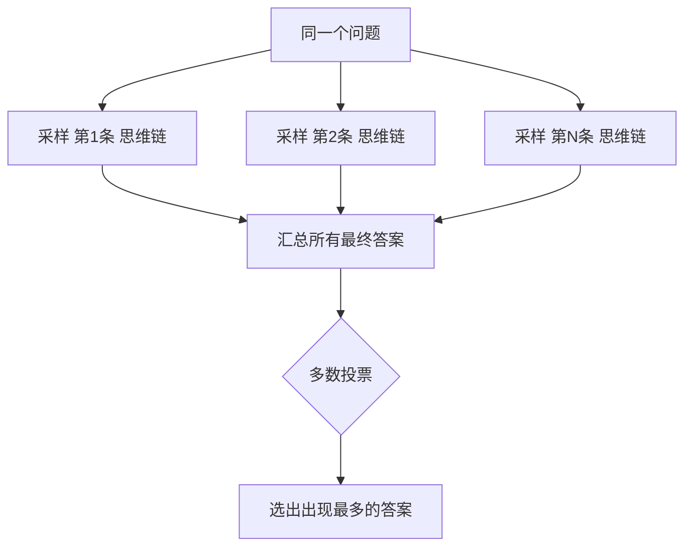

# 自洽性（Self-Consistency）

上篇讲了[思维链](/advanced/cot)：让模型一步步推理。但你试过没有——**同一个问题，让它"一步步想"两次，它给出的推理路径可能完全不一样，答案也时而对时而错**。单次思维链还是有运气成分。

自洽性（Self-Consistency）的思路很朴素，也很有效：**同一个问题，采样多条不同的推理链，然后"少数服从多数"投票选答案。** 谁的票数多，谁就更可能是对的。

::: tip 一句话定义
**自洽性（Self-Consistency）** = 针对同一问题生成多条独立的思维链（CoT），以多数投票（majority vote）的方式选出最终答案。
:::

## 为什么投票能更准

这背后是个常识：一个人蒙一道选择题可能错，但**让一群人各自独立做、再投票，整体正确率会更高**——只要每个人单独做对的概率 > 50%。

模型也一样。单次推理可能走歪一条链；但如果你采样出 10 条链，其中 7 条都推导出"9"、3 条推到别的数字，那"9"大概率是真的（它更"自洽"）。Wang 等（2022，Google）用这招把数学推理的准确率又往上抬了一大截。

> 类比：就像你解不出题时，找 10 个同学各写一遍过程，答案出现最多的那个，通常最靠谱。

## 怎么做：三步

1. **把温度（temperature）调高一点**（比如 0.7~1.0）：让模型每次推理"走不同的路"，才能采样到多样化的链。温度太低，每次都生成一样的链，投票就没意义了。
2. **多次采样**：同一个问题跑 N 次（常见 N=5~20），每次都带 "Let's think step by step" 这类思维链触发语，收集每条链的最终答案。
3. **多数投票**：统计所有答案，出现次数最多的作为最终输出；若平票，可随机或取置信度高的。

## 流程图



注意：所有链都是**从同一个问题出发**，最后在投票节点汇合。

## 可复制示例（OpenAI 格式）

下面示意用 `gpt-4o` 对同一问题采样多条链并投票。为简洁，这里用循环展示核心步骤（真实场景你会多次调用 API）。

```js
// 需 API Key：https://platform.openai.com 获取，设为环境变量 OPENAI_API_KEY
// 模型：gpt-4o（OpenAI，2024 年发布）；自洽性对推理模型 o1/o3 也适用
import OpenAI from 'openai'

const client = new OpenAI({ apiKey: process.env.OPENAI_API_KEY })

const question = `食堂里有 23 个苹果。用掉 20 个做午餐，又买来 6 个，现在有几个？
请一步步思考，最后用"答案：X"给出结果。`

const answers = []
const N = 10 // 采样 10 条链
for (let i = 0; i < N; i++) {
  const completion = await client.chat.completions.create({
    model: 'gpt-4o',
    temperature: 0.8, // 调高，让每条链走不同路径
    messages: [{ role: 'user', content: question }],
  })
  // 从回复里抽取"答案：X"后的数字（示意：用正则）
  const match = completion.choices[0].message.content.match(/答案[:：]\s*(\d+)/)
  if (match) answers.push(Number(match[1]))
}

// 多数投票
const counts = {}
for (const a of answers) counts[a] = (counts[a] || 0) + 1
const finalAnswer = Object.entries(counts).sort((x, y) => y[1] - x[1])[0][0]
console.log('各答案分布：', counts)
console.log('最终答案（投票）：', finalAnswer)
// 典型输出：各答案分布 { '9': 8, '27': 2 } → 最终答案：9
```

::: warning 常见坑
- **温度还是 0**：低温度下每条链几乎一样，投票形同虚设。自洽性必须靠"多样性"吃饭。
- **成本翻倍**：跑 N 次就是 N 倍词元（token）开销。N 取 5~10 通常够用，别盲目拉到 20+。
- **只投票不校验**：如果 10 条里有 9 条都"自信地"算错成同一个数，多数投票反而帮你放大错误。所以问题本身要适合推理，且模型单链正确率应 > 50%。
- **和思维链混用但忘了触发**：自洽性是把思维链跑很多次，别忘了每条链都要触发分步推理。
:::

## 进阶小贴士

自洽性说白了就是思维链的"集成版"——类似机器学习里把多个弱模型投票成强模型。实战里有几条经验：第一，**答案能自动抽取时最香**（比如数学题末位数字、选择题字母），因为投票靠程序数数；开放式生成任务难投票，就不太适合。第二，**N 不必太大**，研究里 5~10 条往往就够，再往上边际收益递减、成本却线性涨。第三，它和[思维树](/advanced/tot)不冲突：自洽性是"同题多链平行投票"，思维树是"单链内部分叉回溯"，你甚至可以先用思维树探路、再对最好分支做自洽性投票。

## 速查清单 ✅

- [ ] 能说出自洽性 = 多条链 + 多数投票
- [ ] 知道要调高温度制造多样性
- [ ] 知道 N 一般取 5~10
- [ ] 理解"单链正确率 > 50% 投票才有用"
- [ ] 明白它比单次思维链更准也更贵
- [ ] 知道它建立在[思维链](/advanced/cot)之上

## 和其他技巧怎么搭配

自洽性几乎总是站在思维链肩膀上：没有分步推理，就没有"多条链"可投。实务中常见组合是"CoT + 自洽性 + 答案抽取器"三段流水线——模型分步写、跑 N 次、正则抠出末位答案、数数投票。若你还想进一步提准，可在投票前先用[思维树](/advanced/tot)的评估思路给各链打分，做"加权投票"而非简单多数。

## 记忆卡片 🃏

> **自洽性 Self-Consistency** = 同题采 N 条链，少数服从多数。
> 关键：高温度换多样性；投票放大"最稳"答案。
> 代价：N 倍成本。

## 小结

自洽性就是**把思维链（CoT）跑很多次、再投票**。它靠"多样推理 + 多数决"把单次推理的运气成分抹平，数学/逻辑题上往往比单次思维链更稳。代价是成本随采样数线性上涨。它完全建立在 [思维链](/advanced/cot) 之上——先会链式推理，再会投票。下一篇讲怎么让推理"分叉探索"：[思维树（Tree-of-Thought）](/advanced/tot)。

---

> **来源与授权**：本文改编自 [dair-ai/Prompt-Engineering-Guide](https://github.com/dair-ai/Prompt-Engineering-Guide)（MIT License，Copyright 2022 DAIR.AI），并参考 [promptingguide.ai](https://www.promptingguide.ai) 与 [deepwiki.com.cn](https://deepwiki.com.cn/dair-ai/Prompt-Engineering-Guide) 的中文内容。仅供学习交流，保留原作者版权声明。
