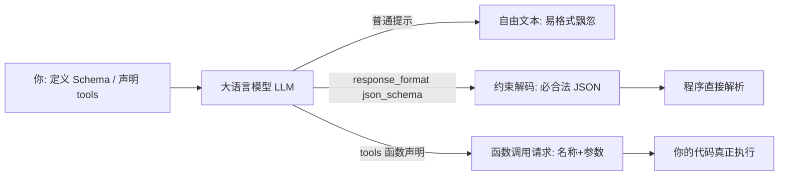

# 结构化输出（JSON / Function Calling）

你让模型「返回一段 JSON，里面有姓名和年龄」，它十次里有两次给你裹一堆解释、或者把键名拼错。

你想把这段输出喂给后端程序，结果程序一解析就崩——因为它收到的是「好的，这是你要的 JSON：{...}」。

**结构化输出（Structured Output）** 要解决的就是这件事：让模型**老老实实按你定的格式出**，程序能零报错地吃掉。

::: tip 一句话定义
**结构化输出（Structured Output）** = 用 JSON Schema、函数声明或约束解码等手段，强制大语言模型（LLM）产出**固定格式、可被程序直接解析**的结果，而不是自由文本。
:::

## 为什么需要结构化输出

> 类比：你让实习生填一张固定表格（姓名 / 年龄 / 城市），比让他「随便写段介绍」好对接一百倍——因为表格每一列你都能直接入库。

模型天生爱「写文章」，但工程系统爱「读字段」。三者不解决，就卡在中间：

| 你想要 | 自由文本提示的麻烦 |
| --- | --- |
| 喂数据库 | 字段名飘忽、偶尔多塞解释 |
| 调下游 API | 类型不对（年龄变字符串）、缺字段 |
| 批量处理 | 每条格式微妙不同，解析脚本天天改 |

所以目标不是「让模型聪明」，而是「让输出**可预测**」。

## 三条路子：怎么让输出变规矩

**① JSON Schema 约束（最直白）**

你先定义一个 JSON Schema（字段名、类型、是否必填），让模型照着填。相当于把填空题的格子先画好，它只能往格子里写。

**② Function Calling / Tool 调用（不止吐 JSON）**

OpenAI 的 `tools` 参数让你声明「模型可以调用哪些函数、参数是什么 Schema」。模型不直接返回答案，而是返回一个**规范的函数调用请求**（函数名 + 符合 Schema 的参数），由你的代码真正去执行——查天气、下单、查库都靠它。这是让模型「动手」而不是只「动嘴」的关键，详见 [工具调用](/agents/function-calling)。

**③ 约束解码 / 结构化输出（最稳）**

像 OpenAI 的 `response_format: { type: 'json_schema', json_schema: {...} }` 会在**生成层面**做约束解码：模型每生成一个词元，都被限制只能填进合法的结构里，从而保证「绝不会产出非法 JSON」。这比「我在提示里求你输出 JSON」可靠得多。



> 一句话选路：只想要规整 JSON → 上 `response_format`；想让模型去调外部工具 → 上 `tools`；两者底层都靠 Schema 描述结构。

## 可复制示例（OpenAI 格式，Function Calling 示意）

```js
// 需 API Key：https://platform.openai.com 获取，设为环境变量 OPENAI_API_KEY
// 模型：gpt-4o（OpenAI, 2024）；下列 tools 用法在 gpt-4o / gpt-4.5 一致
// 以下为「让模型决定调用哪个函数」的调用示意，函数体由你的代码实现
import OpenAI from 'openai'

const client = new OpenAI({ apiKey: process.env.OPENAI_API_KEY })

const completion = await client.chat.completions.create({
  model: 'gpt-4o',
  messages: [
    { role: 'user', content: '北京今天适合穿什么？帮我查下天气。' },
  ],
  // tools = 你暴露给模型的函数清单，每个函数带一份 JSON Schema 参数
  tools: [
    {
      type: 'function',
      function: {
        name: 'get_weather',
        description: '根据城市查询当前天气',
        parameters: {
          type: 'object',
          properties: {
            city: { type: 'string', description: '城市名，如 北京' },
            unit: { type: 'string', enum: ['celsius', 'fahrenheit'] },
          },
          required: ['city'],
          additionalProperties: false, // 禁止模型乱加字段
        },
      },
    },
  ],
  tool_choice: 'auto', // 让模型自己决定调不调、调哪个
})

const msg = completion.choices[0].message
// 模型返回的不是答案，而是一段规范调用请求：
// msg.tool_calls = [{ function: { name: 'get_weather', arguments: '{"city":"北京","unit":"celsius"}' } }]
// 你的代码解析 arguments → 真去查天气 → 再把结果回传模型续写最终回答
console.log(msg.tool_calls)
```

::: warning 常见坑
- **只在提示里写「请返回 JSON」**：这是最弱的约束，模型照样可能加前缀、改键名。要稳定就上 `response_format` 或 `tools`。
- **Schema 写得太松**：不设 `required`、`additionalProperties: false`，模型就会漏字段或塞多余字段，解析时炸。
- **把 arguments 当对象直接用**：`tool_calls[].function.arguments` 是**字符串**，必须先 `JSON.parse` 再传给你的函数。
- **指望模型填对枚举/类型**：Schema 约束了结构，但不保证语义正确（比如把「上海」填进 city 是合法的）。业务校验别省。
- **中文键名来回变**：和前端约定死字段名，别让模型自己翻译，否则联调时字段对不上。
:::

## 速查清单 ✅

- [ ] 能说出结构化输出的目的：让输出可被程序直接解析
- [ ] 知道三种约束：JSON Schema / tools 调用 / 约束解码
- [ ] 会用 `response_format: { type: 'json_schema' }` 强制合法 JSON
- [ ] 理解 `tools` 返回的是「调用请求」而非「最终答案」
- [ ] 记得 `arguments` 是字符串，要先 parse
- [ ] 会给 Schema 加 `required` 和 `additionalProperties: false`

## 记忆卡片 🃏

> **结构化输出** = 用 Schema / tools / 约束解码，逼模型产出规整可解析结果。
> 一句话：别求模型输出 JSON，要**约束**它输出 JSON。
> 选型：要 JSON → `response_format`；要动手调工具 → `tools`。

## 小结

结构化输出把模型从「写文章」变成「填表格」，是接入真实系统的必经一步。最稳的做法不是求它守格式，而是用 `response_format` 或 `tools` 在生成层就锁死结构。想让模型真正去执行动作、串成工作流，接着看 [工具调用](/agents/function-calling)。

---

> **来源与授权**：本文改编自 [dair-ai/Prompt-Engineering-Guide](https://github.com/dair-ai/Prompt-Engineering-Guide)（MIT License，Copyright 2022 DAIR.AI），并参考 [promptingguide.ai](https://www.promptingguide.ai) 与 [deepwiki.com.cn](https://deepwiki.com.cn/dair-ai/Prompt-Engineering-Guide) 的中文内容。仅供学习交流，保留原作者版权声明。
