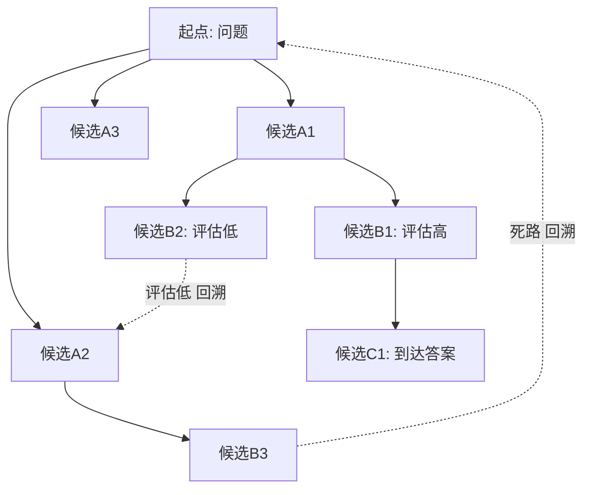

# 思维树（Tree-of-Thought, ToT）

[思维链](/advanced/cot)是"一条线想到底"，[自洽性](/advanced/self-consistency)是"同题跑多条平行线再投票"。但现实里很多难题，**一条道走到黑会撞墙**——你需要的是：分几个岔路试试、看看哪条有戏、不行就退回来换条路。

思维树（Tree-of-Thought，ToT）干的就是这个：把推理过程**展开成一棵树**，每个节点是一小步思考，你可以从节点长出多个"备选下一步"，自己评估哪个最有前途，再往下走；走错了还能回溯（backtrack）。

::: tip 一句话定义
**思维树（Tree-of-Thought，ToT）** = 把问题推理建模成一棵搜索树：在每个节点生成多个候选"思考步"，用模型自评打分，沿高分分支探索，必要时回溯。
:::

## 为什么需要"树"而不是"链"

人类解奥数题时，不会只写一条解法。你会想："方案 A 看起来能行，方案 B 也不错，先试 A；A 卡住了，回过头试 B。" 这种**探索 + 评估 + 回溯**的能力，单条思维链没有——它一旦选错方向，只能将错就错。

ToT（Yao 等，2023，Princeton + Google）把这种"深思熟虑（deliberate search）"搬进提示工程：

- **分叉（branching）**：一个状态能长出多个候选下一步，不止一条路。
- **自评（self-evaluate）**：模型当裁判，给每个候选打"肯定/可能/不可能"。
- **回溯（backtrack）**：某分支走死，退回上一步换别的岔路。

> 类比：思维链像沿着一条直线走迷宫；思维树像手里拿着地图，走错就原路返回另找出口。

## 怎么做：四步循环

1. **分解问题**：把任务切成一串"思考步"（thought step），每步是树里的一个节点。
2. **生成候选**：在当前节点，让模型提出 k 个可能的下一步（k 个分支）。
3. **自我评估**：让模型给每个候选打分（如 sure / likely / impossible），作为搜索的启发信号。
4. **搜索与回溯**：用 BFS/DFS 之类策略沿高分走；若整条都死，回溯到上一个有希望的分支。

## 树状结构图



实线是有希望的路径，虚线是"评估太低 / 走死"被丢弃、需要回溯的节点。

## 可复制示例（OpenAI 格式）

ToT 通常需要写一段搜索循环代码（不只是提示词）。下面给一个**框架示意**：用模型既当"生成候选"又当"评审"，BFS 探索。

```js
// 需 API Key：https://platform.openai.com 获取，设为环境变量 OPENAI_API_KEY
// 模型：gpt-4o（OpenAI，2024）；ToT 也常用于 o1/o3 等强推理模型做候选生成
import OpenAI from 'openai'
const client = new OpenAI({ apiKey: process.env.OPENAI_API_KEY })

async function llm(prompt) {
  const r = await client.chat.completions.create({
    model: 'gpt-4o',
    messages: [{ role: 'user', content: prompt }],
  })
  return r.choices[0].message.content
}

// 示意：24 点游戏（用 4 个数字凑 24）。每步生成候选运算，再自评。
async function expand(state) {
  const cands = await llm(`当前数字集合：${state}。给出 3 种下一步运算（候选）。`)
  return cands
}
async function evaluate(state) {
  const vote = await llm(`当前状态：${state}。距离凑出 24 还有希望吗？回答 sure/likely/impossible。`)
  return vote.includes('sure') ? 1 : vote.includes('likely') ? 0.5 : 0
}
// 真实实现会用队列做 BFS，按 evaluate 分数剪枝 + 回溯。此处为结构示意。
console.log('ToT 核心：expand(生成分支) → evaluate(自评) → 搜索/回溯')
```

::: warning 常见坑
- **太贵**：每个节点都要"生成 + 评估"两次模型调用，树一大调用量爆炸。务必限制分支数 k 和深度。
- **自评不可靠**：让模型给自己打分，它有时会给出"迷之自信"。关键决策点最好加交叉验证。
- **什么时候不该用**：能一条思维链解决的中等题，上思维树纯属杀鸡用牛刀。
:::

## 思维链 vs 思维树：怎么选

| 维度 | 思维链 CoT | 思维树 ToT |
| --- | --- | --- |
| 结构 | 一条线 | 一棵树（多分支+回溯） |
| 适合 | 单路径能解的多步推理 | 需要试探/规划/搜索的难题 |
| 成本 | 低 | 高（调用多） |
| 典型场景 | 算术、常识推理 | 24点、谜题、规划、创意发散 |

## 进阶小贴士

别看思维树厉害就无脑上，落地前先问自己三句话：① **问题真需要搜索吗？** 一条思维链能解的中等题，上树纯属浪费。② **节点能自动评估吗？** 若模型自评不可靠，你得自己写校验器（比如代码跑一下验证状态合法），否则搜索会被带偏。③ **预算扛得住吗？** 分支数 k × 深度 d × 2（生成+评估）就是调用量上界，先算笔账。经验法则：谜题、规划、需要"试错—回头"的难题才上思维树；普通推理，[思维链](/advanced/cot)加[自洽性](/advanced/self-consistency)投票通常就够了。

## 速查清单 ✅

- [ ] 能说出思维树 = 树状推理 + 自评 + 回溯
- [ ] 知道它比思维链多了"分叉"和"回溯"
- [ ] 会用"生成候选 / 自我评估 / 搜索"三步描述流程
- [ ] 知道思维树成本高，别滥用
- [ ] 能区分思维链与思维树的适用场景

## 和其他技巧怎么搭配

思维树可以和自洽性组合出更猛的玩法：先在树的高层用自洽性探出哪条主干更有戏，再对选中的分支深挖；也可以在叶子节点用 PAL 写代码验证状态是否合法，代替"让模型自评"这种不太可靠的裁判。总之，ToT 负责"往哪走"，CoT 负责"每一步怎么走"，PAL 负责"这步走得对不对"。

## 记忆卡片 🃏

> **思维树 ToT** = 推理展开成树，边探索边自评，走死就回溯。
> 对比思维链：思维链一条线，思维树一棵树。
> 用武之地：要规划、要试错的难题。

## 小结

思维树把推理从"一条线"升级成"一棵树"：**在每个节点分叉出多个候选、让模型自评打分、沿高分走，走死就回溯**。它适合需要试探和规划的难题（谜题、24 点、路径规划），但对成本要求高。日常中等题，[思维链](/advanced/cot) 就够了；要更稳可叠加[自洽性](/advanced/self-consistency)投票。

---

> **来源与授权**：本文改编自 [dair-ai/Prompt-Engineering-Guide](https://github.com/dair-ai/Prompt-Engineering-Guide)（MIT License，Copyright 2022 DAIR.AI），并参考 [promptingguide.ai](https://www.promptingguide.ai) 与 [deepwiki.com.cn](https://deepwiki.com.cn/dair-ai/Prompt-Engineering-Guide) 的中文内容。仅供学习交流，保留原作者版权声明。
