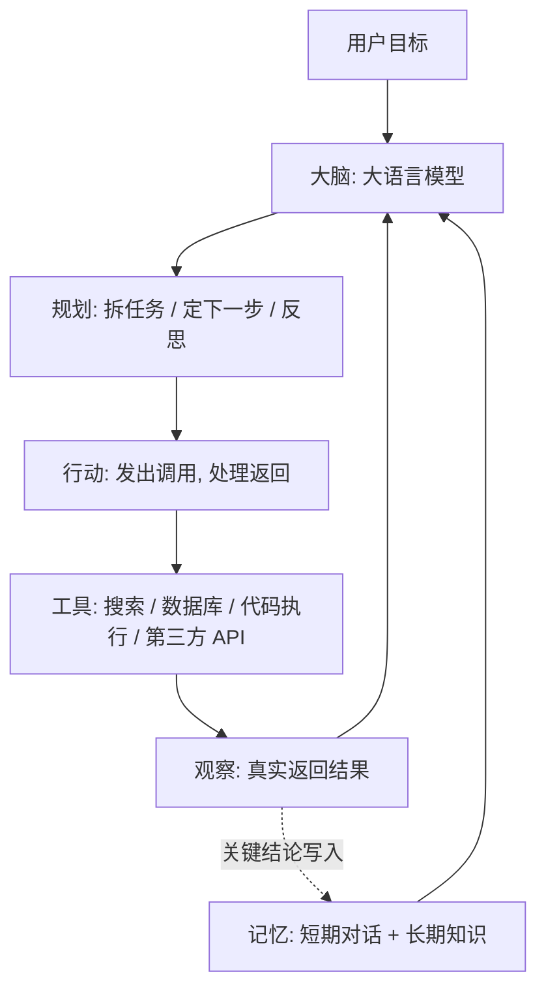

# 智能体的核心组成

上一篇你知道了智能体（agent）会自己转圈。但「转圈」是行为，不是结构。真动手做一个的时候，要操心的东西具体得多：它凭什么知道下一步干啥？上一轮查到的东西还记得吗？能调哪些工具？调完谁去执行？

这四个问题，正好对应智能体的四大件。

::: tip 一句话定义
一个智能体 = **大脑（大语言模型）** + 四个部件：**规划（planning）** 定下一步、**记忆（memory）** 存该记住的、**工具（tools）** 提供能力清单、**行动（action）** 真正执行并把结果带回来。
:::

## 为什么要拆开看

因为**出问题时你必须能定位到哪块坏了**。同一句「它老是答不对」，背后可能是四种病：

- 上来就瞎答，没有计划 → **规划**没做好
- 忘了三轮前用户说的预算 → **记忆**没做好
- 调错函数、参数瞎编 → **工具**描述没写清
- 说自己发了邮件其实没发 → **行动**环节断了

不拆开，你只能一遍遍改系统提示词，改到自己怀疑人生。

> 类比：智能体像新来的实习生。规划 = 他会不会列待办；记忆 = 他记不记笔记；工具 = 你给他开了哪些系统权限；行动 = 他真的去点那个按钮没有。哪一环掉链子，症状完全不同。

## 四大件的结构关系



两条虚线之外是一个**闭环**：大脑规划 → 行动执行 → 工具返回 → 观察回到大脑。记忆不在环上，它是环旁边的存储层：随时被读取，也被观察结果写入。

## 一、规划（Planning）：决定下一步

规划回答「**现在该做什么**」，含三件事：

| 子能力 | 干什么 | 常见做法 |
| --- | --- | --- |
| 任务分解 | 把「做份竞品分析」拆成可执行小步 | 提示里要求「先列计划再动手」 |
| 步骤选择 | 这轮调哪个工具、还是直接作答 | 交给模型判断，靠清晰的工具描述 |
| 反思 | 上一步失败了，换个思路 | 把**具体错误原因**结构化写回上下文 |

**症状**：绕圈子、重复做同一件事、一头扎进死路不回头。

**最省力的改法**是把工作方式写成规则，往往比长篇角色设定有用：

```
工作方式：
1. 先用一句话说明你的计划；
2. 一次只做一步，需要外部信息就调工具；
3. 工具报错时说明原因并换方案，不要重复同一次调用；
4. 信息齐了再给最终结论。
```

智能体一定会失败——查不到、超时、参数不对。区别只在于它是「记住这条路不通、换别的」，还是「原地重试到步数用尽」。想要前者，就得把**具体**报错信息回灌进去，而不是笼统一句「调用失败」。

## 二、记忆（Memory）：存该记住的

记忆分两层，混着用容易乱：

- **短期记忆**：本次会话里的东西——对话历史、这轮工具返回、任务进度。天然就在上下文窗口里，问题是**会越滚越大**。
- **长期记忆**：跨会话还在的东西——用户偏好、项目约定、验证过的结论。存在窗口外面（数据库、向量库、笔记文件），需要时才取回。

**症状**：要么「失忆」（每轮重新问预算多少），要么「臃肿」（几十轮原始对话加几百行 JSON 全塞着，注意力被稀释，越聊越糊）。

关键手艺是**该压缩就压缩、该外置就外置**：历史长了换成摘要而非原文；工具返回只留这一步真需要的几个字段，原始结果存外面留引用；已确认的结论写进长期记忆，别指望它一直待在对话里不被冲掉。这套东西讲深了是独立学科，见[上下文工程](/agents/context-engineering)。

## 三、工具（Tools）：能力清单

工具是智能体的手，含两部分，别搞混：**工具声明**是给模型看的文本（属于上下文的一部分），**工具实现**是真正干活的代码，模型永远碰不到。

模型只能靠 `description` 判断调哪个，所以描述写法直接决定成败：

| 写法 | 效果 |
| --- | --- |
| `description: '查数据'` | 不知道查什么数据，乱调 |
| `description: '按订单号查询订单状态与物流单号；订单号 18 位数字'` | 知道何时用、参数长什么样 |

**症状**：调错工具、参数瞎编、或明明有合适工具却不用。

还有个量的问题：**工具不是越多越好**。声明本身占词元（token），几十个摆一起模型选错率大幅上升。实践里按场景**只暴露当前需要的那几个**。参数结构怎么写、以及 MCP 这个新标准，见[函数调用与工具调用](/agents/function-calling)。

## 四、行动（Action）：真正执行

这一件最容易被当成「不用管的胶水代码」，其实最容易出事。它要做四件事：**解析**模型给的调用请求 → **校验**参数（模型可能给出不合法的值）→ **执行**真实函数 → **回灌**结果（包括失败时的错误信息）。

**症状**：最典型的是「模型说自己做了，其实没做」。去看代码，往往是根本没执行 `tool_calls`，或者执行了却没塞回 `messages`。模型看不见结果，只能编一个。

**这一环还是你的安全边界**。模型不承担后果，你的代码承担。写操作（下单、删除、发对外消息）必须加人工确认，参数必须白名单校验，每次调用都该有日志。所谓「智能体权限管控」，落地全在这一层。

## 可复制示例（示意）

下面展示四大件如何拼进**同一次调用**。完整循环见[什么是智能体](/agents/what-is-agent)。

```js
// 需 API Key：https://platform.openai.com 获取，设为环境变量 OPENAI_API_KEY
// 模型：gpt-5（OpenAI，2025 年发布的旗舰系列）
// 【示意】只展示四大件如何进入上下文，parameters 细节用 … 省略
const messages = [
  // 【规划】把"怎么想"写成规则，而不是笼统的角色设定
  {
    role: 'system',
    content: `你是差旅助理。工作方式：
1. 先用一句话说明计划；
2. 一次只做一步，缺信息就调工具；
3. 工具报错时说明原因并换方案；
4. 下单前必须先向用户确认。`,
  },

  // 【记忆·长期】从用户档案取回的稳定偏好，不是聊天记录
  { role: 'system', content: '用户长期偏好：只坐高铁二等座；单程预算上限 300 元；不接受 22 点后到达。' },

  // 【记忆·短期】上文压缩后的摘要，而不是原始 20 轮对话
  { role: 'assistant', content: '（上文摘要）用户下周三从上海去杭州出差，当天往返。' },

  { role: 'user', content: '帮我把去程和回程都看好，给我两个方案。' },
]

// 【工具】只暴露这个场景需要的两个，别把全部工具一起摆上来
const tools = [
  {
    type: 'function',
    function: {
      name: 'search_train',
      description: '查询两地之间某天的高铁班次、出发到达时间与二等座票价',
      parameters: { type: 'object', properties: { /* from, to, date … */ }, required: ['from', 'to', 'date'] },
    },
  },
  {
    type: 'function',
    function: {
      name: 'book_train',
      // 权限约束直接写进描述里，这不是装饰
      description: '下单购票。必须在用户明确确认车次后才可调用，禁止自行决定。',
      parameters: { type: 'object', properties: { /* trainNo, date … */ }, required: ['trainNo', 'date'] },
    },
  },
]

// 【行动】由你的代码执行 tool_calls：解析 → 校验 → 执行 → 以 role:'tool' 回灌
// book_train 这类写操作，在执行前插入人工确认
```

::: warning 常见坑
- **四件混成一坨系统提示**：偏好、规则、历史、工具说明全堆进一个 3000 字的 system 里，改哪都怕碰坏别的。分开管才好调试。
- **记忆只加不减**：对话和工具结果无脑追加，跑到几十轮就开始胡言乱语。必须有压缩和清理策略。
- **工具一次全暴露**：几十个摆一起，选错率飙升，词元还白烧。按场景暴露。
- **行动环节没校验没确认**：模型给什么参数就执行什么，等于把生产数据库交给一个会犯错的实习生。
:::

## 四大件对照表

| 部件 | 职责 | 症状 | 修法 |
| --- | --- | --- | --- |
| 规划 | 决定下一步 | 绕圈、重复、撞死路 | 提示写成可执行规则；错误回灌以便反思 |
| 记忆 | 记住该记的 | 失忆或臃肿 | 短期摘要压缩；长期外置存储 |
| 工具 | 声明能力 | 调错、参数瞎编 | 描述写清用途与参数；按场景暴露 |
| 行动 | 真正执行 | 说做了其实没做 | 校验参数；结果必须回灌；写操作加确认 |

## 速查清单 ✅

- [ ] 能背出四大件：规划、记忆、工具、行动
- [ ] 知道记忆分短期（窗口内）和长期（窗口外）
- [ ] 明白模型只靠 `description` 选工具
- [ ] 知道工具不是越多越好，要按场景暴露
- [ ] 明白行动环节是安全边界，写操作要加人工确认
- [ ] 遇到问题能对着症状定位到具体哪一件

## 记忆卡片 🃏

> **智能体四大件** = 规划（下一步做什么）+ 记忆（记住什么）+ 工具（能干什么）+ 行动（真的去干）。
> 大脑是模型，四大件是你自己搭的。
> 排障口诀：绕圈找规划、失忆找记忆、调错找工具描述、没生效找行动。

## 小结

智能体的「智能」来自模型，但**能不能用**几乎全靠这四大件搭得好不好：规划让它知道下一步，记忆让它不失忆也不臃肿，工具决定能力上限，行动是它和真实世界之间唯一的通道、也是你的安全边界。

四件里工具和记忆各自还能再挖很深：往下分别是[函数调用与工具调用](/agents/function-calling)和[上下文工程](/agents/context-engineering)。

---

> **来源与授权**：本文改编自 [dair-ai/Prompt-Engineering-Guide](https://github.com/dair-ai/Prompt-Engineering-Guide)（MIT License，Copyright 2022 DAIR.AI），并参考 [promptingguide.ai](https://www.promptingguide.ai) 与 [deepwiki.com.cn](https://deepwiki.com.cn/dair-ai/Prompt-Engineering-Guide) 的中文内容。仅供学习交流，保留原作者版权声明。
