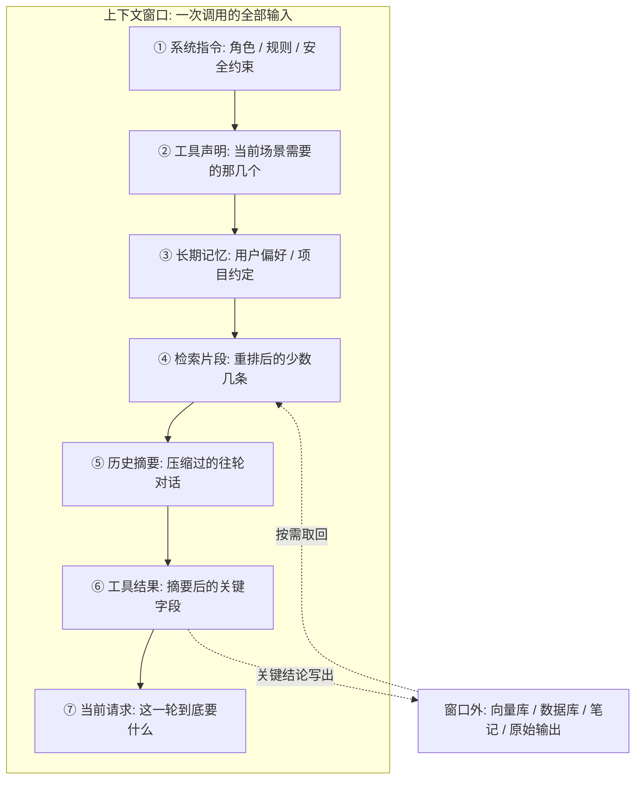

# 上下文工程（Context Engineering）

你调了三天提示词，智能体还是在第 40 轮开始胡说八道。换更强的模型、把系统提示写到 3000 字、反复抠措辞——都没用。

因为问题不在那句提示词上，而在于：**第 40 轮时，模型眼前的上下文窗口里塞的是什么**。那里面有几十轮对话原文、十几个工具返回的原始 JSON、二十段检索片段。你写的 3000 字系统提示，被压在最底下。

::: tip 一句话定义
**上下文工程（Context Engineering）** = 不再只打磨一条提示词，而是把「模型每一步能看到的全部内容」当成一个要被主动设计的系统：谁进窗口、谁被压缩、谁排在前面、谁该隔离出去。
:::

## 提示工程 vs 上下文工程

**上下文工程不是提示工程的替代品，是它的上一层。** 提示词依然重要，只是成了被管理的对象之一。

| 维度 | 提示工程 | 上下文工程 |
| --- | --- | --- |
| 管理对象 | 一段提示词 | 整个上下文状态 |
| 核心问题 | 这句话怎么写 | 这一步该让它看到什么 |
| 适用场景 | 单轮、短任务 | 多轮、带工具、长任务 |
| 主要手段 | 角色、示例、格式约束 | 检索、压缩、排序、记忆、隔离 |
| 典型故障 | 指令不清 | 上下文污染、状态丢失、信息过载 |
| 本质 | 写作 | 系统设计 |

一句话记：**提示工程决定模型「怎么说」，上下文工程决定它「基于什么来想和做」**。

Andrej Karpathy 有个流传很广的类比：把大语言模型（LLM）当 CPU，上下文窗口就是 RAM——容量有限、需要主动调度，不是拿来倒垃圾的。Anthropic 在 2025 年 9 月的工程博客里正式把这件事命名为「上下文工程」，称之为提示工程的自然延伸。

## 为什么是现在才火

**第一，窗口里的内容大部分不再是人写的。** 单轮问答时代，上下文就是你敲的那段字；智能体（agent）时代，里面装的是工具返回、检索片段、历史摘要、失败日志，你能控制的只是「让哪些进来」。

**第二，窗口变大了，塞满反而更糟。** 2026 年百万词元（token）级窗口已稀松平常，很多人第一反应是「全塞进去不就完了」。实测会撞上四种衰减：

| 失效模式 | 症状 |
| --- | --- |
| 中间失焦（lost in the middle） | 开头结尾最受关注，埋在中间的关键约束被跳过 |
| 上下文分心 | 十条「沾点关系」的结果比两条精准的更糟，推理被带偏 |
| 上下文污染 | 早期进来一条错误事实，后面每轮都被复述、放大 |
| 上下文腐化（context rot） | 还没到硬上限，召回和推理质量就开始下滑 |

成本和延迟是看得见的税；**准确率下滑是看不见的那笔，更贵**。所以窗口越大，「选什么」越重要。

> 类比：给实习生一本 800 页手册，不如给他你圈出的 3 页。他不是记不住，是找不着重点。

## 上下文是拼出来的



顺序有两条讲究：**稳定的放前、易变的放后**（①②③ 每次都一样，④⑤⑥ 每轮在变，这么排前缀才能吃到缓存）；**当前请求放最末**（模型对结尾注意力最高）。

## 四个动作：写、选、压、隔离

**写（Write）——把东西放到窗口外面。** 窗口是 RAM，你还得有硬盘：草稿笔记、落库的长期记忆、几百行原始 JSON。窗口里只留摘要加一个引用 ID，要细节再回读。这样**智能体不再依赖「一直记着」，而是依赖「知道去哪儿翻」**。

**选（Select）——决定谁能进来。** 标准只有一句：**不会改变答案的内容，就不该在窗口里。** 做法是混合检索（关键词 + 向量）后重排（rerank），只留 top 2~5 条；加时效、权限、来源硬过滤；工具按场景暴露；历史按相关性挑而非取最近 N 轮。**好的检索胜过大的检索**。

**压（Compress）——把长的变短。** 窗口快满时做**压实（compaction）**：把历史总结成一段替换原文，关键是保住任务推进必需的信息（进度、已确认结论、待办、失败过的路径），而不是单纯求短。40 行的 API 响应通常只有三个字段有用，就送那三个。

**隔离（Isolate）——给子任务干净的窗口。** 主智能体只传一段压缩后的任务描述，子智能体在**全新窗口**里只带这活需要的指令和资料，干完返回精简结果。三个各守干净上下文的子智能体，明显好过一个背着全部历史包袱的大智能体——这也是「跑到第 80 步就变笨」的主要解法。

### 长上下文的两条实战策略

**按需加载（just-in-time context）**：别在开局预先塞满可能用到的资料，让它真需要时自己去取。预加载看着稳妥，实际是拿窗口空间赌「说不定会用到」。

**结构化笔记**：让它把进展写成外部笔记（任务 ID、阶段、已完成、待执行、阻塞项），下一轮开头读回来，比从 50 轮对话里自己回忆可靠得多。

## 用提示缓存（prompt caching）把钱省下来

上下文工程有个实惠的副产品：**排序排对了，钱直接省一大截**。

各家 API 都支持对**重复的输入前缀**走缓存，命中部分按远低于正常输入的价格计费（折扣各家不同，以官方定价页为准；OpenAI 侧一般是自动前缀缓存，Anthropic 侧需显式打 `cache_control` 标记）。

命中有个硬条件：**前缀必须逐字节一致**。所以系统指令、工具声明、长期偏好这些几乎不变的放最前面就每次都命中；而在系统提示里塞 `当前时间：2026-08-27 14:32:07`，或每轮动态重排工具顺序，**整段前缀缓存全废**。见过团队被一个时间戳烧掉几倍成本，改动只是把它挪进用户消息。

```js
// 需 API Key：https://platform.openai.com 获取，设为环境变量 OPENAI_API_KEY
// 模型：gpt-5（OpenAI，2025 年发布的旗舰系列）
// 【示意】重点看 messages 的顺序，而非具体字段
const messages = [
  // ↓ 稳定前缀区：一个字都别动态拼接，缓存全靠它 ↓
  { role: 'system', content: SYSTEM_RULES },   // ① 指令，常量
  { role: 'system', content: USER_PROFILE },   // ③ 长期偏好，极少变
  // ↑ 缓存命中区到此为止；tools 参数同样应当稳定 ↑

  // ④ 检索片段：重排后只留 3 条，带出处
  { role: 'system', content: `参考资料（仅依据以下内容回答，无依据请说不知道）：
[1] 退款政策 3 条：7 天内无理由退货…
[2] 退款政策 5 条：定制商品不支持无理由退货…
[3] 订单 20260827001：定制款，已生产` },

  // ⑤ 历史摘要：压实过的，不是原文
  { role: 'assistant', content: '（上文摘要）用户就一笔定制订单申请退款。' },

  // ⑥ 工具结果：只留关键字段，原始 JSON 存窗口外
  { role: 'tool', tool_call_id: 'call_1', content: '{"order_id":"20260827001","status":"in_production","customized":true}' },

  { role: 'user', content: '那我这单到底能不能退？' },   // ⑦ 当前请求放最末

  // ❌ 反例：时间戳写进 system → 前缀每次都变，缓存永远打不中
  // { role: 'system', content: `当前时间：${new Date().toISOString()}` },
]
```

## 检索增强生成（RAG）怎么融进上下文

很多人把检索增强生成（RAG）和上下文工程当同一件事。不是——**RAG 只是「选」的一种实现**，上下文工程还要管记忆、工具结果、压缩、排序、隔离。接进来时有三条实践：

1. **检索完必须重排 + 截断**。召回 20 条、重排、只留 3 条。塞 20 条不是更保险，是制造分心。
2. **必须带出处**，并要求「只依据参考资料回答，没依据就说不知道」。这是事实对齐（grounding）最省的做法。
3. **别一次检索到底**。智能体可以查完发现不对再换关键词，这正是它比一次性 RAG 强的地方，见 [ReAct](/advanced/react)。

排障还有个实用习惯：**把失败请求实际进入窗口的内容记下来**。绝大多数「模型答错了」，翻日志会发现它根本没看到正确资料。

::: warning 常见坑
- **窗口大就往里堆**：百万词元不是让你填满的。四种衰减都是静默发生的——不报错，只是变笨。
- **历史只加不减**：对话和工具输出无脑追加，几十轮必然糊。压实和清理要一开始就设计。
- **动态内容污染缓存前缀**：一个时间戳、一次工具重排，就让整段前缀缓存作废，账单翻几倍。
- **失败不闭环**：报错原因没写回上下文，模型只会原地重试到步数耗尽。
:::

## 速查清单 ✅

- [ ] 能说清两者关系：提示工程是上下文工程的一层
- [ ] 记住 CPU/RAM 类比：窗口是稀缺工作内存
- [ ] 能背出四个动作：写、选、压、隔离
- [ ] 知道四种衰减：中间失焦、分心、污染、腐化
- [ ] 会排序：稳定的在前、易变的在后、当前请求在最末
- [ ] 知道提示缓存要求前缀逐字节一致，别在系统提示塞时间戳
- [ ] 排障先看「实际进入窗口的内容」，而不是先改提示词

## 记忆卡片 🃏

> **上下文工程** = 系统性地决定「模型这一步能看到什么」，而不是打磨一条提示词。
> 四个动作：**写**（外置）、**选**（少而精）、**压**（压实摘要）、**隔离**（子任务独立窗口）。
> 排序口诀：**稳定的在前吃缓存、易变的在后、当前请求放最末**。
> 反直觉的一条：窗口越大，「选什么」越重要。

## 小结

智能体表现差，多数时候不是模型笨，而是**它这一步看到的东西不对**——太多、太旧、顺序错、类型不对。上下文工程把这件事从「凭感觉写提示词」升级成可设计、可排障的系统工程：用**写**外置，用**选**控入口，用**压**腾空间，用**隔离**保干净，顺手吃到缓存折扣。

提示工程没有过时，它变成了这套系统里的**指令层**。基础见[什么是提示工程](/introduction/what-is)，智能体怎么搭见[核心组成](/agents/components)与[函数调用](/agents/function-calling)。

---

> **来源与授权**：本文改编自 [dair-ai/Prompt-Engineering-Guide](https://github.com/dair-ai/Prompt-Engineering-Guide)（MIT License，Copyright 2022 DAIR.AI），并参考 [promptingguide.ai](https://www.promptingguide.ai) 与 [deepwiki.com.cn](https://deepwiki.com.cn/dair-ai/Prompt-Engineering-Guide) 的中文内容。仅供学习交流，保留原作者版权声明。
