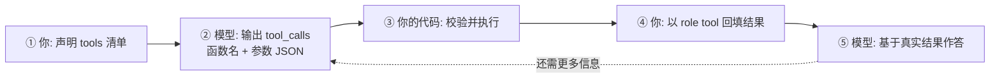

# 函数调用与工具调用（Function Calling）

有个误解特别普遍：以为模型能「自己去查天气」。

它不能。模型唯一会做的事是**生成文本**。所谓函数调用，是模型生成了一段结构化的话——「我想调用 `get_weather`，参数是 `{"city":"北京"}`」——然后**你的代码**去把这个函数真正执行掉，再把结果告诉它。

模型出主意，你出手。这就是全部机制。

::: tip 一句话定义
**函数调用（Function Calling）**，也叫**工具调用（tool use）** = 你事先声明一批函数的名字、用途和参数格式，模型在需要时输出「要调哪个 + 传什么参数」的结构化结果，由外部代码执行后把返回值回填进上下文，模型再据此继续。
:::

## 为什么必须走这一步

因为如果不走，模型只会**编**。

你问「我的订单 20260827001 到哪了」，没有工具的模型会给你一个语气特别肯定的编造答案。这是幻觉（hallucination）最常见的发生场景之一：不是模型坏，是它压根没有获取真实数据的通道。

函数调用给的就是这个通道。它顺手还解决了另外两件事：

- **算得准**：把「算一下年化收益」交给计算器函数，比让模型心算靠谱得多。
- **能动手**：发邮件、写数据库、创建工单——凡是要改变外部世界的，都得靠工具。

> 关键的安全设计在这里：**决定权在模型，执行权在你**。模型只能「请求」调用，你的代码可以校验、可以拒绝、可以先弹个确认框。这条边界是故意这么设的，别绕过它。

## 三段式流程



第 ② 步模型返回的不是答案，而是**一个请求**。很多人第一次接到 `tool_calls` 时会懵：「它怎么没回答我？」——它在等你干活。

## tools 参数结构

以 OpenAI 的 Chat Completions 为例，一个工具声明长这样：

| 字段 | 作用 | 写法要点 |
| --- | --- | --- |
| `type` | 固定 `'function'` | — |
| `function.name` | 函数名，模型用它标识调哪个 | 用小写下划线，语义清楚，如 `get_order_status` |
| `function.description` | **模型选工具的唯一依据** | 写清「什么时候用它」，而不只是「它是什么」 |
| `function.parameters` | 参数结构，用 JSON Schema 描述 | 每个字段都写 `description`，枚举值用 `enum` 锁死 |
| `parameters.required` | 哪些参数必填 | 必填项要真的必填，别全塞进去 |
| `strict` | 严格模式，强制参数完全贴合 Schema | 支持的模型上建议开，能大幅减少参数格式错误 |

一句话总结写法：**`description` 写给模型看，`parameters` 写给你的代码看**。前者决定它选不选对，后者决定它传不传对。

## 可复制示例（示意）

```js
// 需 API Key：https://platform.openai.com 获取，设为环境变量 OPENAI_API_KEY
// 模型：gpt-5（OpenAI，2025 年发布的旗舰系列）；Claude / Gemini / DeepSeek 的工具调用字段名略有差异，思路一致
// 【示意】完整循环见 /agents/what-is-agent，这里聚焦 tools 的结构写法
import OpenAI from 'openai'
const client = new OpenAI({ apiKey: process.env.OPENAI_API_KEY })

const tools = [{
  type: 'function',
  function: {
    name: 'get_order_status',
    // ① 说清"什么时候该用我"，模型全靠这句话判断
    description: '当用户询问某个订单的进度、物流或签收情况时调用。需要 18 位订单号。',
    parameters: {
      type: 'object',
      properties: {
        order_id: {
          type: 'string',
          description: '18 位数字订单号，如 20260827001234567',
        },
        // ② 可选值用 enum 锁死，比在 description 里写「可以填 xx 或 yy」可靠得多
        detail: {
          type: 'string',
          enum: ['brief', 'full'],
          description: 'brief 只返回状态，full 返回完整物流轨迹。默认 brief。',
        },
      },
      required: ['order_id'],
      additionalProperties: false,
    },
    strict: true, // ③ 严格模式：参数必须完全符合上面的 Schema
  },
}]

const messages = [
  { role: 'user', content: '订单 20260827001234567 到哪了？给我详细轨迹。' },
]

const res = await client.chat.completions.create({
  model: 'gpt-5',
  messages,
  tools,
  // tool_choice: 'auto' 是默认；想强制必须调某个工具，可指定
  // tool_choice: { type: 'function', function: { name: 'get_order_status' } }
})

const call = res.choices[0].message.tool_calls?.[0]
console.log(call.function.name, call.function.arguments)
// 输出示例：get_order_status {"order_id":"20260827001234567","detail":"full"}

// ④ 接下来：你自己校验 order_id 是否合法 → 查真实系统 → 以 role:'tool' 回填
// messages.push(res.choices[0].message)
// messages.push({ role: 'tool', tool_call_id: call.id, content: JSON.stringify(realResult) })
```

注意 `arguments` 是**字符串**，不是对象，得自己 `JSON.parse`。这是新手第一天必踩的坑。

## 和结构化输出是什么关系

两者底层是一套东西——都靠 JSON Schema 约束模型输出的形状——但用途不同：

- **结构化输出**：你要一份**数据**，比如把发票图片抽成 JSON。终点就是那个 JSON。
- **函数调用**：你要模型**发起一个动作**。JSON 只是中间产物，真正的重点是后面那次执行和回填。

判断方法：**要东西 → 结构化输出；要做事 → 函数调用**。想深入 Schema 的写法，见[结构化输出](/advanced/structured-output)。

## 新趋势：MCP（Model Context Protocol）

原生函数调用有个规模问题：**每个模型 × 每个工具，都要你手写一遍胶水代码**。

5 个模型接 10 个工具，理论上要写 50 套适配。工具的鉴权、错误处理、参数映射，全得重复。这个「N×M 问题」就是 MCP 要解决的。

**MCP（Model Context Protocol，模型上下文协议）** 是 Anthropic 在 2024 年 11 月开源的一套标准，用 JSON-RPC 定义「AI 客户端」和「工具服务端」之间怎么说话。你把工具封装成一个 **MCP 服务端（server）**，任何支持 MCP 的客户端（Claude、ChatGPT、Cursor、各种 IDE 与智能体框架）都能直接用，不用为每家再写一遍。

官方的类比是「AI 世界的 USB-C」——接口统一了，线就能通用。

一个 MCP 服务端对外暴露三类东西：

| 暴露内容 | 是什么 | 例子 |
| --- | --- | --- |
| Tools（工具） | 可被调用的函数 | 查数据库、创建 issue、发消息 |
| Resources（资源） | 可被读取的数据 | 文件内容、表结构、文档 |
| Prompts（提示模板） | 可复用的提示词模板 | 「代码审查」标准流程 |

**它没有取代函数调用**，这点特别容易搞混：

> 模型侧依然是函数调用——模型输出「要调哪个工具、传什么参数」这件事没变。MCP 管的是**这个调用请求怎么送到工具那边、工具清单从哪儿发现**。两者是叠加关系，不是替代关系。

### 生态现状（2026 年）

- **治理中立化**：2025 年 12 月 Anthropic 把 MCP 捐给了 Linux 基金会旗下新成立的 Agentic AI Foundation（AAIF），OpenAI、Block 等作为联合成员参与。这一步消掉了企业最大的顾虑——标准不再由单一厂商控制。
- **跨厂商支持**：OpenAI 在 2025 年跟进支持，Google 生态随后加入。到 2026 年，主流客户端基本都能当 MCP 客户端用，公开的 MCP 服务端已有上万个（GitHub、Slack、Postgres、Notion、Jira 等常见系统都有现成实现）。
- **传输方式**：本地用 stdio，远程用 streamable HTTP；早期的 SSE 方案已被规范弃用，新项目别再用。远程服务端的鉴权走 OAuth 2.1 + PKCE。

### 什么时候用 MCP，什么时候不用

| 场景 | 建议 |
| --- | --- |
| 一个工具只给你自己的一个应用用，短期也不会变 | **别上 MCP**，原生函数调用更轻 |
| 同一批工具要给多个客户端 / 多个模型用 | **上 MCP**，一次封装到处能跑 |
| 企业内部工具多、还在持续增加 | **上 MCP**，省掉 N×M 的重复适配 |
| 想直接接 GitHub、数据库、Slack 这类常见系统 | **上 MCP**，社区已有现成服务端 |

::: warning 常见坑
- **`arguments` 当成对象用**：它是 JSON 字符串，必须先 `JSON.parse`，而且要对解析失败做兜底——模型偶尔会给出不合法的 JSON。
- **参数不校验直接执行**：模型可能传出越权的 ID、超范围的数值。工具实现内部必须自己校验和限权，别把 Schema 当安全防线——Schema 只约束形状，不约束意图。
- **工具描述含糊**：`description: '查询数据'` 会让模型乱调或干脆不调。写清「什么情况下调我」。
- **一次暴露几十个工具**：声明本身烧词元（token），且选错率随数量上升。按场景只给需要的那几个。
- **把安装 MCP 服务端当成装插件**：本地 MCP 服务端通常以你的权限直接运行进程，风险等级和「从 npm 装一个 CLI 工具」一样。来源不明的别装，这在 2026 年已经有公开披露的实际攻击面。
:::

## 速查清单 ✅

- [ ] 能说出三段式：声明 tools → 模型输出 tool_calls → 你执行并回填
- [ ] 记住模型只请求、不执行；执行权和安全边界都在你的代码里
- [ ] 知道 `description` 决定选不选对、`parameters` 决定传不传对
- [ ] 知道 `arguments` 是字符串，要 `JSON.parse` 并做兜底
- [ ] 能说清 MCP 是什么、以及它不替代函数调用
- [ ] 会判断「一个应用用」vs「多客户端复用」来决定是否上 MCP
- [ ] 知道装 MCP 服务端要看来源

## 记忆卡片 🃏

> **函数调用** = 模型说「调这个、传这些」，你的代码去执行，再把结果回填。
> 模型出主意，你出手——决定权在模型，执行权在你。
> **MCP** = 工具调用的统一接口标准（2024 年 11 月由 Anthropic 提出，2025 年 12 月移交 Linux 基金会 AAIF 治理），解决 N×M 适配问题，与函数调用叠加使用而非替代。

## 小结

函数调用是智能体的**手**：模型输出结构化的调用请求，你的代码负责校验、执行、回填。写好它的关键在两处——`description` 让模型选对工具，参数校验让你自己别翻车。

规模上来之后，逐个手写适配会拖死你，这时该考虑 MCP：把工具封装成标准服务端，一次写好多端复用。至于工具结果、记忆、检索内容该怎么塞进有限的上下文窗口，那是另一门功课：[上下文工程](/agents/context-engineering)。

---

> **来源与授权**：本文改编自 [dair-ai/Prompt-Engineering-Guide](https://github.com/dair-ai/Prompt-Engineering-Guide)（MIT License，Copyright 2022 DAIR.AI），并参考 [promptingguide.ai](https://www.promptingguide.ai) 与 [deepwiki.com.cn](https://deepwiki.com.cn/dair-ai/Prompt-Engineering-Guide) 的中文内容。仅供学习交流，保留原作者版权声明。
