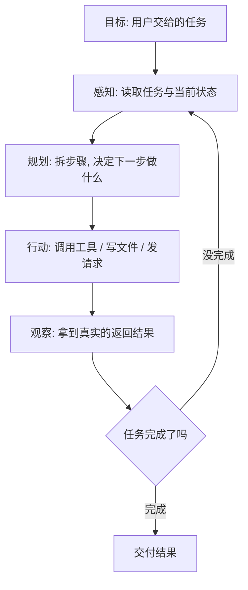

# 什么是智能体（Agent）

你让 AI「帮我写一段产品文案」，它回你一段话，完事——这是**问答**。

你让 AI「查一下下周三团队谁有空，订个会议室，再把通知发到群里」，它得去翻日历、调订会系统、发消息，中间还要根据查到的结果改主意——这就不是一次问答能搞定的了。这时候你需要的是**智能体**。

::: tip 一句话定义
**智能体（agent）** = 以大语言模型（LLM）为大脑，能自己按「感知 → 规划 → 调工具 → 行动 → 观察结果」的循环反复迭代，直到完成目标的系统。
:::

关键词是**循环**和**自主**。普通问答是「你问一句、它答一句」；智能体是「你给个目标，它自己转好几圈，中间要查什么、要调什么，它自己决定」。

## 为什么需要智能体

单次问答有三道天花板，靠改提示词是翻不过去的：

1. **知识过期**：模型的知识停在训练截止那天。你问它「我们仓库现在还有几件货」，它只能瞎猜。
2. **只会说、不会动**：它能写出一封退款邮件的内容，但发不出去。发邮件这个动作，模型自己做不到。
3. **一步走不完**：「对比三家供应商报价再出结论」，这需要查三次、比一次、写一次。硬塞进一个提示里，它大概率漏掉一半。

智能体就是把这三个洞补上：给它**眼睛**（读取真实数据）、给它**手**（调用工具）、给它**耐心**（多轮循环，不行就换个思路再来）。

> 类比：普通问答像考试时的闭卷答题，只能凭记忆写；智能体像开卷 + 允许你中途去查资料、打电话、跑数据，答完还能自己检查一遍再交卷。

## 它是怎么转起来的



这五步里，最容易被忽略的是**观察**。很多人以为智能体的本事在「规划」，其实**它厉害的地方是能看到自己行动的真实后果**——工具报错了、查出来是空的、数据和预期不一样，它就能据此改计划。少了这一环，它就只是个「一口气编完一整套步骤」的作文机器。

这个循环的骨架，就是 [ReAct（推理 + 行动）](/advanced/react)那一套 Thought → Action → Observation。你可以把 ReAct 理解成智能体最经典的那种转法。

## 智能体 vs 单次问答

| 对比项 | 单次问答 | 智能体 |
| --- | --- | --- |
| 交互形态 | 你问一句，它答一句 | 你给目标，它自己转 N 圈 |
| 能不能拿实时数据 | 不能 | 能，靠调工具 |
| 能不能改变外部世界 | 不能 | 能，能下单、写库、发消息 |
| 中途出错怎么办 | 你重写提示词 | 它看到报错，自己换路子重试 |
| 谁决定下一步 | 你 | 它（在你划定的范围内） |
| 成本 | 一次调用 | 多次调用，明显更贵更慢 |

最后一行很重要：**智能体不是升级版问答，是另一种成本结构**。能一句话答完的事，别上智能体。

## 一个智能体最少要有哪几样东西

- **一个能调工具的模型**：2025 年之后的主流模型（GPT-5 系列、Claude Sonnet/Opus 系列、Gemini 3 系列、DeepSeek V3/V4 等）都原生支持工具调用（tool use），这是前提。
- **一组工具**：搜索、查库、执行代码、调你自己的 API，都算。
- **一个循环**：一段 `while` 循环，负责「把模型的调用请求执行掉，再把结果塞回去」。
- **一个刹车**：最大步数、超时、花费上限。没有刹车的智能体会烧钱烧到你心疼。

四样里，前两样靠模型和 API，后两样得你自己写。

## 可复制示例（OpenAI 格式）

下面是一个**能真正跑起来的最小智能体**：只有一个工具、一段循环，但形状和生产环境里的智能体是一样的。

```js
// 需 API Key：https://platform.openai.com 获取，设为环境变量 OPENAI_API_KEY
// 模型：gpt-5（OpenAI，2025 年发布的旗舰系列）；换成 claude-sonnet 系列、gemini-3-pro、deepseek-chat 同理
import OpenAI from 'openai'
const client = new OpenAI({ apiKey: process.env.OPENAI_API_KEY })

// ① 给智能体一只"手"：查库存
const tools = [{
  type: 'function',
  function: {
    name: 'check_stock',
    description: '按商品名查询当前库存件数。商品名必须是完整名称。',
    parameters: {
      type: 'object',
      properties: { name: { type: 'string', description: '商品名，如「登山杖」' } },
      required: ['name'],
    },
  },
}]

// 真正干活的本地函数（生产里这里会去查数据库）
function checkStock({ name }) {
  const db = { 户外背包: 12, 登山杖: 0 }
  return { name, stock: db[name] ?? 0 }
}

const messages = [
  { role: 'system', content: '你是仓库助手。回答必须基于工具查到的真实库存，不许估算。' },
  { role: 'user', content: '登山杖和户外背包分别还有多少货？' },
]

// ② 智能体循环：想 → 调工具 → 看结果 → 再想。最多 6 步，这就是"刹车"
for (let step = 0; step < 6; step++) {
  const res = await client.chat.completions.create({ model: 'gpt-5', messages, tools })
  const msg = res.choices[0].message
  messages.push(msg)

  // 模型这轮没再要求调工具 → 它认为活干完了，跳出循环
  if (!msg.tool_calls?.length) {
    console.log('最终答复：', msg.content)
    break
  }

  // ③ 执行它要求的每个调用，把真实结果回灌进上下文——这一步就是"观察"
  for (const call of msg.tool_calls) {
    const args = JSON.parse(call.function.arguments)
    messages.push({
      role: 'tool',
      tool_call_id: call.id,
      content: JSON.stringify(checkStock(args)),
    })
  }
}
// 输出示例：登山杖当前 0 件，已缺货；户外背包还有 12 件。
```

把这段代码从头到尾读一遍，你就理解了智能体的全部秘密：**它不神秘，就是一个 for 循环里反复问模型「下一步干啥」，然后替它把活干掉**。工具调用的参数怎么写，见[函数调用](/agents/function-calling)。

::: warning 常见坑
- **没设刹车**：模型可能一直「再查一下」不收手。步数上限、词元（token）预算、超时，三个至少设一个。
- **忘了把结果回灌**：你执行完工具，必须以 `role: 'tool'` 塞回 `messages`。不然模型「动了手却看不见结果」，循环直接断掉。
- **给了危险的手**：只要工具里有「删数据」「下单付款」「发对外邮件」，就必须加人工确认环节。智能体不会替你承担后果。
- **拿智能体干问答的活**：翻译一段话、改一句文案，一次调用就够了。硬套循环只会更慢、更贵、还更容易跑偏。
:::

## 什么不算智能体

市面上很多东西自称智能体，其实不是。快速分辨：

- **只会检索再回答的**（一次检索 + 一次生成）→ 那是[检索增强生成（RAG）](/advanced/rag)，不是智能体，因为它不会「查完发现不对，再换个词查」。
- **工作流写死的**：步骤 1→2→3 全是你写死的代码，模型只负责填空 → 那是自动化流水线。智能体的核心区别是**下一步做什么由模型自己决定**。
- **提示词特别长的**：3000 字的系统提示不等于智能体。没循环、没工具，它还是问答。

这条界线不是抠字眼：**能不能自主决定下一步**，直接决定了你要不要为它准备刹车、审计日志和权限控制。

## 速查清单 ✅

- [ ] 能说出智能体的五步循环：感知 → 规划 → 行动 → 观察 → 再来
- [ ] 知道智能体补的是「知识过期 / 不会动手 / 一步走不完」三个洞
- [ ] 明白「观察必须来自真实工具返回」，不能让模型自己编
- [ ] 会给智能体设刹车：步数上限 / 预算 / 超时
- [ ] 能分清智能体、RAG、写死的工作流
- [ ] 知道简单任务不该上智能体

## 记忆卡片 🃏

> **智能体** = 会自己转圈的 AI：感知 → 规划 → 调工具 → 行动 → 看结果 → 再来一轮。
> 和问答的根本区别：**下一步做什么，它自己定**。
> 三件必备：能调工具的模型 + 一组工具 + 一个带刹车的循环。

## 小结

智能体不是「更聪明的聊天机器人」，而是**把模型放进一个循环里，让它能看到真实世界的反馈并据此调整**。它补上了单次问答的三个硬伤：知识过期、不会动手、一步走不完；代价是更贵、更慢、需要你亲手装刹车。

搞清楚它是什么之后，下一步该拆开看它内部有哪几个零件：[智能体的核心组成](/agents/components)。

---

> **来源与授权**：本文改编自 [dair-ai/Prompt-Engineering-Guide](https://github.com/dair-ai/Prompt-Engineering-Guide)（MIT License，Copyright 2022 DAIR.AI），并参考 [promptingguide.ai](https://www.promptingguide.ai) 与 [deepwiki.com.cn](https://deepwiki.com.cn/dair-ai/Prompt-Engineering-Guide) 的中文内容。仅供学习交流，保留原作者版权声明。
