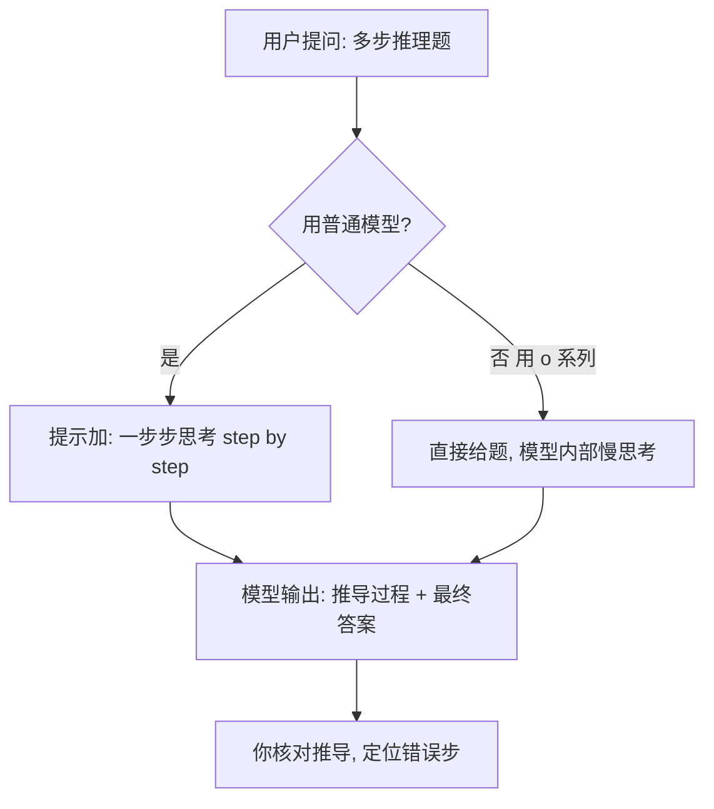

# 推理

你让模型「一列火车 3 小时走 240 公里，再走 2 小时时速 90，总平均时速多少」——这种**要一步步算、不能直接拍脑袋**的活，就是**推理（Reasoning）**。模型一次性给答案容易算错，得教它「把过程写出来」。

::: tip 一句话定义
**推理（Reasoning）** = 让模型处理需要多步推导的任务（数学、逻辑、规划），并产出可验证的推理过程。
:::

## 为什么值得专门学

- **直接要答案会翻车**：复杂题模型常「跳步」导致结果错。
- **过程可见才好查**：写出中间步骤，你能定位哪步错了。
- **推理模型已很强**：`o1` / `o3`（OpenAI, 2024–2025）这类推理模型自带慢思考，难题表现远超普通模型。

> 类比：推理像解应用题——只写「答：X」你不敢信，写出「因为…所以…」才放心。

## 核心技巧：思维链

**思维链（Chain-of-Thought，CoT）** 就是让模型「一步步思考（think step by step）」，把中间推理显式写出来。详见 [思维链进阶篇](/advanced/cot)。

两种用法：
- **手动引导**：提示里加「请一步步推理，最后再给答案」。
- **少样本 CoT**：给 1–2 个「问题→推导→答案」范例，模型照学。

推理模型（o 系列）则不同：它们内部已自动做长链思考，**不用写 CoT 提示**，直接给题即可，但要在 API 上稍作等待。

## 推理流程（mermaid）



## 可复制示例（OpenAI 格式）

```js
// 需 API Key：https://platform.openai.com 获取，设为环境变量 OPENAI_API_KEY
// 普通模型写法：gpt-4o（OpenAI, 2024 年发布），配合思维链提示
// 推理模型写法：o1（OpenAI, 2024 年发布），无需 CoT 提示，直接给题
import OpenAI from 'openai'

const client = new OpenAI({ apiKey: process.env.OPENAI_API_KEY })

const question = `一列火车前 3 小时以 80 km/h 行驶，后 2 小时以 90 km/h 行驶。
求全程的平均时速。`

// 方案 A：gpt-4o + 思维链
const r1 = await client.chat.completions.create({
  model: 'gpt-4o',
  messages: [
    { role: 'system', content: '你是数学老师，解题要一步步推导。' },
    { role: 'user', content: `请一步步思考（think step by step），最后写「答案：X km/h」。
${question}` },
  ],
})
console.log(r1.choices[0].message.content)
// 思路：总路程 = 3*80 + 2*90 = 420 km；总时间 = 5 h；平均 = 420/5 = 84 km/h

// 方案 B：推理模型 o1（无需 CoT 提示）
const r2 = await client.chat.completions.create({
  model: 'o1',
  messages: [{ role: 'user', content: question }],
})
console.log(r2.choices[0].message.content)
```

**适用模型建议**：难题用推理模型 `o1` / `o3` / `DeepSeek-R1`；简单题用 `gpt-4o` + 思维链即可，更便宜更快。

::: warning 常见坑
- **普通模型直接要答案**：跳步必错，务必加「一步步思考」。
- **推理模型硬套 CoT**：o 系列内部已思考，再写「step by step」反而冗余、拖慢。
- **不核对推导**：即使过程长，也要检查关键一步，模型可能某步算术错。
- **温度太高**：推理任务设 `temperature: 0` 更稳。
:::

## 速查清单 ✅

- [ ] 复杂推理用思维链（CoT）让模型写过程
- [ ] 会用 gpt-4o + CoT 与 o1 两种方案
- [ ] 知道推理模型无需 CoT 提示
- [ ] 推理任务设 `temperature: 0`
- [ ] 拿到结果后核对关键推导步

## 记忆卡片 🃏

> **推理** = 多步推导题，要让模型写出过程。
> 普通模型加「一步步思考」；o 系列直接给题。温度调 0，核对步骤。

## 小结

推理任务别让模型直接蹦答案，配合**思维链**让它写清步骤，或用 `o1` 这类推理模型自动慢思考。关键在于过程可见、可核对。下一篇讲**数据生成**：[/applications/data-generation](/applications/data-generation)。

---

> **来源与授权**：本文改编自 [dair-ai/Prompt-Engineering-Guide](https://github.com/dair-ai/Prompt-Engineering-Guide)（MIT License，Copyright 2022 DAIR.AI），并参考 [promptingguide.ai](https://www.promptingguide.ai) 与 [deepwiki.com.cn](https://deepwiki.com.cn/dair-ai/Prompt-Engineering-Guide) 的中文内容。仅供学习交流，保留原作者版权声明。
