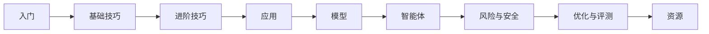

## 学习路径

下面是一条推荐的学习路线，帮助你从零开始逐步深入提示工程（Prompt Engineering）：

## 分区导览

按下面的板块顺序学习，每一步只依赖前一步：

| 板块 | 讲什么 | 从哪开始 |
| --- | --- | --- |
| 🟢 入门 | 提示工程是什么、一条好提示有哪几块、基础原则 | [什么是提示工程](/introduction/what-is) |
| 🔵 基础技巧 | 零样本 / 少样本 / 指令式 / 输出格式 | [零样本提示](/techniques/zero-shot) |
| 🟣 进阶技巧 | 思维链 / 自洽性 / 思维树 / ReAct / RAG / 多模态 | [思维链 CoT](/advanced/cot) |
| 🟠 应用 | 摘要 / 问答 / 分类 / 抽取 / 代码 / 推理 / 数据生成 | [文本摘要](/applications/summarization) |
| 🔷 模型 | GPT / Claude / Gemini / Llama / 国产模型怎么选 | [模型概览与选型](/models/overview) |
| 🟤 智能体 | 什么是 Agent、核心组成、函数调用、上下文工程 | [什么是智能体](/agents/what-is-agent) |
| 🔴 风险与安全 | 对抗攻击 / 提示注入 / 越狱 / 可靠性 | [对抗攻击](/risks/adversarial) |
| 🟡 优化与评测 | 怎么把提示词改得更好、怎么量化好坏 | [提示优化方法](/optimization/optimizing-prompts) |
| ⚪ 资源 | 论文 / 工具 / 数据集 / 学习路径 | [必读论文清单](/resources/papers) |

## 现在开始

点击右上角的 **快速开始**，或直接阅读 [什么是提示工程](/introduction/what-is) 迈出第一步。每篇文章末尾都有「速查清单」和「记忆卡片」，方便你确认自己真的学会了。

## 来源与授权

- 改编自 [dair-ai/Prompt-Engineering-Guide](https://github.com/dair-ai/Prompt-Engineering-Guide)（MIT License，Copyright 2022 DAIR.AI）。
- 原始英文站点：[promptingguide.ai](https://www.promptingguide.ai)。
- 中文资料参考：[deepwiki.com.cn/dair-ai/Prompt-Engineering-Guide](https://deepwiki.com.cn/dair-ai/Prompt-Engineering-Guide)。
- 仅供学习交流使用；每篇文章页脚均保留 MIT 来源声明。
