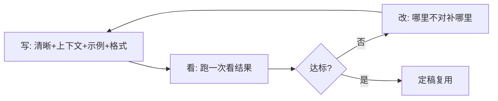

# 提示工程基础原则

你写提示词（prompt）时，是不是经常凭感觉？感觉哪里不对就加点字，结果越改越乱。其实提示工程（Prompt Engineering）有 5 条「基本功」，照着练，质量立刻稳下来。

::: tip 一句话定义
**提示工程基础原则** = 写提示时遵循的 5 条通用法则：清晰具体、给上下文、给示例、定格式、反复迭代。
:::

## 为什么需要「原则」而不是「模板」

任务千奇百怪，没法给每个场景配一个模板。但原则能迁移——不管是写文案、做分类还是写代码，这 5 条都成立。

> 类比：原则是「烹饪基本功」（火候、刀工、调味），模板是「某道菜谱」。基本功练好，什么菜都做得像样。

## 五条原则逐一拆解

### 1. 清晰具体

别让模型猜。把「要什么、不要什么、给谁看」一次说清。模糊的描述会逼模型自己脑补，脑补就容易歪。

### 2. 给足上下文

把模型不知道但解题必需的信息补上：背景、目标读者、约束。上下文不够，模型只能套通用套路，结果「对、但没用」。

### 3. 给示例

当你要的是特定格式或风格，举 1~N 个「输入→输出」样例，让模型照着学（这就是少样本提示，见 [少样本提示（Few-Shot）](/techniques/few-shot)）。示例往往比千言万语的解释更管用。

### 4. 指定输出格式

要列表、表格、JSON 还是 Markdown？明说。结构化输出还能方便程序接着处理，见 [指定输出格式](/techniques/format)。

### 5. 迭代优化

好提示是改出来的，不是一次写对的。固定走「写 → 看 → 改」的闭环：跑一次看哪不行，针对性加约束或示例，再跑。

## 模糊 vs 清晰：一张表看懂差距

| 维度 | ❌ 模糊写法 | ✅ 清晰写法 |
| --- | --- | --- |
| 任务 | 写点产品介绍 | 写一段 100 字内、面向家长的小学编程课介绍 |
| 上下文 | （没给） | 我们是线下小班课，卖点是「好玩+能参赛」 |
| 示例 | （没给） | 参考风格：「孩子边玩边学，半年做出第一个小游戏」 |
| 格式 | 随便写 | 用 1 句卖点 + 2 个要点，Markdown 列表 |
| 迭代 | 写一次就交 | 跑完发现太长→补「≤100 字」再跑 |

> 注意：清晰 ≠ 啰嗦。每条信息都得有用，删掉不影响结果的废话。

## 怎么落地：一个最小闭环



迭代时优先改「最便宜」的一块：先调指令和格式，不够再加示例，最后才考虑换模型或加复杂技巧。

## 可复制示例（OpenAI 格式）

同一条需求，模糊版和清晰版对比。下面只跑清晰版。

```js
// 需 API Key：https://platform.openai.com 获取，设为环境变量 OPENAI_API_KEY
// 模型：gpt-4o（OpenAI, 2024 年发布）；可换成 deepseek-chat / qwen-plus 等
import OpenAI from 'openai'

const client = new OpenAI({ apiKey: process.env.OPENAI_API_KEY })

const completion = await client.chat.completions.create({
  model: 'gpt-4o',
  messages: [
    {
      role: 'system',
      // 原则1+2：清晰具体 + 给角色/上下文
      content: '你是一名少儿编程课的课程顾问，擅长用家长听得懂的话讲卖点。',
    },
    {
      role: 'user',
      // 原则1 清晰任务 + 原则3 示例 + 原则4 指定格式
      content: `请写一段课程介绍。要求：
- 面向 6-12 岁孩子家长，口语化、别用术语；
- 突出卖点：好玩、能参加白名单赛事；
- 格式：先 1 句总述，再 2 个要点（Markdown 列表）；
- 总字数 ≤ 100。

参考风格示例：「孩子边玩边学，半年做出人生第一个小游戏。」`,
    },
  ],
})

console.log(completion.choices[0].message.content)
// 输出示例：
// 让孩子在玩中爱上编程，还能拿奖。
// - 项目式学习，每节课做出一个能跑的小游戏
// - 对接教育部白名单赛事，作品可直接参赛
```

::: warning 常见坑
- **把「长」当「清晰」**：堆字数不等于说清楚，冗余只会稀释重点。
- **一次塞五个任务**：一个提示专注一件事，拆分比堆叠更稳。
- **只看一次就放弃迭代**：第一版不理想很正常，改约束比换模型划算。
- **示例和指令冲突**：举例是 JSON、指令却要一段话，模型直接懵。
:::

## 速查清单 ✅

- [ ] 写提示前先想清楚「要什么、给谁看」
- [ ] 能用「清晰 vs 模糊」自检每条指令
- [ ] 该给上下文/示例/格式时舍得给
- [ ] 跑完会做「写→看→改」迭代
- [ ] 不把啰嗦当清晰

## 记忆卡片 🃏

> **提示工程基础原则** = 清晰具体、给上下文、给示例、定格式、常迭代。
> 一句话：模板救一时，原则用一世；好提示是改出来的。

## 小结

5 条原则——清晰具体、给上下文、给示例、定格式、反复迭代——是提示工程的「基本功」，比背模板更通用。下一篇把「指令」单独拎出来细讲：[指令式提示](/techniques/instructions)。

---

> **来源与授权**：本文改编自 [dair-ai/Prompt-Engineering-Guide](https://github.com/dair-ai/Prompt-Engineering-Guide)（MIT License，Copyright 2022 DAIR.AI），并参考 [promptingguide.ai](https://www.promptingguide.ai) 与 [deepwiki.com.cn](https://deepwiki.com.cn/dair-ai/Prompt-Engineering-Guide) 的中文内容。仅供学习交流，保留原作者版权声明。
