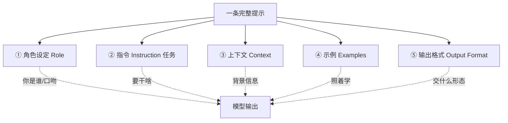

# 提示的组成部分

你有没有这种经历：同样是让 AI 写东西，别人写出来的能直接用，你写出来的像半成品？差别往往不在模型，而在**你给的那条提示里，少了几块拼图**。

::: tip 一句话定义
**一条完整提示** = 角色设定 + 指令（任务）+ 上下文 + 示例 + 输出格式，五块按需拼装，缺哪块效果就塌哪块。
:::

## 为什么要把提示拆成「块」

把提示当成一整坨文字去写，很容易顾此失彼：想起来了格式，忘了给上下文；给了上下文，又没说清要模型当什么角色。

换个思路就好办了——把它当成**搭积木**。每一块负责解决一个具体问题：

- 角色设定：解决「你是谁、该用什么口吻」
- 指令：解决「到底要干什么」
- 上下文：解决「背景是什么、别瞎编」
- 示例：解决「我要的具体长相，照这个学」
- 输出格式：解决「最后交什么形态给我」

> 类比：写提示像给新同事派活。你只说「写个方案」，他当然懵；你把「你是资深策划 / 这是 ToB 客户的 / 参考上次那份 / 要 PPT 大纲」都讲清，他才能一次到位。

## 五块分别是什么

下面用一张图先建立整体感，再逐块拆。



### ① 角色设定（Role）

一句话告诉模型「你现在是 XX 专家」。它立刻会调用对应领域的语感、术语和立场。

```
你是一名有 10 年经验的 Python 后端工程师，说话直接、少废话。
```

不是每个任务都要角色，但「写作 / 咨询 / 评审」类任务，加一句立竿见影。

### ② 指令（Instruction / 任务）

这是提示的心脏：**你想让模型做什么**。用动作动词开头（写、翻译、分类、对比、提取），把目标和边界一次说清。

```
请把下面这段用户反馈归类为「bug / 建议 / 好评」之一，只返回类别名。
```

模糊的「处理一下」会逼模型猜；清晰的指令让它直接动手。

### ③ 上下文（Context）

把模型不知道、但解题必需的信息喂给它：背景、前提、约束条件、目标读者。

```
背景：我们是面向小学生的编程课，家长是决策者。
任务：写一条朋友圈招生文案，让家长觉得「好玩又有用」。
```

没有上下文，模型只能套通用套路，结果往往「对、但没用」。

### ④ 示例（Examples / 少样本）

当你要的是**特定格式或风格**，光说不清，直接甩 1~N 个「输入→输出」样例让它模仿。这就是少样本提示（few-shot）的核心，详见 [少样本提示（Few-Shot）](/techniques/few-shot)。

```
输入：今天快递太慢了。→ 输出：建议
输入：App 闪退了三次。→ 输出：bug
```

### ⑤ 输出格式（Output Format）

想要列表、表格、JSON、Markdown，还是一段话？**必须明说**，模型不会读心。结构化的要求还能方便程序再处理，进阶玩法见 [指定输出格式](/techniques/format)。

```
请用 JSON 返回，字段为 {"category": "...", "reason": "..."}。
```

## 怎么拼：从简到全

不是每条提示都要五块全上。一个简单的判断顺序：

| 任务类型 | 必备块 | 可选块 |
| --- | --- | --- |
| 随手问一句（翻译/定义） | 指令 | 角色、格式 |
| 要特定风格/口吻 | 指令 + 角色 | 上下文、示例 |
| 要固定格式/结构 | 指令 + 输出格式 | 示例、上下文 |
| 复杂业务任务 | 五块全上 | — |

> 经验法则：**先保证「指令 + 输出格式」两块不缺**；效果不够再补角色、上下文、示例。

## 可复制示例（OpenAI 格式）

下面这条提示把五块都派上用场：让模型当客服、做情感分类、带示例、出 JSON。

```js
// 需 API Key：https://platform.openai.com 获取，设为环境变量 OPENAI_API_KEY
// 模型：gpt-4o（OpenAI, 2024 年发布）；可换成 deepseek-chat / qwen-plus 等
import OpenAI from 'openai'

const client = new OpenAI({ apiKey: process.env.OPENAI_API_KEY })

const completion = await client.chat.completions.create({
  model: 'gpt-4o',
  messages: [
    {
      role: 'system',
      // ① 角色设定
      content: '你是一名电商客服质检员，严谨、按规则办事。',
    },
    {
      role: 'user',
      // ② 指令 + ③ 上下文 + ④ 示例 + ⑤ 输出格式，五块齐活
      content: `任务：判断用户留言的情感是「正面 / 负面 / 中性」之一。
上下文：这是某耳机店铺的售后留言。
请严格按下面示例的格式，只返回 JSON。

示例：
输入：音质不错，物流也快。→ 输出：{"sentiment":"正面","reason":"认可音质与物流"}
输入：左耳没声音，申请退货。→ 输出：{"sentiment":"负面","reason":"硬件故障要求退货"}

待分类：
输入：还行吧，没什么惊喜。`,
    },
  ],
})

console.log(completion.choices[0].message.content)
// 输出示例：{"sentiment":"中性","reason":"无明显褒贬，态度平淡"}
```

::: warning 常见坑
- **只写指令、忘说格式**：模型给你一段话，你要的是 JSON，最后还得手动搬。
- **示例和指令打架**：示例里是 JSON，指令却说「用一段话回答」，模型会乱。
- **上下文塞太多废话**：背景有用，但和任务无关的流水账只会稀释重点、多烧 token。
- **五块全上却互相矛盾**：比如角色是「活泼客服」、格式却要「冷冰冰的 JSON」，先统一调性。
:::

## 速查清单 ✅

- [ ] 能说出一条完整提示的 5 块
- [ ] 知道「指令 + 输出格式」是底线，不能缺
- [ ] 会给模型设角色来拉专业度
- [ ] 懂得在「要特定格式/风格」时加示例
- [ ] 明白不是每条提示都要五块全上，按需拼装

## 记忆卡片 🃏

> **提示的组成部分** = 角色 + 指令 + 上下文 + 示例 + 输出格式。
> 指令是心脏，格式是底线；角色提专业度，示例定长相，上下文防瞎编。

## 小结

一条好提示是五块积木拼出来的：角色设定、指令、上下文、示例、输出格式。先保住「指令 + 格式」底线，不够再补别的。下一篇讲怎么把这五块写得更聪明：[提示工程基础原则](/introduction/basics)。

---

> **来源与授权**：本文改编自 [dair-ai/Prompt-Engineering-Guide](https://github.com/dair-ai/Prompt-Engineering-Guide)（MIT License，Copyright 2022 DAIR.AI），并参考 [promptingguide.ai](https://www.promptingguide.ai) 与 [deepwiki.com.cn](https://deepwiki.com.cn/dair-ai/Prompt-Engineering-Guide) 的中文内容。仅供学习交流，保留原作者版权声明。
