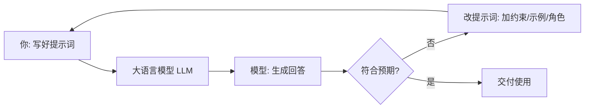

# 什么是提示工程

你每次跟 ChatGPT、Claude、DeepSeek 说话，其实都在干一件事：**写提示词（prompt）**。

你输入的那句话，就是提示词；而「提示工程」，说白了就是——**怎么把这句话写得更聪明，让 AI 更稳、更准地给你想要的东西**。

::: tip 一句话定义
**提示工程（Prompt Engineering）** = 设计、打磨你给大语言模型（LLM）的输入，让它在没有额外训练的情况下，也能稳定产出符合你预期的结果。
:::

## 为什么它值得专门学

同一个模型，提示词写得好不好，输出能差出十万八千里。

举个例子：你让模型「写点关于猫的东西」。它可能给你一首诗、一段百科、或者一个搞笑段子——全看它心情。但如果你说「用 3 个要点、面向小学生、讲清楚猫为什么爱睡觉」，结果就完全可控了。

换句话说：**模型能力是天花板，提示词是你实际能触及的高度**。学会提示工程，等于不花一分钱（不用微调、不用训练）就把模型用到了 80 分。

## 提示工程在干什么：一个闭环



整个过程就是：**写提示 → 看结果 → 不满意就改 → 直到稳定**。提示工程就是把「改」这一步变得有方法、可复现，而不是靠运气瞎试。

## 写好提示词的 4 个基本功

下面这 4 条，几乎适用于所有场景，先记牢：

| 基本功 | 大白话 | 反例 → 正例 |
| --- | --- | --- |
| **说清任务** | 别让模型猜你想干嘛 | 「写点东西」→「写一段 100 字的产品介绍」 |
| **给足上下文** | 把背景告诉它 | 「翻译这段」→「你是跨境电商运营，把这段译成地道英文」 |
| **指定格式** | 你想要什么样子直接说 | 「列优点」→「用带序号的 Markdown 列表，最多 5 条」 |
| **给示例（必要时）** | 它照着学最快 | 直接给 1 个你满意的样例，让它模仿 |

> 后面「基础技巧」章节会把这些拆开细讲，这里先建立感觉即可。

## 一个对照示例

**❌ 模糊提示**
```
帮我写个周报。
```

**✅ 清晰的提示**
```
你是一名前端工程师的周报助手。请帮我写本周周报，要求：
1. 用 Markdown 格式；
2. 分「本周完成 / 进行中 / 风险与阻塞」三块；
3. 每块 2-3 条，每条一句话，口语化；
4. 总字数控制在 200 字以内。

本周我做了：上线了登录页、修了 3 个 bug、在学 RAG、等后端接口。
```

同样一个模型，后者给出的东西你几乎可以直接用，前者还得大改。

## 常见坑（新手必看）

- **太啰嗦**：提示不是越长越好，冗余信息会稀释重点。说清楚即可。
- **没给角色**：很多任务加上「你是一名 XX 专家」会立刻变专业。
- **想要结构却没说格式**：想要 JSON、表格、列表，必须明说，模型不会读心。
- **一次塞太多事**：一个提示专注一件事，拆分比堆叠更有效。

## 小结

- 提示工程 = **把给模型的输入写得更聪明**，不训练也能提效果。
- 核心是「写 → 看 → 改」的闭环，关键在有方法地改。
- 先掌握 4 个基本功：说清任务、给上下文、定格式、必要时给示例。

下一篇我们会从最基础、也最常用的技巧讲起：[零样本提示（Zero-Shot）](/techniques/zero-shot)，也就是「不给例子、直接让模型干活」。

---

> **来源与授权**：本文改编自 [dair-ai/Prompt-Engineering-Guide](https://github.com/dair-ai/Prompt-Engineering-Guide)（MIT License，Copyright 2022 DAIR.AI），并参考 [promptingguide.ai](https://www.promptingguide.ai) 与 [deepwiki.com.cn](https://deepwiki.com.cn/dair-ai/Prompt-Engineering-Guide) 的中文内容。仅供学习交流使用，保留原作者版权声明。
