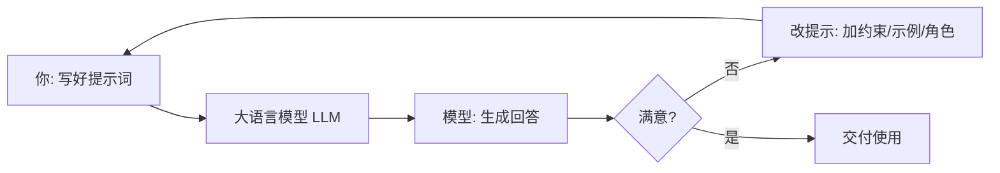

# 什么是提示工程

你每次跟 ChatGPT、Claude、DeepSeek 说话，其实都在干同一件事：**写提示词（prompt）**。

你敲进去的那句话，就是提示词。而「提示工程」，说白了就是——**怎么把这句话写得更聪明，让 AI 更稳、更准地给你想要的东西**。

::: tip 一句话定义
**提示工程（Prompt Engineering）** = 不动模型、只打磨你给大语言模型（LLM）的输入，让它稳定产出你要的结果。
:::

## 为什么值得专门学

同一个模型，提示词写得好不好，输出能差出十万八千里。

> 模型能力是天花板，提示词是你实际够得着的高度。

学会提示工程，等于**不花一分钱（不用训练、不用微调）**就把模型用到了 80 分。

## 它到底在干啥：一个闭环



整个过程就三步：**写 → 看 → 改**。提示工程的本事，是让「改」这一步有方法、可复现，而不是靠运气瞎试。

## 写好提示词的 4 个基本功

| 基本功 | 大白话 | 反例 → 正例 |
| --- | --- | --- |
| 说清任务 | 别让模型猜你想干嘛 | 「写点东西」→「写一段 100 字的产品介绍」 |
| 给足上下文 | 把背景告诉它 | 「翻译这段」→「你是跨境电商运营，译成地道英文」 |
| 指定格式 | 想要啥样直接说 | 「列优点」→「用带序号的 Markdown 列表，最多 5 条」 |
| 给示例 | 它照着学最快 | 直接甩 1 个满意样例让它模仿 |

> 这 4 条后面会拆开细讲，现在先建立感觉。

## 一个对照，立马懂

**❌ 模糊**
```
帮我写个周报。
```

**✅ 清晰**
```
你是一名前端工程师的周报助手。请写本周周报：
1. 用 Markdown；
2. 分「本周完成 / 进行中 / 风险与阻塞」三块；
3. 每块 2-3 条，每条一句话、口语化；
4. 总字数 ≤ 200。

本周：上线登录页、修 3 个 bug、在学 RAG、等后端接口。
```

同一个模型，后者出来的东西你基本能直接发，前者还得大改。

## 新手最常踩的 4 个坑

- **太啰嗦**：提示不是越长越好，废话会稀释重点。说清楚即可。
- **没给角色**：很多任务加一句「你是一名 XX 专家」立刻变专业。
- **想要结构却没说格式**：要 JSON、表格、列表，必须明说，模型不会读心。
- **一次塞太多事**：一个提示专注一件事，拆分比堆叠更管用。

## 速查清单 ✅

- [ ] 能用自己的话解释「提示工程」是啥
- [ ] 记住闭环：写 → 看 → 改
- [ ] 背下 4 个基本功：说清任务 / 给上下文 / 定格式 / 必要时给示例
- [ ] 能把「帮我写个周报」改写成能直接用的版本

## 记忆卡片 🃏

> **提示工程** = 不训练模型，只把给它的输入写得更聪明。
> 一句话：模型是天花板，提示词是你够得着的高度。

## 小结

提示工程就是**把给模型的输入写得更聪明**，不训练也能提效果。核心是「写 → 看 → 改」的闭环，关键在有方法地改。下一篇从最基础也最常用的技巧讲起：[零样本提示（Zero-Shot）](/techniques/zero-shot)。

---

> **来源与授权**：本文改编自 [dair-ai/Prompt-Engineering-Guide](https://github.com/dair-ai/Prompt-Engineering-Guide)（MIT License，Copyright 2022 DAIR.AI），并参考 [promptingguide.ai](https://www.promptingguide.ai) 与 [deepwiki.com.cn](https://deepwiki.com.cn/dair-ai/Prompt-Engineering-Guide) 的中文内容。仅供学习交流，保留原作者版权声明。
