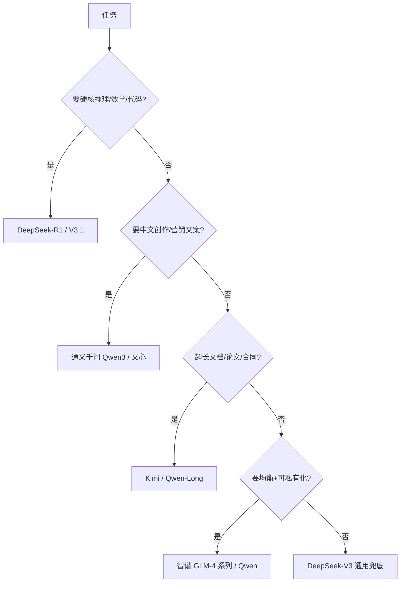

# 国产模型

你可能早就用过 DeepSeek、通义千问、Kimi、智谱清言——它们不只是「中文版 ChatGPT」，而是在**中文语感、本土知识、性价比、国内直连**上各有杀手锏。

这篇把主流国产模型一次讲清，并给出「什么时候该选国产」的判断。

::: tip 一句话定义
**国产模型** 指由国内团队研发的大语言模型（LLM）家族，代表有 **DeepSeek（深度求索）**、**通义千问 Qwen（阿里巴巴）**、**智谱 GLM**、**Kimi（月之暗面）** 等；共同优势是**中文强、成本低、国内网络可直接访问、很多权重开源**。
:::

## 为什么国产模型值得专篇

- **中文与本土知识更贴**：成语、网络梗、政策术语、国内舆情，理解更准。
- **成本低得多**：同档能力下，国产 API 单价往往只有国际旗舰的几分之一。
- **国内直连稳定**：无需翻墙、无需境外信用卡，注册即用。
- **开源力量强**：DeepSeek、Qwen、GLM 都放出权重，可自托管。

## 主要玩家一览（含 2026 最新）

| 模型 | 强项 | 备注（年份/特征） |
| --- | --- | --- |
| **DeepSeek-R1** | 推理（类 o1），数学/代码/逻辑 | 开源，思考链强；2026 有 V3.1/V4 演进 |
| **DeepSeek-V3** | 通用对话/代码，性价比极高 | 开源 MoE；国产默认主力之一 |
| **Qwen2.5 / Qwen3** | 中文语感好、生态大、多模态 | Qwen-VL 看图；Qwen3 支持思考/非思考双模式 |
| **智谱 GLM-4 / GLM-4V** | 均衡、长文本、视觉版 GLM-4V | 2026 演进到 GLM-4.5/4.6，编程强、开源 |
| **Kimi** | 超长上下文、长文档 | 2026 Kimi K2 系列，Agent/长文见长 |

> 时间线提示：早期是 DeepSeek-V2、Qwen2、GLM-4；到 2025–2026 已演进到 **DeepSeek V3.1/V4、Qwen3、GLM-4.5/4.6、Kimi K2**。能力普遍追平国际主力，且多数**兼容 OpenAI 接口**，迁移成本极低。

逐个说几个亮点：DeepSeek 的杀手锏是**把闭源级能力做到了开源价格**，R1 在推理基准上常对标 o1/o3，V3 系列则兼顾通用与代码，是很多创业团队默认底座；Qwen（通义千问）胜在**生态最大、中文语感最自然**，Qwen-VL 能看图，Qwen3 还支持「思考/非思考」双模式切换，一条模型既能快答也能深想；智谱 GLM 走**均衡 + 开源 + 长文本**路线，GLM-4V 支持图像，企业知识库问答很稳；Kimi 从一开始就押注**超长上下文**，长文档、论文、合同处理是它的主场。值得一提的是 DeepSeek 还放出过 OCR、多模态等专项模型，开源节奏很猛。

## 怎么选国产模型



口诀：**写代码推理上 DeepSeek，中文文案上 Qwen，长文上 Kimi，要均衡或私有化上 GLM/Qwen。**

再给一句选型对照，方便和国际模型横向比：同样的钱，国产模型往往能买到更高一档的能力；同样的英文能力，国产在中文上通常更自然。所以**只要你的用户主要说中文、且对数据合规/成本敏感，国产模型往往是最优解**，不必盲目追 GPT/Claude。当然，若你要做强多模态长上下文，Gemini 仍有一席之地；要极致编码，Claude 也值得保留。实际项目里「国产为主 + 国际特定场景补充」是越来越多团队的组合拳。

## 可复制示例（DeepSeek API，兼容 OpenAI 格式）

国产模型大多「换 baseURL 就能用」，原 OpenAI 代码几乎不用改：

```js
// 需 API Key：https://platform.deepseek.com 获取，设为环境变量 DEEPSEEK_API_KEY
// 模型：deepseek-chat（通用，DeepSeek-V3 类，2024+）；deepseek-reasoner（推理，R1 类）
import OpenAI from 'openai'

// 只改 baseURL 和 model，其余与 OpenAI 完全一致
const client = new OpenAI({
  baseURL: 'https://api.deepseek.com/v1', // 国内直连（示意）
  apiKey: process.env.DEEPSEEK_API_KEY,
})

// 通用对话
const chat = await client.chat.completions.create({
  model: 'deepseek-chat',
  messages: [{ role: 'user', content: '用通俗中文解释什么是混合专家 MoE 架构。' }],
})

// 推理模式（类 o1/o3，会先思考）
const reason = await client.chat.completions.create({
  model: 'deepseek-reasoner',
  messages: [{ role: 'user', content: '证明费马小定理的一个简单特例。' }],
})
console.log(reason.choices[0].message.content)
```

> 同样套路适用于通义千问（DashScope）、智谱（GLM）、Kimi：把 `baseURL` 换成各家地址、模型名换成 `qwen-plus` / `glm-4` / `moonshot-v1` 等即可，提示词写法通用。

入驻门槛也低：这几家基本都支持国内手机号注册、国内信用卡或微信/支付宝充值，不用翻墙、不用境外卡，对个人和小团队非常友好。如果你只想先试水，从 DeepSeek 网页版或通义千问 App 直接聊起最省事；要写代码接入，再按上面的 OpenAI 兼容方式切到 API 即可，迁移成本几乎为零。

::: warning 常见坑
- **以为国产=落后**：2025–2026 国产头部已追平国际主力，别用老印象低估。
- **忽视接口兼容性**：多数兼容 OpenAI 格式，却还在重写整套调用层，纯属浪费。
- **只看单价不看稳定性**：个别小厂 API 限流严、波动大，生产环境先压测 QPS。
- **长上下文车型选错**：Kimi 长文强，但超长时也要留意精度衰减，别无脑整库塞。
- **混用最新版本号**：V3.1、Qwen3、GLM-4.6 迭代快，老教程的模型名可能已下架，调用前核对接入文档。
:::

## 速查清单 ✅

- [ ] 国产优势：中文强、成本低、国内直连、多开源
- [ ] 推理/代码 → DeepSeek-R1/V3；中文文案 → Qwen3
- [ ] 长文档 → Kimi / Qwen-Long；均衡/私有化 → GLM-4 / Qwen
- [ ] 多数兼容 OpenAI 格式，只换 baseURL 和 model 名
- [ ] 生产环境先压测稳定性与限流
- [ ] 用最新版本号，调用前核对各家文档

## 记忆卡片 🃏

> **国产模型** = 中文强、便宜、直连、多开源。
> 选型：推理上 DeepSeek，文案上 Qwen，长文上 Kimi，均衡上 GLM。
> 大多兼容 OpenAI 接口，换 baseURL 即可用。

## 小结

国产模型在中文理解、成本、国内直连和开源程度上优势明显。2025–2026 年的 DeepSeek-V3/R1、通义千问 Qwen3、智谱 GLM-4.5/4.6、Kimi K2 已普遍追平国际主力，且大多兼容 OpenAI 接口，迁移极低成本。选型口诀记牢：**推理上 DeepSeek、文案上 Qwen、长文上 Kimi、均衡私有化上 GLM**。回顾总纲见 [模型概览与选型](/models/overview)。

---

> **来源与授权**：本文改编自 [dair-ai/Prompt-Engineering-Guide](https://github.com/dair-ai/Prompt-Engineering-Guide)（MIT License，Copyright 2022 DAIR.AI），并参考 [promptingguide.ai](https://www.promptingguide.ai) 与 [deepwiki.com.cn](https://deepwiki.com.cn/dair-ai/Prompt-Engineering-Guide) 的中文内容。仅供学习交流，保留原作者版权声明。
