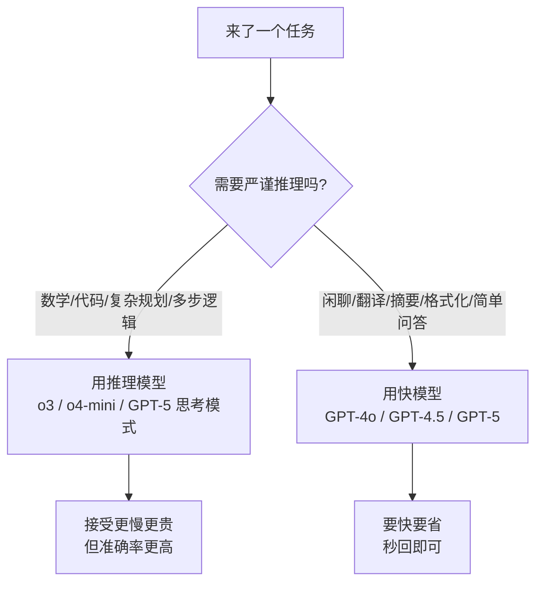

# OpenAI GPT 系列

你用 ChatGPT 时，背后其实藏着两类完全不同的「脑子」：一类反应快、啥都能聊，一类会先闷头想半天再答。搞混它们，要么花钱不讨好，要么该想的不想。

这篇帮你把 OpenAI 的模型家族理清楚，重点是——**快模型 vs 推理模型，到底怎么选。**

::: tip 一句话定义
**OpenAI GPT 系列** 分两类：以 `GPT-4o` / `GPT-4.5` 为代表的**快模型（fast model）**，秒回、全能；以 `o1` / `o3` / `o4-mini` 为代表的**推理模型（reasoning model）**，回答问题前会先做「推理时计算（test-time compute）」，也就是慢思考。
:::

## 为什么要把它们分开讲

2024 年以前，大家默认「模型越强 = 答得越快越好」。但 OpenAI 在 o1 上证明了另一件事：**让模型在回答前多花算力去一步步推理，能大幅搞定数学、代码、复杂规划**——代价是更慢、更贵。

> 快模型像脱口而出的聪明人；推理模型像先打草稿再开口的严谨工程师。

选错类型，典型翻车：让快模型硬解竞赛数学，错一片；让推理模型去陪聊「今天天气咋样」，等半天才回一句，纯属浪费。

## 快模型：GPT-4o 与 GPT-4.5

- **GPT-4o（2024）**：字母 o 是 omni（全能）。原生多模态，能读图、看文件、听音，是 2024–2025 年的日常主力，速度快、价格友好，通用任务闭眼用。
- **GPT-4.5（2025 年初）**：更大、更「懂人话」、情商和指令遵循更好，但偏贵，适合对表达质感要求高的场景。

> 截至 2025 年 8 月，OpenAI 推出 **GPT-5** 作为新默认：它把「快」和「推理」合到一个模型里，简单问题秒回、复杂问题自动进入思考。但 o 系列并未消失——当你要**显式控制**推理深度、或走特定 API 行为时，o 系列仍是专用赛道。

## 推理模型：o1 / o3 / o4-mini

它们共同点是：回答前在内部生成「推理词元（reasoning tokens）」，这些 token **算在输出账单里、但默认不显示在回复中**。

| 模型 | 定位 | 适用 |
| --- | --- | --- |
| `o1`（2024 末） | 初代强推理，适合科研/硬核规划 | 复杂数学、长链逻辑 |
| `o3`（2025） | 推理主力，性价比高（2026 年已降价） | 代码、科学、多步规划 |
| `o4-mini`（2025） | 便宜的推理小钢炮 | 高吞吐推理、成本敏感 |

> 调用推理模型时，它「想」的过程会消耗 token，所以**同一道题，推理模型常常比快模型更贵**——但难任务上准确率提升显著。

补充一点实操经验：推理模型有「推理强度」可以调。强度低，想得快、省钱，但复杂题可能想不透；强度高，准确率高，但慢且贵。日常建议先用中等强度跑通，只在准确率不够时再往上加。另外，很多平台提供**缓存输入（cached input）**和**批处理（Batch）**两种省钱杠杆：重复的 system 提示、长文档摘要这类可缓存；非实时的海量任务走批处理能打到约半价。把这几样用上，推理模型的成本往往没想象中吓人。

## 怎么做：快模型 vs 推理模型 怎么选



经验法则：**模型本来就会的活，用快模型；要它「想清楚」的活，用推理模型。**

实践建议：如果你是从零开始的新项目，直接把 **GPT-5** 当默认模型通常最省心——它内部已把快慢路由合一，复杂问题自动进入思考、简单问题秒回，你不必自己维护「什么时候切 o 系列」的逻辑。只有当你需要**显式锁定推理深度**、或要把 `reasoning_effort` 写进产品逻辑时，才单独调用 o3 / o4-mini。另外，OpenAI 提供 `/v1/models` 接口能列出当前 key 有权访问的模型及发布时间，版本迭代快，写死模型名前最好先拉一次确认没下架。

## 可复制示例（调用差异）

关键差别：推理模型通过单独 `model` 字段指定，且可设推理强度（reasoning effort）；快模型直接 `model: 'gpt-4o'`。

```js
// 需 API Key：https://platform.openai.com 获取，设为环境变量 OPENAI_API_KEY
// 快模型 gpt-4o（OpenAI, 2024）；推理模型 o3（OpenAI, 2025）
import OpenAI from 'openai'
const client = new OpenAI({ apiKey: process.env.OPENAI_API_KEY })

// ① 快模型：秒回，适合日常
const fast = await client.chat.completions.create({
  model: 'gpt-4o',
  messages: [{ role: 'user', content: '用一句话解释什么是上下文窗口。' }],
})

// ② 推理模型：先思考再答，适合难题（reasoning_effort 控制投入）
const reason = await client.chat.completions.create({
  model: 'o3',
  messages: [{ role: 'user', content: '证明：根号2是无理数，并给出清晰步骤。' }],
  // o 系列专属：low/medium/high，越高越慢越准
  reasoning_effort: 'high',
})
// 注：o3 内部推理 token 会计费但不返回；如需查看可走特定接口（示意）
```

::: warning 常见坑
- **拿推理模型陪聊**：慢且贵，简单问题用 GPT-4o / GPT-5 即可。
- **以为推理模型「免费想」**：它的思考 token 照样计费，批量硬上 o3 账单会爆炸。
- **混用参数**：`reasoning_effort` 只推理模型支持，传快模型会报错。
- **忽略 GPT-5 已统一路由**：新项目直接用 GPT-5 往往最省心，不必硬分两类。
- **只看模型名不看上下文上限**：o 系列上下文通常小于 GPT-5 系列，超长文档要留意。
:::

## 速查清单 ✅

- [ ] 记住两类：快模型（GPT-4o/4.5/GPT-5）与推理模型（o1/o3/o4-mini）
- [ ] 推理模型会做「推理时计算」，思考 token 计费但不显示
- [ ] 简单/通用任务 → 快模型；数学/代码/规划 → 推理模型
- [ ] 推理模型用 `reasoning_effort` 控制深度
- [ ] 新项目可优先 GPT-5（自动路由快慢）
- [ ] 批量推理注意成本，必要时换 o4-mini

## 记忆卡片 🃏

> **OpenAI 两类脑子**：快模型秒回全能，推理模型先想后答。
> 选型口诀：会做的用快的，要想清楚的上 o 系列。
> 推理模型的「思考」也花钱，别拿来陪聊。

## 小结

OpenAI 的模型分「快」与「推理」两派：GPT-4o / GPT-4.5（及新默认 GPT-5）反应快、适合日常；o1 / o3 / o4-mini 会先做推理时计算，适合数学、代码、复杂规划。核心判断就一句——**模型本来就会的用快的，要它想清楚的用推理的**。下一篇看另一家强手：[Anthropic Claude](/models/claude)。

---

> **来源与授权**：本文改编自 [dair-ai/Prompt-Engineering-Guide](https://github.com/dair-ai/Prompt-Engineering-Guide)（MIT License，Copyright 2022 DAIR.AI），并参考 [promptingguide.ai](https://www.promptingguide.ai) 与 [deepwiki.com.cn](https://deepwiki.com.cn/dair-ai/Prompt-Engineering-Guide) 的中文内容。仅供学习交流，保留原作者版权声明。
