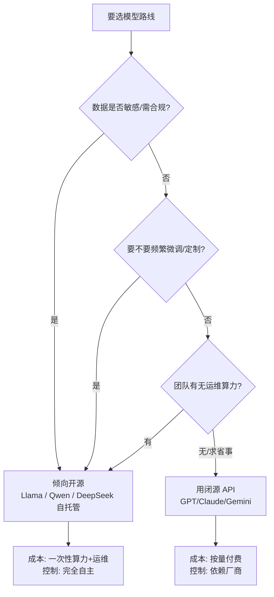

# Meta Llama

前面几篇讲的 GPT、Claude、Gemini，都是「别人家的服务」——你发请求、它收钱、数据过它的服务器。而 **Llama** 不一样：它的**模型权重公开**，你能完整下载下来，跑在自己机器或公司的机房里。

这篇讲清楚：开源到底香在哪，又麻烦在哪，以及 2026 年 Llama 已经进化到什么程度。

::: tip 一句话定义
**Meta Llama** 是 Meta 开源的大语言模型（LLM）家族，发布**模型权重（open weights）**而非只提供 API；你可以**本地部署、私有化、微调（fine-tuning）**，把模型完全掌控在自己手里。
:::

## 为什么「开源权重」这么重要

闭源 API 的痛点是：数据得出境、按量付费、速率受限、随时可能改价或下线。开源权重把这三件事反转了：

- **数据不出门**：医疗、金融、法务等敏感行业，能在内网跑，合规压力骤降。
- **一次部署，长期免调用费**：买断算力后，调用不再按 token 计费。
- **可改可训**：用自家数据微调，做成行业专有模型。

> 2026 年，开源模型已不是「将就的平替」。以 Llama 4 为例，它在多项基准上追平甚至超过同期的闭源主力，企业渗透率快速攀升。

## Llama 4：2025–2026 的主力代

老教程常提 Llama 3（最大 405B，纯文本，上下文 128K）。到 2025–2026 年，家族已到 **Llama 4**，用**混合专家（MoE, Mixture of Experts）**架构，关键型号：

| 型号 | 特点 | 上下文 |
| --- | --- | --- |
| Llama 4 Scout | 轻量、原生多模态、单卡可跑 | 高达 **1000 万 token** |
| Llama 4 Maverick | 更强、多模态、工具调用稳 | 100 万 token |
| Llama 4 Behemoth | 超旗舰「教师模型」（训练中） | 约 2 万亿参数 |

MoE 的妙处：总参数巨大，但每次推理只激活一小部分「专家」，所以**又强又省**。Scout 的千万级 token 上下文，意味着整本书、超长代码库可以一次装下。

## 怎么做：开源 vs 闭源 API 怎么取舍



一句话：**要可控、要合规、要定制 → 开源；要省事、要最快用上最强 → 闭源 API。**

给想动手的人一个最小起步：装好 Ollama 后，命令行跑 `ollama run llama4-scout`（模型名以官方为准）就能在本机聊天；想接代码，把上文示例里的 `baseURL` 指向 `http://localhost:11434/v1` 即可，提示词写法与 OpenAI 完全一致。如果本机显卡小，先试量化版或用云上的托管开源服务（如各云厂商的「模型市场」），等验证跑通再决定是否自建集群。记住：**开源省的是「调用费」，不是「总拥有成本」**——人力、运维、显卡都是账。

补充几个落地要点：本地跑大模型最常见的两个工具是 **Ollama**（开箱即用，适合个人和原型）和 **vLLM**（高吞吐，适合生产）。如果显卡不够，用 **4-bit / 8-bit 量化**能把模型压到消费级显卡也能跑，代价是精度略降——对多数业务够用。开源生态另一大红利是**衍生模型海量**：像 Qwen、Llama 在 Hugging Face 上有几十万个社区微调版本，常能直接找到「法律」「医疗」「客服」等现成变体，省去自己从头训。最后提醒，部署后要关注**显存、并发、冷启动**这些运维指标，开源不是「下完就完事」，而是把算力成本换成了工程成本。

## 可复制示例（本地调用思路）

开源模型常用 **Ollama** 或 **vLLM** 托管，然后通过 OpenAI 兼容接口调用，代码几乎不变：

```js
// 需本地先跑起服务：ollama run llama4-scout（或 vLLM 部署），无需云端 API Key
// 模型：llama-4-scout（Meta, 2025）本地权重；兼容 OpenAI 接口
import OpenAI from 'openai'

// baseURL 指向你自己的本地/内网服务，不连外网
const client = new OpenAI({
  baseURL: 'http://localhost:11434/v1', // Ollama 默认地址（示意）
  apiKey: 'not-needed', // 本地部署可不设密钥
})

const res = await client.chat.completions.create({
  model: 'llama4-scout',
  messages: [
    { role: 'user', content: '用中文总结这段内部财报的三个关键风险。' },
  ],
})
console.log(res.choices[0].message.content)
```

::: warning 常见坑
- **以为开源=完全免费**：权重免费，但跑模型要 GPU 算力、要人运维，隐性成本不低。
- **小团队硬上大模型**：671B/400B 级模型全精度部署吃几十张卡，先用量化版（如 4-bit）或更小型号。
- **许可证踩雷**：Llama 社区许可证对超大型商业产品有额外约定，商用前读条款；Qwen / DeepSeek 多为更宽松的 Apache/MIT。
- **忽视上下文衰减**：千万 token 听着猛，但实际「大海捞针」精度会随长度下降，别真把整库无脑塞。
- **版本混乱**：Llama 3 与 4 架构差异大（稠密 vs MoE、纯文本 vs 多模态），照搬老教程会翻车。
:::

## 速查清单 ✅

- [ ] Llama = 开源权重，可本地部署/私有化/微调
- [ ] 开源价值：数据不出门、免调用费、可定制
- [ ] Llama 4 用 MoE 架构，Scout 上下文达千万 token
- [ ] 取舍：要可控/合规/定制 → 开源；求省事 → 闭源 API
- [ ] 开源也有隐性成本（算力+运维），注意许可证
- [ ] 本地调用可走 Ollama/vLLM 的 OpenAI 兼容接口

## 记忆卡片 🃏

> **Llama** = 把模型权重给你，自己说了算。
> 香在：数据私有、免调用费、可微调。
> 烦在：要算力、要运维、要看许可证。
> 2026 看 Llama 4（Scout/Maverick/Behemoth，MoE 架构）。

## 小结

Llama 代表的是「开源权重」路线：模型权重公开，你能本地部署、私有化、按业务微调，把数据和成本都攥在自己手里。2025–2026 的 Llama 4 用 MoE 架构把能力与性价比拉满，千万级上下文更是亮眼。选型时记住——**要可控合规定制选开源，求省事最快上闭源 API**。国产也有强开源力量，见 [国产模型](/models/domestic)。

---

> **来源与授权**：本文改编自 [dair-ai/Prompt-Engineering-Guide](https://github.com/dair-ai/Prompt-Engineering-Guide)（MIT License，Copyright 2022 DAIR.AI），并参考 [promptingguide.ai](https://www.promptingguide.ai) 与 [deepwiki.com.cn](https://deepwiki.com.cn/dair-ai/Prompt-Engineering-Guide) 的中文内容。仅供学习交流，保留原作者版权声明。
