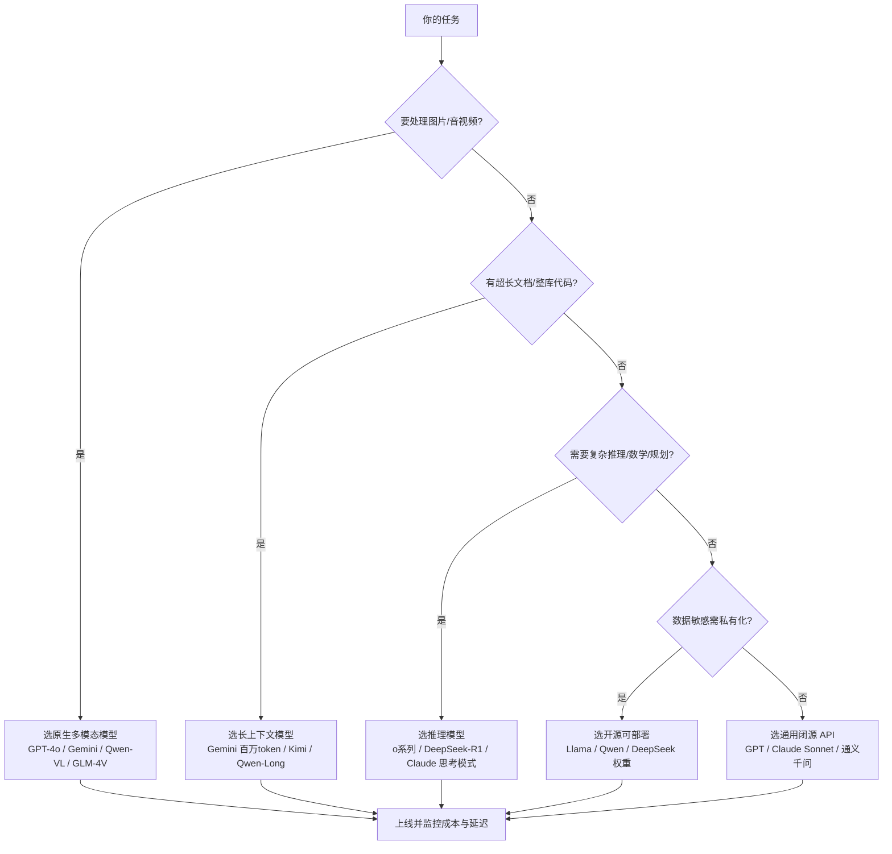

# 模型概览与选型

你打开 OpenAI、Anthropic、Google、Meta 的官网，再看一眼国内的 DeepSeek、通义千问、智谱、Kimi，几百个模型名扑面而来——光是「GPT 到底有几个」就能把人绕晕。

这篇不堆参数、不列榜单，只回答一个最实用的问题：**你手上的任务，该选哪个模型？**

::: tip 一句话定义
**模型选型** = 在「能力 / 上下文长度 / 成本 / 速度 / 多模态 / 开源与否」六个维度之间做权衡，给具体任务挑一个最合适的模型，而不是无脑追「最强」。
:::

## 为什么选型这件事值得单独讲

很多人有个误区：以为模型越强越好，于是所有请求都丢给最贵的旗舰。结果要么烧钱，要么慢到用户跑路。

> 没有「最好的模型」，只有「最适合这个任务的模型」。

同一个客服机器人，90% 的咨询是简单问答，用轻量模型就够；只有 10% 的复杂投诉才需要旗舰推理。分清楚这俩，成本能差好几倍。

## 六个维度，挨个看

| 维度 | 大白话 | 怎么权衡 |
| --- | --- | --- |
| 能力 | 模型聪不聪明、推理准不准 | 难任务（代码、数学、长文分析）上旗舰；简单任务别浪费 |
| 上下文长度（context window） | 一次能「看」多少字 | 长文档、整库代码选百万 token 级（如 Gemini）；闲聊 8K–32K 足够 |
| 成本 | 每百万词元（token）多少钱 | API 按输入输出分别计费，输出往往更贵；高并发先看单价 |
| 速度 | 出字快不快、延迟低不低 | 实时对话要快（小/迷你模型）；后台批处理可接受慢 |
| 多模态 | 能否读图、听音、看视频 | 只聊文本不用管；要处理图片 PDF 就选原生多模态模型 |
| 开源与否 | 权重是否公开、能否自己部署 | 要私有化/微调选开源（Llama、Qwen、DeepSeek）；求省事选闭源 API |

> 几个关键概念先记住：**大语言模型（LLM）** 是底座；**上下文窗口（context window）** 是它一次性能「装下」的最大文本量；**词元（token）** 是计费单位，中文里大约 1–2 个汉字算 1 个 token。

## 怎么选：一张流程图



> 这张图帮你快速落位，但具体型号请结合后文各模型篇（[GPT](/models/gpt)、[Claude](/models/claude)、[Gemini](/models/gemini)、[Llama](/models/llama)、[国产模型](/models/domestic)）再细化。

## 进阶思路：混合路由，别只盯一个模型

成熟一点的应用通常不会把全部流量砸在一个模型上，而是做**路由（routing）**：先用便宜的小模型兜常规请求，只有判断为「难任务」时才升级到旗舰或推理模型。比如客服里 90% 的问答用轻量模型，只有涉及退款纠纷、技术排障才上强模型——这一招往往能把模型账单砍掉一半以上，体验还不降。

判断「该不该升级」可以很简单：看用户问题是否包含代码块、数学公式、长文档引用，或前一轮模型是否自信不足（比如反复改口）。把这些信号写进你的调用逻辑，比无脑堆最强模型聪明得多。

## API 调用的三个通用注意事项

不管你接哪家模型，下面三件事迟早会坑到你，提前记住：

### 1. API Key 安全
- **永远别把密钥写进代码或前端**，用环境变量或密钥管理服务。
- 给密钥设用量上限和告警，防止被盗刷。
- 开源项目里用 `.env` + `.gitignore`，别手滑提交到仓库。

### 2. 重试与容错
- 网络抖动、限流（429）、服务端 5xx 都会偶发，调用层要做**指数退避重试**。
- 区分「可重试错误」（限流、超时）和「不可重试错误」（参数错误、余额不足）。

### 3. 速率限制（rate limit）
- 每家都有每分钟请求数（RPM）、每日额度等限制，高并发前先看文档。
- 真要大批处理，用官方的 **Batch / 批处理接口**，通常半价还不受实时限流。

## 可复制示例（通用调用思路）

下面用 OpenAI 兼容格式演示「带重试的安全调用骨架」，思路对哪家都通用：

```js
// 需 API Key：设为环境变量 OPENAI_API_KEY，切勿硬编码进代码
// 模型：gpt-4o（OpenAI, 2024）；可换成 deepseek-chat / qwen-plus / gemini 等
import OpenAI from 'openai'

const client = new OpenAI({ apiKey: process.env.OPENAI_API_KEY })

async function safeChat(messages, retries = 3) {
  for (let i = 0; i < retries; i++) {
    try {
      const res = await client.chat.completions.create({
        model: 'gpt-4o',
        messages,
      })
      return res.choices[0].message.content
    } catch (err) {
      // 429 限流或 5xx 才重试，且指数退避
      if (err?.status === 429 || err?.status >= 500) {
        await new Promise(r => setTimeout(r, 2 ** i * 500))
        continue
      }
      throw err // 参数错等直接抛出
    }
  }
}
```

::: warning 常见坑
- **无脑上最强最贵模型**：简单任务用旗舰，烧钱又变慢，用户感知不到差别。
- **忽视上下文窗口**：把 200 页合同塞进只支持 32K 的模型，直接被截断。
- **密钥硬编码 + 提交到 GitHub**：几分钟就可能被爬虫扫走、一夜刷爆额度。
- **不做重试**：生产环境一次网络抖动就让请求失败，体验崩塌。
- **只看榜单不看延迟/稳定性**：某模型榜第一但 QPS 只有 5，上线即崩。
:::

## 速查清单 ✅

- [ ] 选型看六个维度：能力 / 上下文 / 成本 / 速度 / 多模态 / 开源
- [ ] 长文档 → 长上下文；图片视频 → 多模态；数学规划 → 推理模型
- [ ] 数据敏感 → 优先考虑开源可私有化部署
- [ ] API Key 走环境变量，设告警，绝不进代码仓库
- [ ] 调用层做指数退避重试，区分可重试与不可重试错误
- [ ] 大批任务用 Batch 接口省成本

## 记忆卡片 🃏

> **模型选型** = 给任务挑最合适的，不是挑最贵的。
> 六维度：能力 / 上下文 / 成本 / 速度 / 多模态 / 开源。
> API 三件事：密钥安全、重试容错、看清速率限制。

## 小结

选型的核心不是追最强，而是**在六个维度里为任务做平衡**：难任务上推理/旗舰，长文档上长上下文，省钱要分轻量档，数据敏感看开源。API 调用层则把密钥安全、重试、限流三件事做扎实，比选哪个模型更影响线上稳定性。想看具体型号，接着读 [GPT 系列](/models/gpt)、[Claude](/models/claude)、[Gemini](/models/gemini)、[Llama](/models/llama)、[国产模型](/models/domestic)。

---

> **来源与授权**：本文改编自 [dair-ai/Prompt-Engineering-Guide](https://github.com/dair-ai/Prompt-Engineering-Guide)（MIT License，Copyright 2022 DAIR.AI），并参考 [promptingguide.ai](https://www.promptingguide.ai) 与 [deepwiki.com.cn](https://deepwiki.com.cn/dair-ai/Prompt-Engineering-Guide) 的中文内容。仅供学习交流，保留原作者版权声明。
