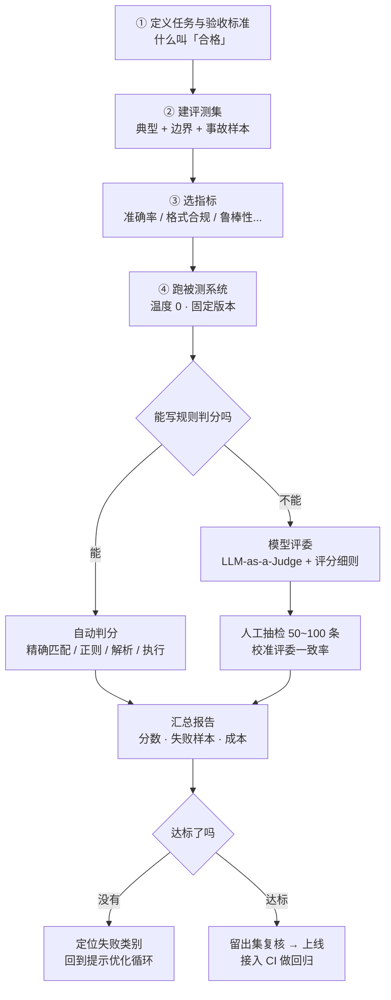

# 提示评测

团队里最常见的一句话是：「我觉得这版提示词更好。」你追问「好多少」，现场就安静了。

**评测（Evaluation，业内常简称 evals）就是把这句「我觉得」换成一个数字。** 有了数字，改提示词才不叫玄学，换模型才敢按按钮，出事故才能定位是哪一层坏了。

::: tip 一句话定义
**提示评测（Evaluation）** = 用一批固定的测试样本和一组明确的指标，把提示词或整条链路的表现量化成可比较、可复现的分数，让「变好了没有」这件事有据可查。
:::

## 为什么它比提示技巧更重要

**因为没有评测，所有优化都是错觉。** 大语言模型（LLM）有随机性、有长度偏好、对措辞极度敏感——你手改十版、每版看三条输出，结论比抛硬币好不了多少。有了评测之后：

- 改提示词从「盲调」变成「A/B 有分数」；
- 换模型从「不敢动」变成「跑一遍就知道能不能换」；
- 线上事故从「凭印象修」变成「加进测试集，永不复发」；
- 提示工程从个人手艺变成**团队能接手的资产**。

> 类比：评测就是 AI 应用的单元测试。你不会允许业务代码没测试就上线，凭什么允许提示词裸奔？

## 评测流程长什么样



注意 ⑤ 那个分叉：**能写规则就绝不请模型当评委**。规则便宜、稳定、可复现；评委贵、有偏见、还会漂移。

## 指标怎么设计

别只盯准确率。一套能用的指标至少覆盖四个维度：

| 维度 | 指标 | 怎么算 | 何时必看 |
| --- | --- | --- | --- |
| 对不对 | 准确率（Accuracy） | 判对条数 / 总条数 | 分类、抽取、单选 |
| 对不对 | 精确率 / 召回率 / F1 | 混淆矩阵 | 类别不均衡，准确率会骗人 |
| 能不能用 | 格式合规率 | JSON 解析成功 / 字段齐全比例 | 输出要进下游程序 |
| 稳不稳 | 鲁棒性（Robustness） | 输入扰动后分数的**掉幅** | 面向真实用户 |
| 稳不稳 | pass^k | 同题独立跑 k 次**全通过**的概率 | 智能体（agent）、多步链路 |
| 靠不靠谱 | 幻觉率 / 拒答率 / 误拒率 | 见 [可靠性与事实性](/risks/reliability) | 客服、医疗、法律、金融 |
| 划不划算 | 词元消耗 / 延迟 / 单次成本 | 从响应里直接读 | 任何要上量的场景 |

三点补充：

- **鲁棒性别只测「干净输入」。** 真实用户会打错字、混中英文、加表情。给每条样本做三种扰动——同义改写、加无关噪音、调换选项顺序——**掉幅比绝对分更能预测线上表现**。
- **pass^k 近两年越来越常用。** 单次成功率 90% 的五步流程，全对概率只有 0.9⁵ ≈ 59%——只报单次准确率等于自欺欺人。
- **成本和质量一起报。** 「准确率 +2%、成本 ×3」多数业务里叫倒退。

## 人工评测 vs 自动评测

三条路，成本和可靠性刚好相反，实际项目里**三条都要用**：

| 方式 | 成本 | 可靠性 | 用在哪 |
| --- | --- | --- | --- |
| 规则自动判分 | 极低 | 高（只要规则对） | 分类、抽取、JSON、代码执行 |
| 模型评委（LLM-as-a-Judge） | 中 | 中，有系统性偏见 | 开放式写作、摘要、多轮对话 |
| 人工评测 | 高 | 最高，但会疲劳、主观 | 上线把关 + 校准评委 |

推荐配比：**规则跑全量（每次提交都跑），评委跑主观题，人工只抽检 50~100 条校准评委。**

### 模型评委的三个偏见，必须治

让 GPT 给 GPT 打分听着荒谬，实践中确实有效——前提是知道它偏在哪：

1. **位置偏好（Position Bias）**：两两对比时偏爱**先出现**的那个。
   → **交换顺序各跑一次**，两次结论一致才算赢。
2. **长度偏好（Length Bias）**：答案越长越容易被判「更详尽」。
   → 细则里明确「简洁不扣分、啰嗦要扣分」；或参考 AlpacaEval 的**长度控制（length-controlled）**评分把长度因素回归掉。
3. **自我偏好（Self-preference Bias）**：偏爱自己家族的输出风格。
   → **评委和被测模型换家**（被测 GPT、评委用 Claude，或反之），或多评委投票。

还有三条实操经验：

- **给细则，别给形容词。** 「请评价回答质量，1-5 分」几乎没用。要写成可核对的清单：「事实错误 −2／未回答问题 −2／超出资料范围 −1／格式不符 −1」。
- **让评委先说理由再给分。** 顺序反了分数质量明显下降——本质上是让评委也用[思维链（CoT）](/advanced/cot)。成熟做法如 **G-Eval**（带细则的链式打分）和 **DAG**（把评判拆成决策树），DeepEval 已内置。
- **算一致率。** 拿人工标注那 50~100 条对比评委，算一致率或 Cohen's Kappa，**低于 80% 的评委不要用**。

## 检索增强生成场景：用 RAGAS

如果你的系统是[检索增强生成（RAG）](/advanced/rag)，只测「最终答案对不对」不够——答案错了，你分不清是**检索没找到**还是**模型没看资料**，这两种病的药完全不同。

**RAGAS**（Retrieval-Augmented Generation Assessment，开源）就是干这个的：把链路拆开分段打分，且大部分指标**不需要人工标注标准答案**，靠模型评委逐条核验。

### 四个核心指标

| RAGAS 指标 | 中文 | 它在问什么 | 分数低说明 |
| --- | --- | --- | --- |
| `Faithfulness` | 答案忠实度 | 答案里每条断言都能在资料里找到支撑吗 | **模型在编**，该收紧提示或要求引用 |
| `ResponseRelevancy` | 答案相关性 | 答案真的在回答问题吗，有没有跑题、答半截 | 问题理解或生成提示有问题 |
| `LLMContextPrecision` | 上下文精确率 | 检索回来的片段有多少是真有用的（信噪比） | **检索噪音大**，调 top-k、加重排 |
| `LLMContextRecall` | 上下文召回率 | 该检索到的信息有没有漏 | **检索漏召**，改切分、换嵌入模型 |

前两个看**生成端**，后两个看**检索端**——这就是分段打分的价值：一张表直接告诉你该修哪一半。

::: warning 术语已经变了，别抄旧教程
早期 RAGAS 的 `context_relevancy`（上下文相关性）**已被上下文精确率 / 召回率这一对拆分取代**，新版不再推荐；`answer_relevancy` 更名为 `ResponseRelevancy`；API 也从 Hugging Face `Dataset` 换成 `SingleTurnSample` + `EvaluationDataset`。大量中文教程仍停在旧写法，照抄会直接报错——**以 [ragas 官方文档](https://docs.ragas.io) 为准**。
:::

新版另有几个好用的：`FactualCorrectness`（事实正确性）、`NoiseSensitivity`（塞入无关资料后答案会不会被带偏），以及一批面向智能体的工具调用指标。RAGAS 还能**从你的文档反向生成测试问题**（`TestsetGenerator`），解决「我没有评测集」这个最常见的启动障碍。

### 可复制示例（RAGAS）

```python
# 需 API Key：https://platform.openai.com 获取，设为环境变量 OPENAI_API_KEY
# 依赖：pip install "ragas>=0.2" langchain-openai
# 评委模型：gpt-4o-mini（OpenAI, 2024，便宜够用）；RAGAS API 随版本演进，以官方文档为准
from ragas import EvaluationDataset, SingleTurnSample, evaluate
from ragas.metrics import (
    Faithfulness,                      # 答案忠实度 → 查幻觉
    ResponseRelevancy,                 # 答案相关性 → 查跑题
    LLMContextPrecisionWithReference,  # 上下文精确率 → 查检索噪音
    LLMContextRecall,                  # 上下文召回率 → 查检索漏召
)
from ragas.llms import LangchainLLMWrapper
from ragas.embeddings import LangchainEmbeddingsWrapper
from langchain_openai import ChatOpenAI, OpenAIEmbeddings

judge = LangchainLLMWrapper(ChatOpenAI(model="gpt-4o-mini", temperature=0))
embed = LangchainEmbeddingsWrapper(OpenAIEmbeddings(model="text-embedding-3-small"))

# 每条样本 = 问题 + 你的检索结果 + 你的生成答案 + 参考答案
samples = [
    SingleTurnSample(
        user_input="公司年假怎么算？",
        retrieved_contexts=[
            "员工入职满 1 年起享有年假 5 天，每满 1 年递增 1 天，上限 15 天。",
            "食堂供餐时间为 11:30 至 13:00。",  # 故意混入的噪音 → 会拉低上下文精确率
        ],
        response="入职满 1 年有 5 天年假，之后每满 1 年多 1 天，最多 15 天。",
        reference="满 1 年 5 天，每满 1 年 +1 天，上限 15 天。",
    ),
]

result = evaluate(
    dataset=EvaluationDataset(samples=samples),
    metrics=[
        Faithfulness(llm=judge),
        ResponseRelevancy(llm=judge, embeddings=embed),
        LLMContextPrecisionWithReference(llm=judge),
        LLMContextRecall(llm=judge),
    ],
)
print(result)
# 输出示意：
# {'faithfulness': 1.00, 'answer_relevancy': 0.96,
#  'llm_context_precision_with_reference': 0.50,  # ← 一半是噪音，检索该优化
#  'context_recall': 1.00}
```

看这组数字：忠实度和召回率满分，**问题精准落在上下文精确率 0.50**——检索回来两条有一条是食堂通知。你要修的是检索，不是提示词。

分数怎么读，常用档位：**0.9 以上优秀，0.7~0.9 可上线，低于 0.7 必须优化。**

## 公开基准怎么用

公开基准（Benchmark）用来**选模型**，不是用来验收你的业务。

| 类别 | 常用基准 |
| --- | --- |
| 通用知识与推理 | MMLU-Pro、GPQA Diamond、BBEH |
| 数学与代码 | AIME、LiveCodeBench、SWE-bench Verified |
| 事实性与幻觉 | TruthfulQA、HaluEval、RAGTruth |
| 检索与嵌入 | MTEB、BEIR |
| 人类偏好 | LMArena（原 Chatbot Arena，真人盲测 Elo）、AlpacaEval |
| 综合框架 | HELM、Inspect AI（英国 AI 安全研究院开源） |

::: warning 基准的三个陷阱
- **数据污染（Contamination）**：热门基准的题目大量出现在训练数据里，高分可能只是「背过」——这正是 MMLU 被 MMLU-Pro、GPQA 替代的原因。优先看**新出的、题目未公开的**榜单。
- **榜单第一 ≠ 你的场景第一**：某模型 SWE-bench 登顶，不代表它写中文客服话术更好。基准只用来把候选缩到 2~3 个。
- **只看均值**：0.85 可能是「均匀地小错」，也可能是「某一类输入全错」。必须按类别拆开看失败样本。
:::

## 现成工具，别手搓

| 工具 | 特点 | 适合 |
| --- | --- | --- |
| **promptfoo** | YAML 声明式，CLI 优先，原生接 CI，带红队测试 | 提示词 A/B + 安全测试 |
| **DeepEval** | pytest 风格断言，50+ 指标，内置 G-Eval / DAG | Python 团队，评测当单测跑 |
| **RAGAS** | RAG 分段打分 + 合成测试集 | 检索类应用 |
| **OpenAI Evals** | 开源评测框架 + 基准注册表 | 用标准基准比模型 |
| **Langfuse / LangSmith / Braintrust / Arize Phoenix** | 链路追踪 + 数据集 + 在线评测 + 标注队列 | 把线上流量沉淀成评测集 |

选型只看三点：**能进 CI**、**能同时跑规则+评委+人工**、**结果能绑定到提示词版本**。第三点最易忽略，但没有它历史分数不可复现。

## 速查清单 ✅

- [ ] 有固定评测集（≥20 条，含边界与事故样本）+ 一份从未参与调优的留出集
- [ ] 指标覆盖四维：对不对 / 能不能用 / 稳不稳 / 划不划算，不只有准确率
- [ ] 能写规则判分的地方绝不请模型当评委
- [ ] 用评委时：给细则、先理由后给分、交换顺序、评委与被测模型不同家，并用人工抽检算一致率
- [ ] RAG 分段量化：忠实度 + 答案相关性看生成端，上下文精确率 + 召回率看检索端
- [ ] 知道 `context_relevancy` 已被拆分取代，不抄旧版 RAGAS 写法
- [ ] 公开基准只用来筛模型；评测已接入 CI 自动回归

## 记忆卡片 🃏

> **提示评测** = 把「我觉得更好」换成一个可复现的数字。
> 三层判分：**规则 > 模型评委 > 人工**，成本递增，能用规则就别请评委。
> RAG 四件套：**忠实度 + 答案相关性**（生成端）× **上下文精确率 + 召回率**（检索端）。
> 心法：没有评测的优化都是错觉；**评测代码比提示词值钱**。

## 小结

评测是提示工程里唯一不会过时的资产：提示词会淘汰，测试集会一直用下去。指标要覆盖准确率、格式合规率、鲁棒性和成本；判分优先用规则，主观题才上模型评委，并治好位置、长度、自我偏好三个偏见。RAG 场景用 RAGAS 分段量化——**忠实度 / 答案相关性**看生成端、**上下文精确率 / 召回率**看检索端。公开基准只用来筛模型，业务好坏永远由你自己的测试集说话。

把这套分数接回[提示优化方法](/optimization/optimizing-prompts)的循环，提示工程就从手艺变成了工程；想深挖幻觉怎么度量，回看[可靠性与事实性](/risks/reliability)。

---

> **来源与授权**：本文改编自 [dair-ai/Prompt-Engineering-Guide](https://github.com/dair-ai/Prompt-Engineering-Guide)（MIT License，Copyright 2022 DAIR.AI），并参考 [promptingguide.ai](https://www.promptingguide.ai) 与 [deepwiki.com.cn](https://deepwiki.com.cn/dair-ai/Prompt-Engineering-Guide) 的中文内容。仅供学习交流，保留原作者版权声明。
