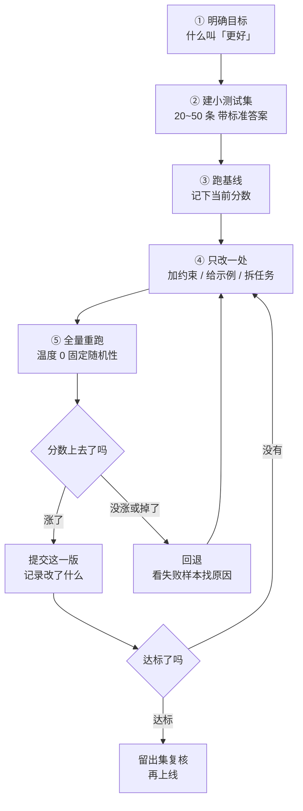

# 提示优化方法

你大概经历过这个场景：提示词昨天跑得挺好，今天加了一句约束，另一类输入突然就崩了。你也说不清到底是哪句话起的作用，只好一版版往下试，试到第十几版已经忘了第三版为啥被淘汰。

这不是你不行，是**方法不对**。提示词几乎没人能一次写对，它是改出来的——但「改」这件事本身也需要工程方法，不然你只是在换着姿势碰运气。

::: tip 一句话定义
**提示优化（Prompt Optimization）** = 用「改一处 → 在固定测试集上跑 → 看分数变化」的循环，把提示词从「碰巧能用」推到「稳定可用」，让每一次改动都有据可查、可回退。
:::

## 为什么不能靠感觉改

**第一，改动之间会互相干扰。** 你为了修 A 类输入加了一句「必须简洁」，结果 B 类输入需要的细节全被砍了。手里没有测试集，你只会看到「A 好了」，看不到「B 坏了」——**你只是把 bug 从看得见的地方挪到了看不见的地方**。

**第二，大语言模型（LLM）有随机性。** 同一个提示词跑两次结果可能不同。你改完跑一次觉得变好了，很可能只是这次采样运气好。单次试跑得出的结论，置信度接近于零。

**第三，换模型就得重调。** 今天用 GPT-4o，下季度换 Claude 或 DeepSeek，成本降一半但提示词表现变了——如果你有一套能一键重跑的测试集，换模型是半小时的活；没有，就是从头再来一遍。

> 打个比方：靠感觉改提示 = 不看仪表盘调发动机；有测试集地改 = 每拧一下螺丝都能读到转速。

## 优化循环长什么样



关键在两个字：**回退**。没有测试集的人不敢回退，因为不知道回到哪一版更好；有测试集的人可以放心地大改，因为改坏了一眼就能看出来。

## 五步方法，照着做

### 1. 先建测试集，再改提示（顺序别倒）

绝大多数人是「改到满意才想起要测」。反过来：**先花半小时攒 20~50 条样本**，再动提示词一个字。

样本要凑三类：

| 类型 | 占比参考 | 说明 |
| --- | --- | --- |
| 典型样本 | 60% | 日常最常见的输入，保底 |
| 边界样本 | 25% | 超长、空值、多语言混杂、含表情符号 |
| 事故样本 | 15% | 线上真实翻过车的输入，一条都别丢 |

**事故样本最值钱**。每次线上出问题，第一件事不是改提示，是把那条输入加进测试集——这样同样的坑不会踩第二次。

### 2. 一次只改一处（控制变量）

同时改三处，涨了 5 分你也不知道该谢谢谁。改动清单要像 git 提交一样细：

- ❌ 「优化了一下提示词」
- ✅ 「system 里加了一句『不确定就回答未知』，准确率 0.72 → 0.81」

### 3. 让模型自己报错（错误驱动优化）

别自己盯着 20 条失败样本硬看。把它们打包丢回模型，让它当分析师：

> 下面是提示词、输入、模型的错误输出、期望输出。请找出这条提示词**导致错误的具体表述**，并给出 3 条改进建议，每条只改一处。

模型经常能指出你自己看不见的问题——比如某个词有歧义、两条约束互相矛盾、格式要求写在了太靠后的位置。这招成本极低，收益常常很高。

### 4. 拆任务，别堆提示

当一条提示词写到既要抽取、又要判断、又要写摘要、还要出 JSON，它一定不稳。**模型的注意力是有限资源，一次塞四件事，四件都做七成。**

拆成流水线：


拆开的好处不止是准确率：**你终于能定位是哪一步坏了**。一条大提示词只有「对/错」，三步流水线有三个可观测点。

### 5. 提示词要版本化

把提示词当代码管：进 git、写变更说明、记下对应的测试分数。别存在同事的聊天记录里，也别只留一个 `prompt_最终版_改_v3.txt`。

## 常见症状与对应改法

| 症状 | 大概率原因 | 改法 |
| --- | --- | --- |
| 输出格式忽好忽坏 | 只用文字描述格式 | 上结构化输出（JSON Schema / 严格模式），见 [结构化输出](/advanced/structured-output) |
| 简单题也算错 | 没让它分步想 | 加[思维链（CoT）](/advanced/cot) |
| 风格不对 | 只讲了要求没给样例 | 补 1~3 个[少样本](/techniques/few-shot)范例 |
| 爱编事实 | 只靠模型记忆 | 接[检索增强生成（RAG）](/advanced/rag) + 要求引用 |
| 同一题多跑几次答案不同 | 采样随机性 | 温度设 0；重要场景上[自洽性](/advanced/self-consistency)投票 |
| 长提示里的约束被忽略 | 关键约束埋在中段 | 把硬约束放在最前或最后，并编号 |

## 可复制示例：最小回归脚本

优化的地基就是这段几十行的代码。有了它，你每次改提示词只需要跑一遍。

```js
// 需 API Key：https://platform.openai.com 获取，设为环境变量 OPENAI_API_KEY
// 模型：gpt-4o（OpenAI, 2024）；换成 deepseek-chat / qwen-plus / glm-4 同样可跑
// 用途：提示词回归测试——改完提示，跑一次看分数是涨还是掉
import OpenAI from 'openai'

const client = new OpenAI({ apiKey: process.env.OPENAI_API_KEY })

// ① 固定测试集：典型 + 边界 + 事故样本，别少于 20 条（这里只演示 4 条）
const testSet = [
  { input: '这快递太慢了，等了一周', expect: '负面' },
  { input: '客服态度特别好，问题秒解决', expect: '正面' },
  { input: '包装一般，东西还行', expect: '中性' },
  { input: '不错不错，就是有点贵😅', expect: '中性' }, // 边界：表情 + 褒贬混杂
]

// ② 候选提示词：每次只改一处，旧版留着做对比
const prompts = {
  v1: '判断这条评论的情感倾向。',
  v2: '判断这条评论的情感倾向，只回答「正面」「负面」「中性」之一，不要解释。',
  // v3 相比 v2 只多了一条歧义处理规则 —— 这就是「一次只改一处」
  v3: `判断这条评论的情感倾向，只回答「正面」「负面」「中性」之一，不要解释。
规则：褒贬混杂或态度不明的，一律判为「中性」。`,
}

async function runOne(systemPrompt, input) {
  const res = await client.chat.completions.create({
    model: 'gpt-4o',
    temperature: 0, // 关键：评测必须关掉随机性，否则分数是噪音
    messages: [
      { role: 'system', content: systemPrompt },
      { role: 'user', content: input },
    ],
  })
  return res.choices[0].message.content.trim()
}

// ③ 打分 + 打印失败样本（失败样本才是下一版的改进依据）
async function evaluate(name, systemPrompt) {
  let hit = 0
  const fails = []
  for (const { input, expect } of testSet) {
    const out = await runOne(systemPrompt, input)
    out.includes(expect) ? hit++ : fails.push({ input, expect, got: out })
  }
  console.log(`[${name}] 准确率 ${(hit / testSet.length).toFixed(2)}`)
  fails.forEach((f) => console.log(`  ✗ ${f.input} → 期望 ${f.expect}，实际 ${f.got}`))
  return hit / testSet.length
}

for (const [name, p] of Object.entries(prompts)) await evaluate(name, p)
// 输出示例：
// [v1] 准确率 0.50   ✗ 包装一般，东西还行 → 期望 中性，实际 这条评论情感偏中性，因为...
// [v2] 准确率 0.75   ✗ 不错不错，就是有点贵😅 → 期望 中性，实际 正面
// [v3] 准确率 1.00
```

分数从 0.50 到 1.00，你能**指着代码说出每一分是怎么来的**——这就是有方法和碰运气的区别。想把指标做得更专业（鲁棒性、格式合规率、模型评委），接着看[提示评测](/optimization/evaluation)。

## 什么时候该交给自动化

手动迭代到某个点会失效：候选措辞太多、场景太多、你的直觉已经榨干了。这时候上自动搜索：

- **[自动提示工程（APE）](/advanced/ape)**：让模型批量生成候选提示词，用评分函数选最优。适合「任务清楚、就是不知道怎么说」。
- **[主动提示（Active Prompting）](/advanced/active-prompt)**：不知道该拿哪些样本去教模型时，先找出模型最不确定的题，优先标注它们。
- **DSPy**：目前工程界最主流的做法，把提示当可编译程序，用 `MIPROv2`、`GEPA` 等优化器自动搜索指令与示例组合，你只需要提供指标函数。
- **平台内置优化器**：OpenAI、Anthropic、Google 的控制台都带提示词生成/改写，适合快速拿一个不错的起点，再接你自己的测试集验证。

一句话判断：**手动迭代负责摸清方向，自动搜索负责在方向内榨干收益。** 顺序别反——没有测试集就上自动优化，等于让机器帮你更快地跑偏。

::: warning 常见坑
- **在测试集上改到 100 分**：改了几十版、每版都用同一批数据判优，等于把答案背下来了。必须留一份**从没参与调优**的留出集做最终复核。
- **温度没关**：评测时温度不为 0，分数波动可能全是采样噪音，你会把噪音当成改进。
- **测试集太小**：5 条样本对一条就是 20 分，一条错误样本能让结论翻转。20 条是底线，50 条才算稳。
- **一次改一堆**：同时改角色、格式、示例，涨了跌了都不知道归因给谁，等于没测。
- **只看总分不看失败样本**：0.85 可能是「均匀地小错」，也可能是「某一类输入全错」。后者才是要命的，只看均值看不出来。
:::

## 速查清单 ✅

- [ ] 动手改提示之前，已经有 20 条以上带标准答案的测试集
- [ ] 测试集里包含边界样本和线上真实事故样本
- [ ] 每次只改一处，并记录「改了什么 + 分数变化」
- [ ] 评测时温度固定为 0
- [ ] 复杂任务拆成多步流水线，而不是堆进一条提示词
- [ ] 提示词进版本管理，能随时回退到任意历史版本
- [ ] 知道手动迭代到瓶颈后，可以上 APE / DSPy 自动搜索

## 记忆卡片 🃏

> **提示优化** = 改一处 → 在固定测试集上跑 → 看分数，循环直到达标。
> 三条铁律：**先有测试集**、**一次只改一处**、**温度设 0**。
> 心法：不敢回退，是因为没有分数；有了分数，才敢大改。

## 小结

提示优化的核心不是什么高级技巧，而是**把改提示词变成一件有分数、可归因、能回退的工程活**。先建测试集再动手，一次只改一处，复杂任务拆成流水线，改动全部进版本管理；手动迭代摸到瓶颈了，再交给 [APE](/advanced/ape) 或 DSPy 去榨干剩下的收益。

而这一切的前提是「分数算得对」——指标怎么设计、模型评委怎么用、检索增强生成场景怎么量化，下一篇[提示评测](/optimization/evaluation)专门讲这个。

---

> **来源与授权**：本文改编自 [dair-ai/Prompt-Engineering-Guide](https://github.com/dair-ai/Prompt-Engineering-Guide)（MIT License，Copyright 2022 DAIR.AI），并参考 [promptingguide.ai](https://www.promptingguide.ai) 与 [deepwiki.com.cn](https://deepwiki.com.cn/dair-ai/Prompt-Engineering-Guide) 的中文内容。仅供学习交流，保留原作者版权声明。
