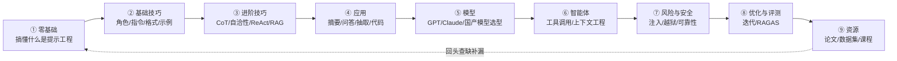

# 学习路径与课程

你可能收藏了一堆教程，却越看越乱：这篇讲 CoT，那篇讲 RAG，中间还夹着一堆看不懂的论文。问题不是资料少，是**没有顺序**。

这一篇只干一件事：**给你一条从零到能用的路线，每个阶段该看什么、看到什么程度停**。

::: tip 一句话定义
**学习路径** = 一张把零散资料串成「先学 A、再学 B、最后能做成 C」的地图。它不增加知识，但能让你少走半年弯路。
:::

## 为什么你需要一条固定路径

提示工程这块知识有个特点：**彼此强依赖**。你没搞懂「少样本」，直接看「思维链」会觉得理所当然；没搞懂「RAG」，看「上下文工程」会觉得在说黑话。

没有路径，你就会陷入两种死循环：要么从头读到尾但记不住，要么哪里不会点哪里结果点出一堆知识孤岛。

> 好的路径不是「覆盖全部」，而是「每一步只需要前一步的知识」。

## 学习路径图



从左到右就是本教程的目录顺序——它本身就是一条验证过的路径，跟着翻就行。

## 分阶段怎么学

| 阶段 | 目标 | 本教程对应 | 外部免费资源 |
| --- | --- | --- | --- |
| ① 入门 | 能说清「提示工程是什么、一条好提示有哪几块」 | [什么是提示工程](/introduction/what-is)、[提示的组成部分](/introduction/elements)、[基础原则](/introduction/basics) | 原版 [promptingguide.ai](https://www.promptingguide.ai) 的 Introduction 一节 |
| ② 基础技巧 | 能手写 zero-shot / few-shot，并指定输出格式 | [零样本](/techniques/zero-shot)、[少样本](/techniques/few-shot)、[指令式](/techniques/instructions)、[输出格式](/techniques/format) | 动手：每个技巧都拿自己的真实任务改写一遍 |
| ③ 进阶技巧 | 复杂推理会用 CoT，多步任务会想 ReAct / RAG | [思维链](/advanced/cot)、[自洽性](/advanced/self-consistency)、[思维树](/advanced/tot)、[ReAct](/advanced/react)、[RAG](/advanced/rag)、[多模态](/advanced/multimodal)、[结构化输出](/advanced/structured-output) | DeepLearning.AI 短课《ChatGPT Prompt Engineering for Developers》（吴恩达） |
| ④ 应用 | 能把提示词用到真实场景 | [应用合集](/applications/summarization)（摘要/问答/分类/抽取/代码/推理/数据生成） | 各模型官方 Cookbook（OpenAI / Anthropic 都有） |
| ⑤ 模型 | 会根据任务选模型 | [模型概览](/models/overview)、[GPT](/models/gpt)、[Claude](/models/claude)、[国产模型](/models/domestic) | 直接读模型官方文档的「Capabilities」页 |
| ⑥ 智能体 | 能让模型调工具、自主完成任务 | [什么是智能体](/agents/what-is-agent)、[核心组成](/agents/components)、[函数调用](/agents/function-calling)、[上下文工程](/agents/context-engineering) | Anthropic《Building Effective Agents》文章 |
| ⑦ 风险与安全 | 知道提示会被怎么骗、怎么防 | [对抗攻击](/risks/adversarial)、[提示注入](/risks/injection)、[越狱](/risks/jailbreak)、[可靠性](/risks/reliability) | 各模型官方安全文档（如 OpenAI 安全最佳实践） |
| ⑧ 优化与评测 | 能把「手感」变成「分数」 | [提示优化](/optimization/optimizing-prompts)、[提示评测](/optimization/evaluation) | [RAGAS](https://github.com/explodinggradients/ragas) 官方文档 |
| ⑨ 资源 | 会自己找资料、追新 | [论文](/resources/papers)、[工具](/resources/tools)、[数据集](/resources/datasets) | arXiv cs.CL 最新列表、HuggingFace 趋势榜 |

## 一个「让模型给你排课表」的小例子

如果你懒得自己排，把下面这条丢给任意模型，它会按你的水平生成专属计划：

```text
你是一名提示工程方向的导师。请根据我的背景生成一份 4 周学习路线：
- 我的背景：<写你是零基础 / 前端工程师 / 算法岗>
- 我的目标：<写你想做聊天机器人 / 智能体 / 评测>
- 每周投入：<写每天几小时>
要求：每周给 3~5 个具体任务（带可点击的学习链接或本教程章节），并标注「动手练习」项。
不要列书单式清单，要能直接照着做。
```

::: warning 常见坑
- **收藏即学会**：把教程塞进收藏夹不等于学会，每个技巧都要拿自己的真实任务改写一遍才算数。
- **跳着学**：没搞懂少样本就去看思维树，只会越看越懵。严格按依赖顺序来。
- **只在玩具数据上验证**：用「写首诗」测试提示词当然都好看，但上线场景才是试金石。
- **追新不追透**：天天看新模型发布，基础技巧却没练熟。新东西是锦上添花，不是地基。
:::

## 速查清单 ✅

- [ ] 知道学习路径是「先 A 再 B」的依赖顺序，不是资料堆砌
- [ ] 能说出本教程 9 大分区的先后顺序及依赖关系
- [ ] 每个基础技巧都拿自己的任务亲手改写过一遍
- [ ] 知道吴恩达短课、各模型官方 Cookbook 这几个免费入口
- [ ] 会给自己的背景和目标让模型生成专属学习计划

## 记忆卡片 🃏

> **学习路径** = 把零散资料串成「先学啥、再学啥」的地图，核心是每一步只依赖前一步。
> 九步闭环：入门 → 基础技巧 → 进阶技巧 → 应用 → 模型 → 智能体 → 风险 → 评测 → 资源（再回头补缺）。
> 铁律：收藏不等于学会，每个技巧都要亲手改写一遍自己的任务。

## 小结

你不需要把全网教程都刷完。顺着上面这条路径，把本教程 9 个分区通读一遍、每个技巧亲手改一遍，再配一两个免费外部课程，就已经超过大部分「看过很多 Prompt 文章」的人了。想找原文和论文出处，回 [必读论文清单](/resources/papers)；想找能直接用的框架和平台，看 [实用工具与框架](/resources/tools)。

---

> **来源与授权**：本文改编自 [dair-ai/Prompt-Engineering-Guide](https://github.com/dair-ai/Prompt-Engineering-Guide)（MIT License，Copyright 2022 DAIR.AI），并参考 [promptingguide.ai](https://www.promptingguide.ai) 与 [deepwiki.com.cn](https://deepwiki.com.cn/dair-ai/Prompt-Engineering-Guide) 的中文内容。仅供学习交流，保留原作者版权声明。
