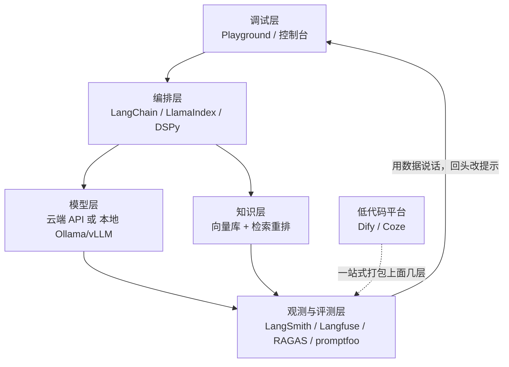

# 实用工具与框架

你在聊天框里调了半天提示词，终于满意了。然后问题来了：怎么把它变成一个能给同事用、能上线、改坏了还能查出来的东西？

这就是工具链要解决的事。这篇不铺开讲每个工具怎么用，只回答一个问题：**在你现在这个阶段，装哪几样就够了？**

::: tip 一句话定义
**提示工程工具链** = 一套把提示词从「聊天框里的手工活」变成「可复用、可测试、可上线」的工程件的软件组合。
:::

## 为什么需要工具，不能一直手工

手工调提示词，前期最快、后期最惨。三个问题迟早找上门：

- **改了不知道有没有变好**：靠印象判断，改 A 修好了、B 悄悄坏了，你还不知道。
- **看不见成本**：一个请求花了多少词元（token）、慢在哪一步，全靠猜。
- **换不动模型**：提示词硬编码在代码里，想从 GPT 换成通义千问，得翻半天。

> 手工调提示词像用记事本写代码：能写，但没有语法高亮、没有断点、没有测试。

工具的价值不是让你写出更妙的提示词，而是**让「改得更好」这件事变得可测量、可回退**。

## 工具栈长什么样

注意最后那条回流箭头：**没有观测和评测，整个链路就是开环的**，你永远在凭感觉改。

## 一、调试层：先把手感练出来

| 工具 | 一句话点评 |
| --- | --- |
| [OpenAI Playground](https://platform.openai.com/playground) | 调温度（temperature）、比模型、看词元消耗，满意后一键导出代码 |
| [Claude 控制台](https://console.anthropic.com) | 自带提示词生成器和优化器，能把你写的粗糙需求改写成结构化提示，抄它的结构很涨功力 |
| [Google AI Studio](https://aistudio.google.com) | 免费额度大方，想试超长上下文和多模态，从这儿入门成本最低 |
| [Claude 提示工程文档（中文）](https://docs.claude.com/zh-CN/docs/build-with-claude/prompt-engineering/overview) | 官方文档里写得最系统的一份，XML 标签、角色提示、提示链都有实例 |
| [OpenAI Cookbook](https://cookbook.openai.com) | 全是能跑的 Notebook，遇到具体场景先来这儿搜有没有现成方案 |

> 新手建议：先在控制台里手工调到满意，再写代码。跳过这步直接上框架，你连「哪里出错」都定位不了。

## 二、编排层：把提示词接进程序

| 工具 | 一句话点评 |
| --- | --- |
| [LangChain](https://python.langchain.com/docs/introduction/) | 生态最大的编排框架，链、工具、记忆、各家模型适配一应俱全；抽象偏厚，适合快速拼装、不适合当第一课 |
| [LangGraph](https://langchain-ai.github.io/langgraph/) | 用「图 + 状态机」写智能体（agent）流程，分支、循环、人工审核节点都能显式画出来，比链式结构可控得多 |
| [LlamaIndex](https://docs.llamaindex.ai/en/stable/) | 专攻检索增强生成（RAG）：文档切分、索引、召回、重排开箱即用，做知识库问答比 LangChain 更顺手 |
| [DSPy](https://dspy.ai) | 思路很不一样——把提示词当成「可优化的程序」，用少量标注数据自动搜索最优提示与示例，省掉手工试错 |
| [Instructor](https://python.useinstructor.com) | 用 Pydantic 定义你要的输出结构，自动校验加重试，再也不用手写 JSON 解析和容错 |
| [Outlines](https://github.com/dottxt-ai/outlines) | 从解码层面约束输出，保证 JSON / 正则一定合法，比「求模型别乱写」靠谱 |

## 三、低代码平台：不写代码也能搭

| 工具 | 一句话点评 |
| --- | --- |
| [Dify](https://dify.ai)（[文档](https://docs.dify.ai)） | 开源低代码平台，拖拽编排工作流 + 内置知识库，团队里非工程同学也能自己改提示词，可私有化部署 |
| [Coze 扣子](https://www.coze.cn) | 国内上手最快的智能体搭建平台，插件生态丰富，做个能用的 Bot 半小时够了 |
| [FastGPT](https://tryfastgpt.ai) | 国产开源知识库问答，对私有化部署和企业内网场景友好 |
| [n8n](https://n8n.io) | 通用自动化工具加 LLM 节点，适合把模型接进已有的业务流（邮件、表单、数据库）而不是从零建应用 |

> 低代码不是玩具，但也别指望它替你做架构。**验证想法用它，逻辑复杂到要写条件分支时，就该转代码了。**

## 四、本地部署：数据不出门，或者纯粹想省钱

| 工具 | 一句话点评 |
| --- | --- |
| [Ollama](https://ollama.com) | 一条 `ollama run` 就能跑本地模型，开发调试首选，兼容 OpenAI 接口格式 |
| [LM Studio](https://lmstudio.ai) | 图形界面，零命令行体验本地模型，适合先看看效果再决定要不要折腾 |
| [llama.cpp](https://github.com/ggml-org/llama.cpp) | 量化推理的老牌项目，CPU 和消费级显卡也能跑，上面两个工具的底座 |
| [vLLM](https://docs.vllm.ai/en/latest/) | 生产级高吞吐推理引擎，自建 API 服务的事实标准，并发和显存利用率远好过原生推理 |
| [SGLang](https://github.com/sgl-project/sglang) | 与 vLLM 同类，在结构化输出和前缀复用场景上表现突出，值得一起压测对比 |

向量库按规模挑就行：本地起步用 [Chroma](https://www.trychroma.com)，上生产看 [Qdrant](https://qdrant.tech) 或 [Milvus](https://milvus.io)，已经在用 PostgreSQL 的直接上 [pgvector](https://github.com/pgvector/pgvector)，别为了向量检索单独引入一套数据库。

## 五、观测与评测：这层最容易被跳过，也最不该跳

| 工具 | 一句话点评 |
| --- | --- |
| [LangSmith](https://www.langchain.com/langsmith) | 全链路追踪加数据集回归测试，每次调用的输入输出、耗时、花费一目了然 |
| [Langfuse](https://langfuse.com) | 开源可自托管的同类产品，追踪之外还带提示词版本管理，改坏了能回滚 |
| [RAGAS](https://docs.ragas.io/en/stable/) | 专测 RAG 的指标库：忠实度、答案相关性、上下文召回，帮你定位是「检索没找到」还是「模型没看懂」 |
| [promptfoo](https://promptfoo.dev) | 用 YAML 写测试用例，一次跑多个模型多个提示版本做对比，能直接接进 CI |
| [DeepEval](https://github.com/confident-ai/deepeval) | pytest 风格的 LLM 测试框架，习惯写单测的人零学习成本 |
| [OpenCompass](https://opencompass.org.cn) | 国内评测体系，中文任务覆盖全，想跑标准基准看它 |

## 三种起步组合，照抄就行

| 你的情况 | 最小可用组合 |
| --- | --- |
| 个人学习 | 官方控制台 + Ollama（跑本地模型练手），先不碰框架 |
| 小团队做原型 | Dify 或 Coze 搭流程 + Langfuse 看调用日志 |
| 要上生产 | LangGraph / LlamaIndex 写编排 + vLLM 或云 API + Qdrant + LangSmith 加 promptfoo 做回归 |

::: warning 常见坑
- **一上来就学框架**：LangChain 的抽象会把「提示词到底长什么样」藏起来，原理没搞懂就用，出问题完全无从下手。先手写裸调用，再上框架。
- **把 Playground 的效果当生产效果**：控制台里你手工重试了三次才满意，线上是一次性的，务必用真实数据批量测。
- **没有评测就上线**：改提示词全靠感觉，等用户投诉才发现回归——最小成本是先攒 20 条真实用例当回归集。
- **以为本地模型能力和云端旗舰持平**：7B 级别的本地模型跑得动不等于跟得上，复杂推理任务差距明显，别拿它验证提示词上限。
- **密钥硬编码进仓库**：所有工具都走环境变量，`.env` 记得进 `.gitignore`。
:::

## 速查清单 ✅

- [ ] 知道工具栈五层：调试 / 编排 / 模型 / 知识 / 观测评测
- [ ] 先在控制台手工调通，再写代码接框架
- [ ] 做 RAG 优先看 LlamaIndex，做智能体流程优先看 LangGraph
- [ ] 本地跑模型用 Ollama 起步，上生产换 vLLM
- [ ] 上线前攒一个 20 条以上的回归用例集，用 promptfoo 或 LangSmith 跑
- [ ] 密钥一律走环境变量，绝不进代码仓库

## 记忆卡片 🃏

> **工具的价值** = 让「改提示词」变得可测量、可回退，而不是替你写出更妙的提示词。
> 五层栈：调试 → 编排 → 模型 → 知识 → 观测评测，闭环靠最后一层。
> 起步三件套：官方控制台（练手）+ Ollama 或云 API（跑通）+ Langfuse 或 promptfoo（别瞎改）。

## 小结

工具别贪多。**你缺的那一环是什么，就补那一样**：手感不够就多泡控制台；接程序卡住就挑一个编排框架；数据敏感就上本地部署；改提示词心里没底，就赶紧把观测和评测补上——这一层的投入回报率最高，也最常被跳过。

想知道这些工具背后的思路从哪来，看 [必读论文清单](/resources/papers)；想搞清评测里那些分数怎么算，看 [常用数据集与基准](/resources/datasets)。

---

> **来源与授权**：本文改编自 [dair-ai/Prompt-Engineering-Guide](https://github.com/dair-ai/Prompt-Engineering-Guide)（MIT License，Copyright 2022 DAIR.AI），并参考 [promptingguide.ai](https://www.promptingguide.ai) 与 [deepwiki.com.cn](https://deepwiki.com.cn/dair-ai/Prompt-Engineering-Guide) 的中文内容。仅供学习交流，保留原作者版权声明。
