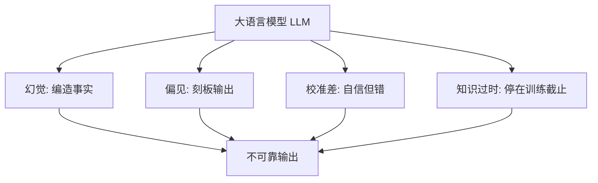

# 可靠性与事实性（Reliability & Factuality）

模型守规矩了，不代表它就靠谱。你问它一个事实，它讲得头头是道、还带引用格式，但内容全是编的——这事比越狱更常发生，也更难一眼看穿。这就是**可靠性与事实性（Reliability & Factuality）**要谈的。

::: tip 一句话定义
**可靠性与事实性（Reliability & Factuality）** = 模型输出是否稳定、可信、与真实世界一致；衡量它「会不会一本正经地胡说」。
:::

## 为什么这事最容易被低估

越狱、注入至少有个「攻击者」，你能感知风险。而**幻觉（Hallucination）**是模型自己「认真犯错」——没有坏人，它也会编。

> 类比：模型像个记性超好但爱脑补的同事，你问啥他都敢答，答错了还特别自信，你稍不留神就当真用了。

在客服、医疗、法律、代码这类「错一句就出事」的场景，事实性直接决定产品能不能上线。

## 模型不靠谱的 4 张面孔

### 1. 幻觉（Hallucination）

模型生成看似合理、实则不存在的事实：编造论文、法条、API、人名、统计数字。根因是它本质是「预测下一个词」，没有「我不确定」的硬开关。

### 2. 偏见（Bias）

训练数据里的社会偏见会渗进输出：性别、地域、职业刻板印象，或对某些群体不公平的措辞。需要时可以加去偏见约束并做公平性检查。

### 3. 校准差（Poor Calibration）

模型**自信但错**：给它一道它不会的题，它不打退堂鼓，反而用高分贝语气编到底。它的「置信度」和「正确率」常常对不上。

### 4. 知识过时（Stale Knowledge）

模型的知识停在训练截止日。问它「最新的 XX 框架怎么用」「昨天发布的政策」，它可能用旧知识硬答，或把新东西编成旧样子。



## 怎么做：让模型「说人话、说对话」

1. **事实对齐（Grounding）/ RAG**：别只靠模型记忆，把权威资料检索进来，让它「照着资料答」。详见[检索增强生成（RAG）](/advanced/rag)。这是治幻觉最有效的手段。
2. **要求引用（Citations）**：提示里写明「每条结论附出来源，找不到来源就标『不确定』」。逼它把断言拴在证据上。
3. **承认不确定**：提示加一句「不知道就说不知道，不要猜」，降低瞎编概率。
4. **人工复核（Human-in-the-loop）**：高风险输出（诊断、法条、金额）必经人确认，模型只做初稿。
5. **评估指标（Evaluation）**：用事实性基准（如 TruthfulQA、HaluEval）和自动化评测盯住「准确率 / 幻觉率」，上线前先量。这也正是[评测篇](/optimization/evaluation)要展开的主题。

## 可复制示例（防御示意）

**让模型强制引用 + 承认不确定（需 API Key；模型 gpt-4o，OpenAI, 2024；示意）：**

```js
// 需 API Key：https://platform.openai.com 获取，设为环境变量 OPENAI_API_KEY
// 示意：生产环境配合 RAG 把资料塞进 user 消息，而非只靠模型记忆
import OpenAI from 'openai'

const client = new OpenAI({ apiKey: process.env.OPENAI_API_KEY })

const completion = await client.chat.completions.create({
  model: 'gpt-4o',
  messages: [
    {
      role: 'system',
      content: `你是严谨的科普助手。规则：
1. 只基于用户提供的资料作答，不自行补充资料外的事实；
2. 每条结论后附「来源：资料第 X 段」；
3. 资料里没有的，明确写「资料未提及，无法确定」，不得臆测。`,
    },
    {
      role: 'user',
      content: `资料：
[1] 维生素 D 有助于钙吸收。
[2] 成人每日建议摄入量约 600 IU。

问题：维生素 D 能治感冒吗？请给出处。`,
    },
  ],
})

console.log(completion.choices[0].message.content)
// 期望：指出资料未提及，无法确定，不编造「能/不能治」
```

::: warning 常见坑
- **把「流畅」当「正确」**：语气越自信越要警惕，校准差恰恰是自信但错。
- **不接 RAG 就问时效性事实**：模型知识有截止日，问「最新」必踩过时坑。
- **忘了要引用**：没要求出处，模型就更容易自由发挥、编得有理有据。
- **高风险场景直接采信**：医疗/法律/金额类，模型输出只当草稿，必须人复核。
:::

## 速查清单 ✅

- [ ] 能说出幻觉、偏见、校准差、知识过时四张面孔
- [ ] 知道 RAG grounding 是治幻觉的主力
- [ ] 会给模型下「要求引用 + 承认不确定」的指令
- [ ] 明白「流畅 ≠ 正确」，警惕过度自信
- [ ] 知道高风险输出要人工复核
- [ ] 了解事实性可用基准 + 评测来量化

## 记忆卡片 🃏

> **可靠性与事实性** = 模型会不会一本正经地胡说。
> 四张脸：幻觉 / 偏见 / 校准差 / 知识过时。
> 治：RAG grounding + 要引用 + 人复核 + 上评测。

## 小结

模型的「不靠谱」比「被攻击」更隐蔽：幻觉让它编造事实、偏见渗进措辞、校准差让它自信地错、知识过时让它用旧答案答新问题。缓解靠四件套——**RAG 事实对齐、强制引用、承认不确定、人工复核**，并用评测指标把「幻觉率」量出来。要系统地把这套度量跑起来，接着看[评测篇](/optimization/evaluation)。

---

> **来源与授权**：本文改编自 [dair-ai/Prompt-Engineering-Guide](https://github.com/dair-ai/Prompt-Engineering-Guide)（MIT License，Copyright 2022 DAIR.AI），并参考 [promptingguide.ai](https://www.promptingguide.ai) 与 [deepwiki.com.cn](https://deepwiki.com.cn/dair-ai/Prompt-Engineering-Guide) 的中文内容。仅供学习交流，保留原作者版权声明。
