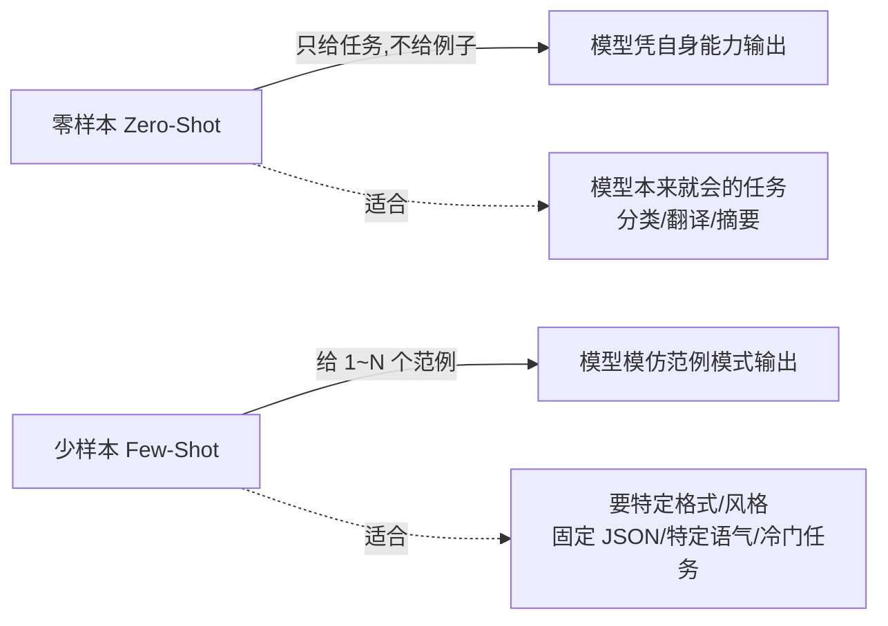

# 少样本提示（Few-Shot）

你有没有遇到过：任务说得很清楚，模型还是自由发挥、格式跑偏？这时候别硬刚指令，给它**看几个例子**——这就是少样本提示（Few-Shot），让模型照葫芦画瓢。

::: tip 一句话定义
**少样本提示（Few-Shot）** = 在提示里给出 1~N 个「输入 → 输出」范例，让大语言模型（LLM）通过上下文学习（in-context learning）模仿这个模式，而不是只靠指令硬猜。
:::

## 为什么「给例子」这么灵

大模型有个本事：你给它看几个样例，它能立刻抓住里面的**规律**——格式、语气、分类标准——然后套到新输入上。这比用文字描述规则高效得多。

> 类比：教新人填表，你念三遍填表规范，不如直接甩两张填好的样表给他。他一看就懂「哦，原来要这样」。

而且现在的新模型（GPT-4o / 4.5、Claude 3.5+、DeepSeek-V3/R1、Qwen2.5+）上下文学习（in-context learning）能力很强，几个例子就能对齐到你要的样子。

## 少样本 vs 零样本



> 判断口诀：**模型本来就会、你不挑格式 → 零样本就够**（见 [零样本提示（Zero-Shot）](/techniques/zero-shot)）。要它严格照某种格式/风格出，或任务偏冷门 → 上 few-shot。

## 怎么写少样本

核心就三步：

1. **挑代表性样例**：覆盖典型情况，最好包含 1 个「容易混淆」的边界case，帮模型定边界。
2. **保持格式一致**：每个样例都写成「输入：… → 输出：…」，模型才会学这个结构。
3. **范例放指令之后、待解问题之前**：顺序一般是 `角色 + 任务说明 + 范例 + 新输入`。

| 要素 | 写法要点 |
| --- | --- |
| 样例数量 | 1 个起步，复杂任务 3~5 个；不是越多越好，多了烧 token |
| 样例质量 | 必须「你想要的样子」，模型会原样模仿缺点 |
| 位置 | 在 system/user 里，新任务前 |

## 可复制示例（OpenAI 格式）

下面用 gpt-4o 做情感分类 + 格式转换两个任务，各给 2~3 个 few-shot 范例。

```js
// 需 API Key：https://platform.openai.com 获取，设为环境变量 OPENAI_API_KEY
// 模型：gpt-4o（OpenAI, 2024 年发布）；可换成 deepseek-chat / qwen-plus 等
import OpenAI from 'openai'

const client = new OpenAI({ apiKey: process.env.OPENAI_API_KEY })

const completion = await client.chat.completions.create({
  model: 'gpt-4o',
  messages: [
    {
      role: 'system',
      // 角色 + 任务说明
      content: '你是一个情感分类器。判断留言情感为 正面/负面/中性 之一，只返回类别。',
    },
    {
      role: 'user',
      // ① 范例 1~3（few-shot）：输入→输出，格式统一
      content: `示例：
输入：音质不错，物流也快。→ 输出：正面
输入：左耳没声音，申请退货。→ 输出：负面
输入：还行吧，没什么惊喜。→ 输出：中性

现在请分类：
输入：包装有点破，但耳机本身很好用。`,
    },
  ],
})

console.log(completion.choices[0].message.content)
// 输出示例：正面
```

再来一个**格式转换**任务，用 few-shot 把口语转成固定 JSON 结构：

```js
// 需 API Key：https://platform.openai.com 获取，设为环境变量 OPENAI_API_KEY
// 模型：gpt-4o（OpenAI, 2024 年发布）；示意结构
const completion2 = await client.chat.completions.create({
  model: 'gpt-4o',
  messages: [
    {
      role: 'system',
      content: '你把用户的口语订单整理成 JSON，字段为 name/product/qty。',
    },
    {
      role: 'user',
      content: `示例：
输入：给我来两箱可乐。→ 输出：{"name":"张三","product":"可乐","qty":2}
输入：李四要三盒牛奶。→ 输出：{"name":"李四","product":"牛奶","qty":3}

输入：王五订五包薯片。`,
    },
  ],
})
console.log(completion2.choices[0].message.content)
// 输出示例：{"name":"王五","product":"薯片","qty":5}
```

::: warning 常见坑
- **样例本身有错**：模型会原样模仿，范例错 = 输出错。先核对样例质量。
- **样例风格不一致**：有的给 JSON、有的给纯文本，模型无所适从，统一一种。
- **只给清一色样例**：没给边界 case，模型遇到模糊输入就乱判；补 1 个「易混」样例定边界。
- **用 few-shot 硬刚零样本能搞定的活**：白烧 token，先试零样本。
:::

## 速查清单 ✅

- [ ] 能说出 few-shot 的定义和「上下文学习」原理
- [ ] 知道它适合「要特定格式/风格/冷门任务」
- [ ] 会挑 1~N 个代表性、格式一致的样例
- [ ] 明白样例放「任务说明之后、新输入之前」
- [ ] 会和零-shot 做取舍，不滥用

## 记忆卡片 🃏

> **少样本提示** = 给几个「输入→输出」范例，让模型照学。
> 关键：样例要准、格式要齐、放对位置；模型本来就会的活别硬用。

## 小结

少样本提示（Few-Shot）就是**给模型看几个范例让它模仿**，最擅长「要特定格式/风格」或偏冷门的任务，靠的是上下文学习（in-context learning）。和零样本配合用最省事。下一篇讲怎么把「指令」本身写清楚：[指令式提示](/techniques/instructions)。

---

> **来源与授权**：本文改编自 [dair-ai/Prompt-Engineering-Guide](https://github.com/dair-ai/Prompt-Engineering-Guide)（MIT License，Copyright 2022 DAIR.AI），并参考 [promptingguide.ai](https://www.promptingguide.ai) 与 [deepwiki.com.cn](https://deepwiki.com.cn/dair-ai/Prompt-Engineering-Guide) 的中文内容。仅供学习交流，保留原作者版权声明。
