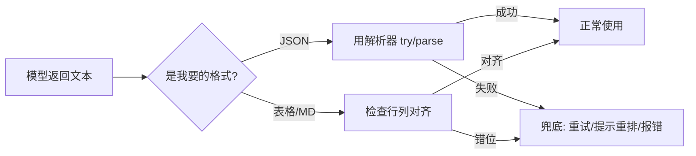

# 指定输出格式

你让 AI「整理成表格」，它给你一段话；你程序要解析 JSON，它却回了句「好的，以下是结果」。问题不在模型，而在你**没把输出格式（output format）说死**。本文教你如何稳稳拿到想要的形态。

::: tip 一句话定义
**指定输出格式** = 在提示里明确要求模型按某种结构产出（JSON / 表格 / XML / Markdown 等），并在拿到结果后做校验与兜底，确保能直接用、能被程序解析。
:::

## 为什么格式值得单独讲

模型默认爱「说人话」——一段自然语言。但你要的往往是**机器能读**的结构：

- 喂给前端渲染 → 要 JSON
- 贴进文档 → 要 Markdown / 表格
- 跨系统对接 → 要 XML

> 类比：你点外卖写「来份炒饭」，老板给一盒；你写「份量一人食、不要葱、分开装酱」，拿到才合心意。格式就是那句「分开装酱」。

不定格式，模型就自由发挥，你还得手动搬数据——既累又易错。

## 四种常用格式怎么要

| 格式 | 适用场景 | 提示里怎么写 |
| --- | --- | --- |
| JSON | 程序解析、接口对接 | 「仅返回 JSON，字段为 {…}，不要解释」 |
| 表格 | 贴文档、对比展示 | 「用 Markdown 表格，表头为 …」 |
| XML | 老系统、可嵌套结构 | 「用 XML，标签为 <item>…</item>」 |
| Markdown | 笔记、文档、列表 | 「用 Markdown，二级标题 + 无序列表」 |

## 写格式要求的 3 个技巧

1. **只返回结构、不要闲聊**：加一句「不要解释、不要前缀」，避免模型在 JSON 前加「这是你要的 JSON：」。
2. **把字段名写死**：JSON 要哪些 key、类型是什么，列清楚，模型才不会自创字段。
3. **给个最小样例**：格式怪时，甩一个微型示例比描述更准（这其实已接近少样本，见 [少样本提示（Few-Shot）](/techniques/few-shot)）。

## 拿到结果后：校验与兜底

模型偶尔会「嘴瓢」——JSON 少了个括号、表格错位。所以**别无条件信任输出**：



> 实操建议：JSON 一定要 `JSON.parse` 包在 try-catch 里；失败了就让模型「只返回合法 JSON 并重试一次」，多数能救回来。

## 可复制示例（OpenAI 格式）

要求模型输出结构化 JSON，并在代码里做校验兜底。

```js
// 需 API Key：https://platform.openai.com 获取，设为环境变量 OPENAI_API_KEY
// 模型：gpt-4o（OpenAI, 2024 年发布）；可换成 deepseek-chat / qwen-plus 等
import OpenAI from 'openai'

const client = new OpenAI({ apiKey: process.env.OPENAI_API_KEY })

const completion = await client.chat.completions.create({
  model: 'gpt-4o',
  messages: [
    {
      role: 'system',
      content: '你是订单信息提取器，严格按格式输出。',
    },
    {
      role: 'user',
      // 指定 JSON 格式 + 字段 + 不要闲聊
      content: `从用户口语中提取订单信息，仅返回合法 JSON，不要任何解释或前缀。
字段：name(字符串) / product(字符串) / qty(数字)。
示例：{"name":"张三","product":"可乐","qty":2}

用户输入：李四要三盒牛奶。`,
    },
  ],
})

const raw = completion.choices[0].message.content
// 校验 + 兜底
try {
  const order = JSON.parse(raw)
  console.log('解析成功：', order)
  // 输出示例：{ name: '李四', product: '牛奶', 'qty': 3 }
} catch (e) {
  console.error('JSON 解析失败，需重试或提示模型重排：', raw)
}
```

::: warning 常见坑
- **只说「用 JSON」没给字段**：模型自创 key，你程序对不上，字段名写死。
- **没加「不要解释」**：模型在 JSON 前加说明，直接 `JSON.parse` 报错，务必只返回结构。
- **不校验就直接用**：模型偶发格式错误，上线必崩，JSON 一定包 try-catch。
- **复杂嵌套硬靠指令**：多层 JSON 建议直接给 few-shot 样例，比纯文字描述稳。
:::

## 速查清单 ✅

- [ ] 要格式时写清「JSON/表格/XML/Markdown」及字段
- [ ] 加「不要解释、只返回结构」防闲聊
- [ ] 复杂格式会给微型样例（接近 few-shot）
- [ ] 程序侧对 JSON 做 try-catch 校验
- [ ] 知道解析失败要重试/兜底，不裸信输出

## 记忆卡片 🃏

> **指定输出格式** = 明说要什么结构，并校验兜底确保能用。
> 关键：字段写死、只要结构、解析必 try-catch。

## 小结

指定输出格式就是**把「要什么形态」说死**，并加校验兜底——JSON 字段写死、只要结构不要闲聊、解析必包 try-catch。它是把 AI 接进系统的关键一步；想要更稳的结构化输出（如函数调用级别的强约束），可看进阶章节 [结构化输出](/advanced/structured-output)（后续）。回到基础，下一篇回顾 [提示工程基础原则](/introduction/basics)。

---

> **来源与授权**：本文改编自 [dair-ai/Prompt-Engineering-Guide](https://github.com/dair-ai/Prompt-Engineering-Guide)（MIT License，Copyright 2022 DAIR.AI），并参考 [promptingguide.ai](https://www.promptingguide.ai) 与 [deepwiki.com.cn](https://deepwiki.com.cn/dair-ai/Prompt-Engineering-Guide) 的中文内容。仅供学习交流，保留原作者版权声明。
