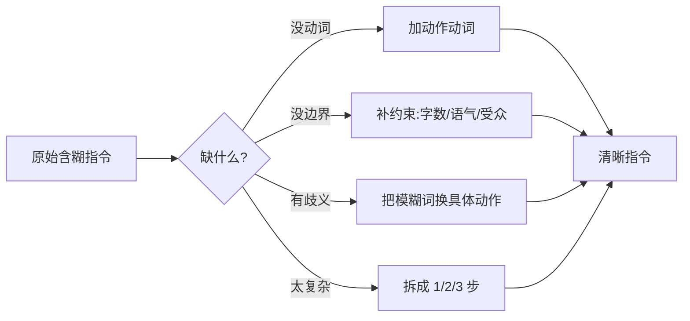

# 指令式提示

你跟 AI 说话，最常见的方式其实就是「下命令」：翻译这段、总结这篇、列出三点。这种**直接给指令**的写法，就叫指令式提示（instruction prompting）。朴素，但用好了极顺手。

::: tip 一句话定义
**指令式提示（Instruction Prompting）** = 用清晰、直接的命令句告诉大语言模型（LLM）「做什么、怎么做的边界是什么」，不靠示例、不靠角色扮演，靠指令本身把事说清。
:::

## 为什么「下命令」也有讲究

指令式提示和零样本提示（Zero-Shot）常常重叠——都是不给例子直接干。区别在重点：零样本强调「不给范例」，指令式强调「**怎么把命令写清楚**」。

一句含糊的指令，模型只能脑补；一句到位的指令，模型立刻动手。写好指令，是几乎所有提示技巧的地基。

> 类比：给队友派活。「弄一下那个页面」他肯定懵；「把登录页的按钮改成蓝色、圆角 8px、今天下班前提交」他马上懂。指令式提示就是把「派活」说到位。

## 写好指令的 4 个要点

### 1. 用动作动词开头

别写「关于天气的一段文字」，写「**写一段**关于天气的文字」。动词（写/翻译/提取/对比/分类/列出）直接告诉模型动作，减少歧义。

### 2. 写明约束

字数、语气、受众、不能做的事——一次列清。「写成 100 字内、口语化、面向家长、不要术语」比「写通俗点」强十倍。

### 3. 避免歧义

一个词有俩意思时，点明你要哪个。「总结」是要要点列表还是一段话？「分析」是要利弊还是步骤？把模糊词换成具体动作。

### 4. 复杂任务分步

一步搞不定的，拆成 1/2/3 步，告诉模型按顺序来。分步还能让你逐步校验，哪步歪了一眼看出。

| 要点 | ❌ 模糊指令 | ✅ 清晰指令 |
| --- | --- | --- |
| 动词 | 关于竞品的内容 | 对比我们和竞品的定价策略 |
| 约束 | 写详细点 | 列 3 条，每条 ≤ 30 字 |
| 歧义 | 总结这篇文章 | 提取本文的 3 个核心观点，用列表 |
| 分步 | 帮我做份方案 | 第一步列目标；第二步给 3 个方向；第三步选 1 个展开 |

## 模糊 → 清晰：改写流程



## 可复制示例（OpenAI 格式）

先给一条模糊指令，再改写成清晰指令，用 gpt-4o 跑清晰版。

```js
// 需 API Key：https://platform.openai.com 获取，设为环境变量 OPENAI_API_KEY
// 模型：gpt-4o（OpenAI, 2024 年发布）；可换成 deepseek-chat / qwen-plus 等
import OpenAI from 'openai'

const client = new OpenAI({ apiKey: process.env.OPENAI_API_KEY })

// ❌ 模糊指令（示意，效果不稳）
// content: '写点关于远程办公的内容'

// ✅ 清晰指令：动作动词 + 约束 + 无歧义 + 分步
const completion = await client.chat.completions.create({
  model: 'gpt-4o',
  messages: [
    {
      role: 'system',
      content: '你是一名 HR 专栏作者，文风务实、有数据感。',
    },
    {
      role: 'user',
      content: `请写一篇关于「远程办公」的短文，要求：
1. 动作：先给定义，再列 3 条优劣；
2. 约束：全文 ≤ 200 字，口语化、不堆术语；
3. 受众：面向刚转远程的职场新人；
4. 格式：定义一段 + 用 Markdown 列表列优劣。`,
    },
  ],
})

console.log(completion.choices[0].message.content)
// 输出示例：
// 远程办公=不在公司、用网络完成工作。
// 优点：
// - 省通勤，时间更自由
// - 环境舒服，状态更松
// - 跨地域招人，选择更多
// 缺点：
// - 容易拖延，需自律
// - 沟通靠打字，易误会
// - 界限模糊，下班难停
```

::: warning 常见坑
- **用名词当指令**：「一份周报」不是指令，「写一份周报」才是。缺动词模型就猜。
- **约束藏在心里**：你心想 5 条标准只说 1 条，模型只能交半吊子，把标准列全。
- **一步塞太多动作**：又要总结又要翻译又要改语气，拆开写更稳。
- **过度指令变枷锁**：约束太死模型没发挥空间，留一点弹性给创意类任务。
:::

## 速查清单 ✅

- [ ] 指令以动作动词开头（写/翻译/提取/对比…）
- [ ] 关键约束（字数/语气/受众）写明
- [ ] 模糊词已换成具体动作
- [ ] 复杂任务已拆成步骤
- [ ] 能把一条模糊指令改写成清晰版

## 记忆卡片 🃏

> **指令式提示** = 用清晰命令句直接下任务，靠指令本身把事说清。
> 关键：动词开头、约束写全、消除歧义、复杂分步。

## 小结

指令式提示就是**把命令写到位**：动作动词开头、约束写全、消除歧义、复杂任务分步。它是所有提示技巧的地基。下一篇讲指令里最常漏的一块——[指定输出格式](/techniques/format)。

---

> **来源与授权**：本文改编自 [dair-ai/Prompt-Engineering-Guide](https://github.com/dair-ai/Prompt-Engineering-Guide)（MIT License，Copyright 2022 DAIR.AI），并参考 [promptingguide.ai](https://www.promptingguide.ai) 与 [deepwiki.com.cn](https://deepwiki.com.cn/dair-ai/Prompt-Engineering-Guide) 的中文内容。仅供学习交流，保留原作者版权声明。
