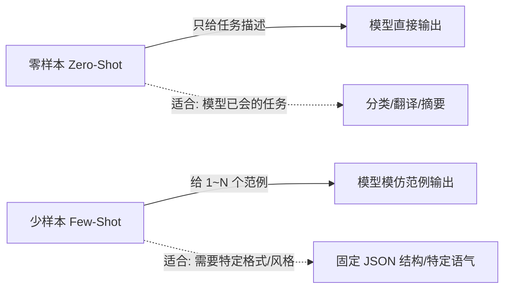

# 零样本提示（Zero-Shot）

「零样本（Zero-Shot）」听着像学术名词，其实特别日常：就是**你直接给模型一个任务，一个例子都不举，让它自己搞定**。

比如你敲一句：「把下面这段话翻译成英文」，没给它任何范例——这就是零样本提示。

::: tip 一句话定义
**零样本提示（Zero-Shot Prompting）**：在提示中只描述任务和目标，**不提供任何输入-输出范例**，直接让大语言模型（LLM）凭自身能力完成任务。
:::

## 为什么它是最常用的技巧

- **快**：不用费心构造示例，想到就能写。
- **省**：示例会占用 token（= 钱 + 上下文空间），零样本最省。
- **够用**：对分类、翻译、摘要、格式化这类「模型本来就会」的任务，零样本往往一次就成。
- **新模型更擅长**：如今的强模型（如 GPT-4o / o 系列、Claude 3.5+、DeepSeek-R1/V3、Qwen2.5+）在零样本下的表现，已经远好于早期模型，很多时候根本不需要喂例子。

## 零样本 vs 少样本



> 简单判断：模型本来就会、你也不挑格式 → 用零样本。需要它严格照某种格式/风格出 → 再上 `few-shot`（下下篇讲）。

## 怎么写好零样本提示

零样本没有范例兜底，所以**指令本身必须清楚**。抓住三点：

1. **定角色**：「你是一名资深 XX」能立刻拉高专业度。
2. **讲任务 + 约束**：要什么、不要什么、什么格式，一次说清。
3. **给输出格式**：想要列表、JSON、还是一段话，明说。

## 可复制示例（OpenAI 格式）

下面是一段真实可运行的零样本调用。注意：需要 `API Key`，模型名按你实际使用的替换。

```js
// 需 API Key：在 https://platform.openai.com 获取，设为环境变量 OPENAI_API_KEY
// 模型版本标注：gpt-4o（2024 年发布，零样本能力强）；你可换成 deepseek-chat / qwen-plus 等
import OpenAI from 'openai'

const client = new OpenAI({ apiKey: process.env.OPENAI_API_KEY })

const completion = await client.chat.completions.create({
  model: 'gpt-4o',
  messages: [
    {
      role: 'system',
      // ① 定角色
      content: '你是一名严谨的跨境电商运营，擅长把中文商品文案改写成地道英文。',
    },
    {
      role: 'user',
      // ② 讲任务 + ③ 给格式约束（零样本不举例，但把要求写明）
      content: `请把下面的中文标题翻译成英文，要求：
- 不超过 12 个单词；
- 突出「防水」卖点；
- 只返回英文，不要解释。

中文标题：这款户外背包采用防水面料，适合徒步旅行。`,
    },
  ],
})

console.log(completion.choices[0].message.content)
// 可能输出：Waterproof Outdoor Backpack for Hiking
```

::: warning 常见误区
零样本 ≠ 模糊提示。很多人写成「翻译一下这个标题」就完事，结果模型自由发挥、格式乱飞。
**零样本的核心是「不举例」，不是「不说清楚」**——任务、角色、格式照样要写明白。
:::

## 什么时候零样本会翻车

- **任务太冷门 / 太专业**：模型知识盲区，没例子就瞎编。
- **你要的格式很怪**：比如某种特定 JSON 嵌套，不给范例它大概率跑偏 → 改用 few-shot。
- **隐含要求多**：你心里有 5 条标准但只说了 1 条，模型只能猜 → 把标准列全。

## 小结

- 零样本 = **给任务、不给例子**，直接让模型做。
- 适合模型本来就会的任务，快、省、够用；新模型零样本能力已很强。
- 写好它的关键：**角色 + 任务 + 格式约束**三件套，一个都别少。
- 需要严格格式/风格时，再升级到 [少样本提示（Few-Shot）](/techniques/few-shot)（后续章节）。

---

> **来源与授权**：本文改编自 [dair-ai/Prompt-Engineering-Guide](https://github.com/dair-ai/Prompt-Engineering-Guide)（MIT License，Copyright 2022 DAIR.AI），并参考 [promptingguide.ai](https://www.promptingguide.ai) 与 [deepwiki.com.cn](https://deepwiki.com.cn/dair-ai/Prompt-Engineering-Guide) 的中文内容。仅供学习交流使用，保留原作者版权声明。
